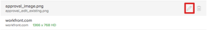
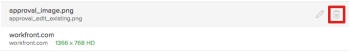

# Generate Proofs in [!DNL Workfront Proof]

>[!IMPORTANT]
>
>This article refers to functionality in the standalone product [!DNL Workfront Proof]. For information on proofing inside [!DNL Adobe Workfront], see [Proofing](../../../review-and-approve-work/proofing/proofing.md).

[!DNL Workfront Proof] enables you to create proofs from documents or websites, and share those proofs with others. The following steps describe the various configuration options that are available:

## Generate a proof for a document

1. Do any of the following to begin creating a new proof and display the [!UICONTROL New Proof] page:

   * Click the green **[!UICONTROL New proof]** button in the upper-left corner of any page.
   * In the **[!UICONTROL Dashboard]** area, in the **[!UICONTROL Overview]** tab, click the **[!UICONTROL New proof]** link.

   * Submit via Dropzone (Enterprise feature).
   * The **[!UICONTROL New Proof]** page displays.

1. To proof one or more documents, add documents to be proofed in either of the following ways (repeat this process to add multiple documents to be proofed):

   * Drag a document from you file system into the drag-and-drop area in the **[!UICONTROL Add Files]** area.
   * Click in the drag-and-drop area in the **[!UICONTROL Add Files]** area, then browse to find and select the document you want to upload from the file system on your workstation.

      

1. To proof one or more websites, specify the URL of the website you want to proof in the **[!UICONTROL Add Files]** area, then press **[!UICONTROL Enter]**.

1. (Optional) Repeat this process to add multiple websites to proof.

   For more details about proofing websites, see [Generate a proof for a URL](#generate-a-proof-for-a-url).

   

1. (Optional) Modify the file names of any uploaded files:

   1. Mouse over the document name you want to modify in the document list in the **[!UICONTROL Add Files]** area, then click the **[!UICONTROL Edit]** icon.

      

   1. In the **[!UICONTROL Proof name]** field, specify a new name, then click **[!UICONTROL Done]**.

   1. (Optional) To delete any files from being uploaded, mouse over the document you want to delete in the document list in the **[!UICONTROL Add Files]** area, then click the **[!UICONTROL Delete]** icon.

      

   1. (Optional) Enable the option, **[!UICONTROL Combine all compatible files into single proof]**.

      **When this option is enabled:** All static files and websites are available in a single proof, and you can upload up to 50 files at a given time.

      >[!NOTE]
      >
      >Interactive files, including videos and interactive websites, cannot be combined into a single proof.

      **When this option is disabled:** All documents and websites are generated as individual proofs, and you can upload up to 20 files at a given time.

      To combine all uploaded files and websites into a single proof:

      1. Enable the option, **[!UICONTROL Combine all compatible files into single proof]**.
      1. In the **[!UICONTROL Proof name]** field, specify a new name for the combined proof.
      1. In the **[!UICONTROL Add Files]** area, reorder the included files by dragging a file to the desired order. The order of the files is the page order of the combined proof. For more information about creating combined proofs, see [Create a multi-page proof](../../../review-and-approve-work/proofing/creating-proofs-within-workfront/create-multi-page-proof.md).

1. (Optional) If you want to use an automated workflow that includes multiple stages, in the **[!UICONTROL Workflow]** section, select from the following options:

   * **Basic:** Select this option to designate users who you want to have access to the proof immediately after it is created. You can share the proof with multiple users.

      For more information about sharing a proof, see "Adding Users to a Proof" in [Share a proof within [!DNL Adobe Workfront]](../../../review-and-approve-work/proofing/managing-proofs-within-workfront/share-a-proof-in-workfront.md).

   * **Automated:** Select this option to manage content review and approval when you have complex review processes, or if you send content for review to the same groups of people regularly. With automated workflow, the proof moves from stage to stage until final approval. The relevant users are notified any time they are required to make an approval.

      For more information about creating an Automated Workflow, see [Set up a proof with an Automated Workflow in [!DNL Workfront Proof]](../../../workfront-proof/wp-work-proofsfiles/automated-workflow/set-up-proof-auto-workflow.md#create2).

1. Select whether to send email notifications and a custom message to the users you selected in the previous step:

   * **Notify recipients about this proof:** Select this option to send an email notification to users. When **[!UICONTROL Basic sharing]** is selected in the **[!UICONTROL Workflow]** section, an email notification sends when the proof is created. When **[!UICONTROL Automated workflow]** is selected in the **[!UICONTROL Workflow]** section, an email notification sends when the proof enters the stage of the automated workflow that the user is associated with.

   * **Add custom message:** Select this option to include a custom message in the notification. You can specify a subject and message body. The message body can include rich text formatting, such as bold, bullets, and hyperlinks.

1. Select any of the following proof settings:

   <table style="table-layout:auto"> 
    <col> 
    <col> 
    <tbody> 
     <tr> 
      <td role="rowheader">Require login - proof can only be shared with other users</td> 
      <td> 
<strong>Require login - proof can only be shared with other users:</strong> When this option is selected, only [!DNL Workfront Proof] users are able to view the proof.
 
This option is disabled by default; any person with the URL is able to view the proof.
 
When this option is selected:
 
       <ul> 
        <li>Users cannot sign in to the proof unless they have been added to the proof.</li> 
        <li>Subscriptions cannot be enabled.</li> 
       </ul> </td> 
     </tr> 
     <tr> 
      <td role="rowheader">Only one decision required for this proof</td> 
      <td> 
When this option is selected, the review is completed after one of the decision makers makes their decision.
 
This option is disabled by default.
 </td> 
     </tr> 
     <tr> 
      <td role="rowheader">Require decisions to be electronically signed</td> 
      <td>Users are required to specify their user name and password at the time that they make a decision on a proof.</td> 
     </tr> 
     <tr> 
      <td role="rowheader">Lock proof when all required decisions are made</td> 
      <td> 
<strong></strong> When this setting is enabled, the proof state is locked after all decisions have been made. The state is automatically changed from unlocked to locked when the final approver makes their decision.
 
This option is disabled by default.
 </td> 
     </tr> 
     <tr> 
      <td role="rowheader">Download original file</td> 
      <td> 
<strong></strong> When this option is selected, reviewers are able to download the original file from which the proof was created.
 
When this option is deselected, the Download icon is no longer visible. This option is enabled by default.
 </td> 
     </tr> 
     <tr> 
      <td role="rowheader">Share proof via public URL or embed code</td> 
      <td>When this option is selected, the proof can be shared via a public URL or embed code.</td> 
     </tr> 
     <tr> 
      <td role="rowheader">Subscribe to proof via public URL or embed code</td> 
      <td> 
When this option is selected, people who have not been added explicitly to the proof can subscribe to the proof. The person subscribing to the proof is granted the role and email that you define in the following settings:
 
       <ul> 
        <li><strong>Subscriber role</strong>: The default proof role that is assigned to all reviewers that subscribe to the proof.</li> 
        <li><strong>Email alert settings for subscribers</strong>: The default email alert that is assigned to all reviewers that subscribe to the proof.</li> 
        <li> 
<strong>Proof access via email link required for</strong>: Configure whether the subscriber receives an email with a link to the proof. You can select <strong>No email</strong> (email link is not required to access the proof), <strong>Proof notification email only</strong> (the subscriber receives a link to the proof via email without any verification), or <strong>Validation and proof notification emails</strong> (Subscriber receives a link to the proof via email and must click the link to access a proof; the purpose of this option is to ensure that the person has entered a correct email address to which they have access).
 
Note: If the proofs have Automated Workflow attached all subscriptions will generate confirmation emails to the proof Owner, so they could decide which stage the person should be added to.
 </li> 
       </ul> </td> 
     </tr> 
    </tbody> 
   </table>

1. Click **[!UICONTROL Create Proof]**.

   Workfront begins generating a proof of the selected documents or websites. Depending on the file size and type, the lag time on a document upload varies. Be patient as bigger files take longer to generate. You can navigate away from the page and Workfront continues to generate your file. The maximum file upload size is 4GB.

   After the proof is generated, click **[!UICONTROL Go to proof]** to launch the proofing tool.

   

   The document appears in the proofing tool.

   Users who do not have proofing enabled on their account are still able to view the document and make comments to the proof.

## Generate a proof for a URL {#generate-a-proof-for-a-url}

You can generate a proof for a URL for the first time. Or, you can generate a new version of a URL proof where a proof has previously been generated.

>[!NOTE]
>
>You can generate an interactive proof for a URL only if your [!DNL Workfront] environment is integrated with a [!DNL Workfront Proof] Premium account. If you cannot use proofing as discussed in this section, contact your system administrator.

To generate a proof for a URL:

1. Do any of the following to begin creating a new proof and display the [!UICONTROL New Proof] page:

   * Click the green **[!UICONTROL New proof]** button in the upper-left corner of any page.
   * In the **[!UICONTROL Dashboard]** area, in the **[!UICONTROL Overview]** tab, click the **[!UICONTROL New proof]** link.

   * Submit via Dropzone (Enterprise feature).

1. (Conditional) In the **[!UICONTROL New proof]** page that appears, to create a new version of an existing proof:

   1. Select the URL proof where you want to add a new version.
   1. Click the **[!UICONTROL New Version]** button at the top of the page.

      

1. In the New proof version page that displays, specify the URL of the website you want to proof in the **[!UICONTROL Add Files]** area, then press **[!UICONTROL Enter]**.

1. (Optional) Repeat this process to add multiple websites to proof.

   

1. Click the website in the document list in the **[!UICONTROL Add Files]** area.

   

1. Specify a **[!UICONTROL Proof name]** for the proof.

   By default, the proof name is the same as the site URL.

1. Select **[!UICONTROL Handle site contents]** options:

   <table style="table-layout:auto"> 
    <col> 
    <col> 
    <tbody> 
     <tr> 
      <td role="rowheader">Capture screenshot</td> 
      <td>Creates a proof of a static image of the URL's front page.</td> 
     </tr> 
     <tr> 
      <td role="rowheader">Interactive</td> 
      <td> 
Creates a proof that allows reviewers to navigate the site, view HTML5 images, Flash elements, and so forth.
 
In order to create an interactive proof, the website must be hosted with a secure protocol (https). In addition, websites that cannot be embedded in an iframe cannot be generated as an interactive proof (iframe embedding restrictions are controlled by the website you are attempting to embed).
 
After the initial proof is created, this setting cannot be changed when creating subsequent versions.
 
For more information about interactive proofing, see <a href="#generate-a-proof-for-interactive-content" class="MCXref xref">Generate a proof for interactive content</a>.
 </td> 
     </tr> 
     <tr> 
      <td role="rowheader">Screenshot resolution</td> 
      <td> 
(This option is not available for interactive proofs.) You can adjust the resolution that your content is displayed in, or you can select multiple resolutions.
 
This enables users reviewing the proof to view how content will appear on different devices, such as various sizes of phones, tablets, and monitors.
 
If you select multiple resolutions, a separate proof is created for each resolution you select.
 
When users comment on the proof, the current screen resolution is automatically displayed in the comment to ensure other users are aware what resolution the comment is associated with.
 </td> 
     </tr> 
     <tr> 
      <td role="rowheader">Look for subpages</td> 
      <td>(This option is not available for interactive proofs.) Select this option to navigate through pages of the website. You can expand the website up to 2 levels deep from the main page. Mouse over a page to view the URL of the page. Select only those pages that you want to proof. Each page you select is created as an individual proof by default; or, enable the <strong>Combine into single proof</strong> option to combine all selected pages into a single proof.</td> 
     </tr> 
    </tbody> 
   </table>

1. (Optional) Configure any advanced proofing options, such as sharing the proof, adding an Automated Workflow, or setting up access and subscription settings. For more details about these options, see the following articles:

   * [Share a proof within [!DNL Adobe Workfront]](../../../review-and-approve-work/proofing/managing-proofs-within-workfront/share-a-proof-in-workfront.md)
   * [Set up a proof with an Automated Workflow in [!DNL Workfront Proof]](../../../workfront-proof/wp-work-proofsfiles/automated-workflow/set-up-proof-auto-workflow.md)
   * [Configure access and subscription settings for a proof](../../../review-and-approve-work/proofing/managing-proofs-within-workfront/configure-access-subscription-settings-proof.md)

1. Click **[!UICONTROL Done]**.

   If you are adding a new version to an existing URL proof, any options that were configured on the original proof or previous version are maintained in this version.If you are adding a new version to an existing URL proof, any options that were configured on the original proof or previous version are maintained in this version.

1. Click **[!UICONTROL Create Proof]**.

## Generate a proof for interactive content {#generate-a-proof-for-interactive-content}

A Pro Workfront Plan or higher is required to use this feature. For more information about the various plans available, see [Workfront Plans](https://www.workfront.com/plans).

For more information about Interactive content, see [Interactive content proofs overview](../../../review-and-approve-work/proofing/proofing-overview/interactive-content-proofs.md).

* [Add interactive content as a URL](#add-interactive-content-as-a-url)
* [Add interactive content as a ZIP file](#add-interactive-content-as-a-zip-file)

### Add interactive content as a URL {#add-interactive-content-as-a-url}

For information about how to add an interactive URL proof, see  [Generate a proof for a URL](#generate-a-proof-for-a-url).

### Add interactive content as a ZIP file {#add-interactive-content-as-a-zip-file}

1. Prepare your content by creating a .zip bundled file.

   For information about .zip bundled file specifications, see [About preparing interactive content in a ZIP file for proofing](../../../review-and-approve-work/proofing/proofing-overview/interactive-content-proofs.md#howtoprepareaninteractiveziparchive) in the article [Interactive content proofs overview](../../../review-and-approve-work/proofing/proofing-overview/interactive-content-proofs.md).

1. Do any of the following to begin creating a new proof and display the [!UICONTROL New Proof] page:

   * Click the green **[!UICONTROL New proof]** button in the upper-left corner of any page.
   * In the **[!UICONTROL Dashboard]** area, in the **[!UICONTROL Overview]** tab, click the **[!UICONTROL New proof]** link.

   * Submit via Dropzone (Enterprise feature).

1. In the **[!UICONTROL New proof]** page that appears, drag and drop your interactive .zip bundle into the **[!UICONTROL Add files]** area.

1. (Optional) Configure any advanced proofing options, such as sharing the proof, adding an automated workflow, or setting up access and subscription settings. For more details about these options, see the following articles:

   * [Share a proof within [!DNL Adobe Workfront]](../../../review-and-approve-work/proofing/managing-proofs-within-workfront/share-a-proof-in-workfront.md)
   * in the article
   * [Configure access and subscription settings for a proof](../../../review-and-approve-work/proofing/managing-proofs-within-workfront/configure-access-subscription-settings-proof.md)

1. Click **[!UICONTROL Create Proof]**.

   Workfront begins generating a proof of the .zip bundle. Depending on the bundle size, the lag time on a document upload varies. Larger files take longer to generate. You can navigate away from the page and Workfront continues to generate your file. The maximum file upload size is 4GB.

   After the proof generates, you can click the **[!UICONTROL Go to proof]** button that appears to open the proof.
