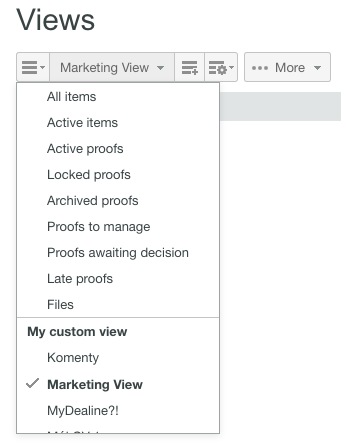
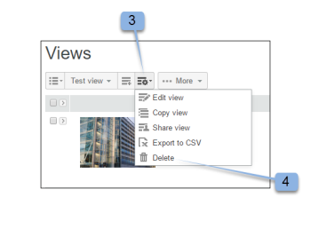

# Create and Manage Custom Views in [!DNL Workfront Proof]

>[!IMPORTANT]
>
>This article refers to functionality in the standalone product [!DNL Workfront Proof]. For information on proofing inside [!DNL Adobe Workfront], see [Proofing](../../../review-and-approve-work/proofing/proofing.md).

You can create custom views of your files and proofs to list the items you want in the ways you want them displayed. You can also export the information in your Custom view as a report (in CSV, comma separated value, file format).

>[!NOTE]
>
>Custom views are available only on Select and Premium plans. Please contact our Sales team for a quote.

## Creating a Custom View

When you create a custom view, you can choose:

* Whether to include proofs, files, or both
* Which columns are displayed
* Which column to sort by
* The sort order for the column (ascending or descending)
* Which types of filters to use for determining what information is included in the view

After the custom view is created, it is available to use immediately. The name of the new view is also included in the drop-down menu under the heading My custom views (below the Standard views).

To create a custom view:

1. Go to the **[!UICONTROL Views]** page.
1. For more information about views, see [Manage Items on the Views Page in [!DNL Workfront Proof]](../../../workfront-proof/wp-work-proofsfiles/manage-your-work/manage-items-on-views-page.md).
1. Do either of the following, depending on whether you want to create a new custom view from scratch, or create a new custom view based on an existing standard view:

   * To create a new custom view based on an existing standard view: From the drop-down menu, select the existing standard view you want to use as the basis for your new custom view. Click the **[!UICONTROL View Settings]** icon, then click **[!UICONTROL Copy]** to new custom view.

   * 

   * To create a new custom view from scratch: Click the **[!UICONTROL New View]** icon.
   * 

1. In the **[!UICONTROL Details]** section, specify the following information:

   * **[!UICONTROL Name]** (required): The name for the new view. Use a unique name so users can easily find the custom view in the drop-down menu on the Views.
   * **[!UICONTROL Items]**: Select whether you want both proofs and file, proofs only, or files only included in the view. By default, both proofs and files are included.

1. In the **[!UICONTROL Columns]** section, determine which columns you want to include in the custom view.

   1. Click the Right arrow icon.
   1. 

   1. Double-click the name of the selected column.
   1. You must select at least one column, and a column can be added only once.
   1. Select a column from the **[!UICONTROL Available columns]** area that you want to include in the new view.
   1. The columns are moved from the **[!UICONTROL Available columns]** list to the **[!UICONTROL Selected columns]** list.

   1. You can select from the standard columns, or you can choose Custom fields and Decision Reasons to be columns in your custom view. (If you have these configured in your account, they appear under the standard list of Available columns area.)
   1. Standard columns you can include

      <table style="table-layout:auto">
      <thead>

      </thead>
      <tbody>  
      <tr>   
      <td><strong>Active stage name</strong></td>   
      <td>Name of the active stage in the automated workflow.</td>  
      </tr>  
      <tr>   
      <td><strong>Comments</strong></td>   
      <td>The number of comments received.</td>
      </tr>  
      <tr>   
      <td><strong>Counter</strong></td>
      <td>Shows a number of the proof that has been uploaded on your account (you have to have a proof counter option enabled in Account Settings).</td>
      </tr>
      <tr>
      <td><strong>Created</strong></td>
      <td>The date and time the item was created.</td>
      </tr>
      <tr>
      <td><strong>Creator</strong></td>
      <td>The user who created the item.</td>
      </tr>
      <tr>
      <td><strong>[!UICONTROL Date added to proof]</strong></td>
      <td>The date you were added to the proof. </td>
      </tr>
      <tr>
      <td><strong>Deadline</strong></td>
      <td>The deadline for the whole proof.</td>
      </tr>
      <tr>
      <td><strong>Decisions</strong></td>
      <td>The number of decisions given out of the expected number (e.g. 0 of 1, 1 of 1, etc.)</td>
      </tr>
      <tr>
      <td><strong>[!UICONTROL Downloads]</strong></td>
      <td>The number of times the original file has been downloaded.</td>
      </tr>
      <tr>
      <td><strong>Filename</strong></td>
      <td>The name of the file or proof.</td>
      </tr>
      <tr>
      <td><strong>Folder</strong></td>
      <td>The folder containing the item.</td>
      </tr>
      <tr>
      <td><strong>Last activity</strong></td>
      <td>The date and time of the last activity on the item.</td>
      </tr>
      <tr>
      <td><strong>Latest decision on</strong></td>
      <td>The date and time of the last decision made.</td>
      </tr>
      <tr>
      <td><strong>My deadline</strong></td>
      <td>Your own deadline on the proofs where you are explicitly added as a Reviewer/Approver (if applied).</td>
      </tr>
      <tr>
      <td><strong>Owner</strong></td>
      <td>The owner of the item.</td>
      </tr>
      <tr>
      <td><strong>Owner country</strong></td>
      <td>The country registered in the system for the owner of the proof. </td>
      </tr>
      <tr>
      <td><strong>Parent proof</strong></td>
      <td>The name of the parent proof.</td>
      </tr>
      <tr>
      <td><strong>Progress</strong></td>
      <td>
Progress bar. Displays proofs that are not yet Started, Opened, Commented on, or Decided on.

This information is not sorted on.
</td>
      </tr>
      <tr>
      <td><strong>Proof name</strong></td>
      <td>The name of the proof.</td>
      </tr>
      <tr>
      <td><strong>Proof type</strong></td>
      <td>
The type of proof: Static file, Static web page, Interactive web (.zip upload), Interactive web page (https), Video, Audio, and Other. 

Combined proofs are identified as "Combined proof type." File type of the proof.
</td>
      </tr>
      <tr>
      <td><strong>File size (MB)</strong></td>
      <td>
File size of the proof as it relates to the disk usage quota.

This information provided for the current version of the proof. If there is no current version, it is for the most recent version.
</td>
      </tr>
      <tr>
      <td>
 

<strong>Active stage deadline</strong>
</td>
      <td>Deadline of stages in the automated workflow.</td>
      </tr>
      <tr>
      <td><strong>Stage name</strong></td>
      <td>Name of each stage in the automated workflow. This includes past stages, active stages, and future stages.</td>
      </tr>
      <tr>
      <td><strong>State</strong></td>
      <td>Active, Locked, Draft, or Submitted.</td>
      </tr>
      <tr>
      <td><strong>Status</strong></td>
      <td>Pending, Changes required, Approved with changes, Approved, or Not relevant.</td>
      </tr>
      <tr>
      <td><strong>Tags</strong></td>
      <td>Any tags attached to the item.</td>
      </tr>
      <tr>
      <td><strong>Upcoming stage names</strong></td>
      <td> Name of each stage that has not yet started in the automated workflow. </td>
      </tr>
      <tr>
      <td><strong>Version counter</strong></td>
      <td> The number of versions of the item. </td>
      </tr>
      <tr>
      <td><strong>Proof version number</strong></td>
      <td><i>The version number of the proof.</i></td>
      </tr> 
      </tbody>
      </table>

   1. (Optional) Do either of the following to move the column to the **[!UICONTROL Selected columns]** area so that it is included in the new view:

      * Reorder any columns in the **[!UICONTROL Selected columns]** list.
      * The order in which columns are shown in the **[!UICONTROL Selected columns]** list determines the order in which the columns are displayed in the custom view.
      * The columns are visible in the **[!UICONTROL Selected columns]** list in the order that you added them from the **[!UICONTROL Available columns]** list.

      * To reorder a column in the **[!UICONTROL Selected columns]** list, select the name of the column and drag it either up or down in the list.

      * Remove a column from the **[!UICONTROL Selected columns]** list, by clicking the name of the selected column, then clicking the **[!UICONTROL Left]** arrow. Alternatively, you can double-click the name of the selected column (the column is moved back to the **[!UICONTROL Available columns]** list).

      * A column can be added only once. For example, if you move Comments column from [!UICONTROL Available] to [!UICONTROL Selected columns] list, the name of this column will disappear from [!UICONTROL Available columns] list.

1. In the **[!UICONTROL Sorting]** section, specify the following information:

   * **Sort by:** Use the [!UICONTROL Sorting] tab if you want to set a particular order in which items are listed in your custom view. If you do not select a column for sorting, the default is No column - that is, no special sort column or order.
   * Only the columns you selected on the [!UICONTROL Columns] tab are included in the [!UICONTROL Sort by column] drop down list.
   * **Ascending or Descending:** Select whether you want to sort the column either ascending or descending by default.

1. Use the **[!UICONTROL Filters]** section to define one or more criteria for selecting items to include in your Custom view. Filters are especially helpful if you want to use your custom view as a report.
1. To include all items in your custom view, skip the **[!UICONTROL Filters]** section.
1. Available filters:

   * **Field:** Select the Field for this filter (Comments is the default field.) The Field list contains all the Standard fields (as in the [!UICONTROL Columns] tab). The list is not limited to the columns you selected for display.
   * **Operator:** The Operators available for the filter depend on the type of Field you selected. Select an Operator that shows the relationship between the Field and the value field. You will fill in this information later.
   * **Value:** Select or enter your chosen value in this Field, according to the field and the Operator you selected. Depending on the Operator you chose, there might be one Value field or two or none. See the examples below.
   * **Filters are applied using the following logic:** Filter criteria between different fields will use the AND operator. Multiple filter criteria using the same field will use the OR operator for the same field.

      If you want to see only proofs with zero comments, select the following values:

      * Field: Comments
      * Operator: Equals
      * Value field: 0

      If you want to see only proofs with two or more comments, select the following values:

      * Field: Comments
      * Operator: Greater or equal to
      * Value field: 2

      If you want to see only proofs with between 1 and 4 comments, select the following values:

      * Field: Comments
      * Operator: Between
      * Value field (first field): 1
      * Value field (second field): 4

         You can change a filter that you have added to your Custom view without any problems or remove it by clicking the cross icon next to the [!UICONTROL setup] filter if needed.

         Because the Field list is not limited to the columns you selected on the [!UICONTROL Columns] tab, take care when you create a filter that includes a column you did not select for display in your custom view. For example, the following filter for the view will select all proofs with a Version counter value of 2 or more:

         * Field = Version counter
         * Operator = Greater or equal to
         * Value field = 2

            >[!NOTE]
            >
            >You can change a filter that you have added to your Custom view without any problems or remove it by clicking the cross icon next to the [!UICONTROL setup] filter if needed.

1. In the **[!UICONTROL Sharing]** section, select which users in your account will be able to see your Custom view.
1. Custom views are specific to the user who creates them. By default the new Custom view is visible only for its creator; however, you can choose to share your custom view by choosing one of the following options:

   * **Only you can see this custom view** (default): Select this option if you want the custom view to be available only to you.
   * **All users can see this custom view**: Select this option to make the custom view available to all users on your account.
   * **Select users that can see this custom view**: Select this option to make the custom view available only to specific users.
   * Begin typing the name or the email address of the user who you want to have access to the custom view, then click the name when it appears in the drop-down list.
   * If you choose to not share your view with other users at this point, you can do so later by editing the custom view.

1. Click **[!UICONTROL Create]**.
1. The Custom view is displayed and is available on the [!DNL Views] page. For more information about views, see [Manage Items on the [!DNL Views] Page in [!DNL Workfront Proof]](../../../workfront-proof/wp-work-proofsfiles/manage-your-work/manage-items-on-views-page.md).

## Editing Custom Views

You can edit a custom view easily. To edit a custom view:

1. Go to the **[!UICONTROL Views]** page.\
   For more information about views, see [Manage Items on the Views Page in [!DNL Workfront Proof]](../../../workfront-proof/wp-work-proofsfiles/manage-your-work/manage-items-on-views-page.md).

1. Click on the [!UICONTROL Views] button (1)
1. Select the view you want to edit from the drop-down menu.\
   

1. Click the **[!UICONTROL View Options]** button, then click **[!UICONTROL Edit view]**.\
   \
   The Edit Custom View page is displayed.

1. Click on the [!UICONTROL Actions] menu. (3)\
   This button is available only if you include the Proof name column in your view.
1. Select [!UICONTROL Edit view] from the menu. (4) \
   

1. The Edit custom view page is displayed.

>[!NOTE]
>
>If you edit your Custom view, the columns in Selected columns list will arrange in an alphabetical order automatically. You will need to rearrange them if needed before updating the view.

## Copying Custom Views

The Copy view function lets you easily make a copy of an existing custom view. This is really useful, for example, if you want to set up separate views for all your designers, with each view being the same except for the proof owner (designer).

To copy a custom view:

1. Go to the **[!UICONTROL Views]** page.\
   For more information about views, see [Manage Items on the Views Page in [!DNL Workfront Proof]](../../../workfront-proof/wp-work-proofsfiles/manage-your-work/manage-items-on-views-page.md).

1. Click on the **[!UICONTROL Views]** button. (1)
1. Select your Custom view from the list. (2)
1. Click the **[!UICONTROL Actions]** menu. (3)\
   This button is available only if you include the Proof name column in your view.

1. Select [!UICONTROL Copy] from the menu. (4)\
   

1. In the Copy custom view page, all the original settings are populated. Modify the Custom view as per your choice and click the **[!UICONTROL Copy view]** button. You will be taken to your new view immediately.\
   

## Sharing Custom Views

The Share view function lets you share a view with other users in your account if you did not already select them on the Sharing section for the view. When you share a custom view with other users, the view appears in their [!UICONTROL My custom views] section of the Views drop down menu.

To share a custom view with other users:

1. Go to the **[!UICONTROL Views]** page.\
   For more information about views, see [Manage Items on the Views Page in [!DNL Workfront Proof]](../../../workfront-proof/wp-work-proofsfiles/manage-your-work/manage-items-on-views-page.md).

1. Click on the **[!UICONTROL Views]** button (1)
1. Select your Custom View from the list (2)
1. Click the **[!UICONTROL Actions]** menu. (3)\
   This button is available only if you include the Proof name column in your view.

1. Select [!UICONTROL Share view] from the menu (4)
1. The Edit custom view page will come up.
1. In the [!UICONTROL Sharing] section elect the users you want to share the view with and click **[!UICONTROL Update view]**.

   

## Exporting Custom Views to CSV Files

To export the data from a custom view to a CSV file:

1. Go to the **[!UICONTROL Views]** page.\
   For more information about views, see [Manage Items on the Views Page in [!DNL Workfront Proof]](../../../workfront-proof/wp-work-proofsfiles/manage-your-work/manage-items-on-views-page.md).

1. Click on the **[!UICONTROL Views]** button. (1)
1. Select your Custom View from the list. (2)
1. Click the **[!UICONTROL Actions]** menu. (3)\
   This button is available only if you include the Proof name column in your view.

1. Select [!UICONTROL Export to CSV] from the menu. (4)\
   \
   In a separate browser window, 'Generating report: 100%' appears plus the number of records (the number of items included in the report from your custom view)

1. (Conditional) If a security message appears indicating that the report download is currently blocked, click to allow the download to proceed.
1. Click **[!UICONTROL Save]** when the File Download window appears asking if you want to open or save the file.
1. Select a location on your computer and save the file.

## Deleting Custom Views

You can delete a Custom view easily. To do this:

1. Go to the **[!UICONTROL Views]** page.\
   For more information about views, see [Manage Items on the Views Page in [!DNL Workfront Proof]](../../../workfront-proof/wp-work-proofsfiles/manage-your-work/manage-items-on-views-page.md).

1. Click on the **[!UICONTROL Views]** button.
1. Select your Custom view from the list
1. Click the **[!UICONTROL Actions]** menu. (3)\
   This button is available only if you include the Proof name column in your view.

1. Select [!UICONTROL Delete] from the menu. (4)\
   

1. Click **[!UICONTROL Delete]** (5) to confirm that you want to delete the current Custom view\
   

1. The default All items view is displayed and your deleted custom view no longer appears in the **[!UICONTROL Views]** drop-down menu.
