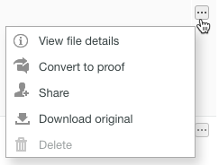

# Manage Files in [!DNL Workfront Proof]

>[!IMPORTANT]
>
>This article refers to functionality in the standalone product [!DNL Workfront Proof]. For information on proofing inside [!DNL Adobe Workfront], see [Proofing](../../../review-and-approve-work/proofing/proofing.md).

You can manage, share, and view information about the files (not proofs) uploaded to Workfront Proof (see [Upload Files and Web Content to [!DNL Workfront Proof]](../../../workfront-proof/wp-work-proofsfiles/create-proofs-and-files/upload-files-web-content.md)).

1. Click the down arrow to the right of **[!UICONTROL Views]** in the left navigation panel, then click **[!UICONTROL Files]** in the drop-down menu.

1. Click the **[!UICONTROL More]** button for the file, then click **[!UICONTROL View file details]** in the menu that appears.\
   \
   You can view and edit details about the file in the window that appears. For example, you can change the filename at the top of the window, the [!DNL Workfront Proof] **Folder** that stores file, and the **Owner** of the file.\
   

1. (Optional) If you have edit rights for the file, use the action buttons in the upper-right corner to manage and share the file:

* **[!UICONTROL Tags]**. Manage tags applied to the file.\
   \
   Beneath the action buttons, you can view any tags applied to the file. You can remove an unwanted tag by clicking the x next to it.\
   

* **[!UICONTROL Move to]**. Organize your files into folders. You can move a file between existing folders or place them in a new folder.\
   

* **[!UICONTROL Share]**. Share files with other people. [!DNL Workfront Proof] sends an email notification including a custom message and download links to the recipients.\
   

* **[!UICONTROL Trash]**. You can delete the file by moving it to the Trash. Please note that the file will count towards your storage limit until the Trash is emptied (see [Restore and Empty the Trash in [!DNL Workfront Proof]](../../../workfront-proof/wp-work-proofsfiles/manage-your-work/restore-and-empty-trash.md)).\
   

* **[!UICONTROL More]**. In this dropdown list, you can click **[!UICONTROL Convert to proof]** to create a proof for a file (see [Generate Proofs in [!DNL Workfront Proof]](../../../workfront-proof/wp-work-proofsfiles/create-proofs-and-files/generate-proofs.md)). The file must meet our file types requirements for proofs (see [Supported proofing file types and size limits overview](../../../review-and-approve-work/proofing/proofing-overview/supported-proofing-file-types.md)). If the name of the file matches the name of an existing proof, [!DNL Workfront Proof] will display a message with a link allowing you to convert the file to a **[!UICONTROL New version]** of that proof (see ).\
   

   >[!TIP]
   >
   >For files which were shared from another [!DNL Workfront Proof] account (and not uploaded to your own account), converting is available only on Enterprise Plans.

   You can click also click **[!UICONTROL Download]** to download the original file to your computer.

1. (Optional) Open the **[!UICONTROL Shared with]** section to list the users the file has been shared with.

   You can **[!UICONTROL Message]** or **[!UICONTROL Remove]** a user using the **[!UICONTROL More]** icon on the right.

   

   If you choose to Message one of these users, the **[!DNL Message all]** page appears, where you can send multiple messages at once.

1. Open the **[!UICONTROL Activity]** section to list all activity on the file, including the time, date and person who performed the action. Activity includes:

   * File uploaded
   * New people added
   * People removed
   * File downloaded

1. Open the **[!UICONTROL Messages]** section to trace messages users have sent in association with the file. You can view the content of a message by clicking the "i" icon to the right.
