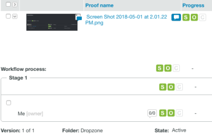
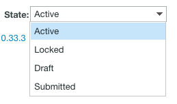

# Understand Proof State in Workfront Proof

>[!IMPORTANT]
>
>This article refers to functionality in the standalone product [!DNL Workfront Proof]. For information on proofing inside [!DNL Adobe Workfront], see [Proofing](../../../review-and-approve-work/proofing/proofing.md).

In [!DNL Workfront Proof], proofs exist in different states. These states determine what actions you can take on the proof, such as commenting or making decisions.

## Understanding Proof State

The four states are as follows:

* [Active](#active)
* [Locked](#locked)
* [Draft (Dropzone only)](#draft-dropzone-only)
* [Submitted (Dropzone only)](#submitted-dropzone-only)

### Active {#active}

Proofs that are uploaded to [!DNL Workfront Proof] through the New Proof page or the Dropzone appear as Active after they are processed. When a proof is active users can review, make comments, and make decisions on the proof.

>[!NOTE]
>
>Proofs that are uploaded through the Dropzone appear as Active only if the Activate proof on submission option is enabled. If the option is not enabled, you must manually activate the proof.

For more information about Dropzone settings, see [Configure the dropzone in [!DNL Workfront Proof]](../../../workfront-proof/wp-acct-admin/account-settings/configure-dropzone-in-wp.md).

### Locked {#locked}

You can lock a proof when you finish reviewing it. Locking a proof means no more comments or decisions can be made on the proof, but the proof can still be opened.

Any users with Edit rights on the proof can unlock it.

For more information about rights, see [Proof Permissions Profiles in [!DNL Workfront Proof]](../../../workfront-proof/wp-acct-admin/account-settings/proof-perm-profiles-in-wp.md).

>[!NOTE]
>
>Email notifications no longer send when a proof is locked. For example, if a proof is locked before its deadline, a notification email is not sent when the deadline is reached.

### Draft (Dropzone only) {#draft-dropzone-only}

When you submit a proof through the Dropzone, it goes into the Draft state before the admin activates it. When it is in the draft zone, you cannot take any actions on the proof.

### Submitted (Dropzone only) {#submitted-dropzone-only}

After a draft is activated by the admin, your proof shows as Submitted in the Dropzone. After it is submitted, you can take actions on the proof.

## Viewing and Changing Proof State

For information about viewing a list of all proofs in a specific state, such as viewing all Active or Locked proofs, see [Manage Items on the Views Page in [!DNL Workfront Proof]](../../../workfront-proof/wp-work-proofsfiles/manage-your-work/manage-items-on-views-page.md) in the article [Manage Items on the Views Page in [!DNL Workfront Proof]](../../../workfront-proof/wp-work-proofsfiles/manage-your-work/manage-items-on-views-page.md).

1. Access your [!DNL Workfront Proof] Dashboard.

   For more information, see [Access [!DNL Workfront Proof] from Adobe Workfront](../../../review-and-approve-work/proofing/managing-proofs-within-workfront/access-wf-proof-in-workfront.md).

1. On the **[!UICONTROL Dashboard]**, click the **[!UICONTROL Expand]** arrow next to the proof you want to view or change the state of.

   

   The **[!UICONTROL Workflow process]** section appears.

   

1. View the **[!UICONTROL State]** in the **[!UICONTROL Workflow process]**.

1. (Optional) To change the state, mouse over the current **[!UICONTROL State]** and click the drop-down menu, then select a new state.

   
