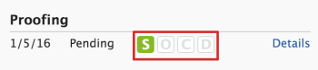
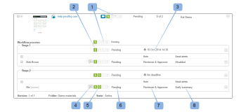
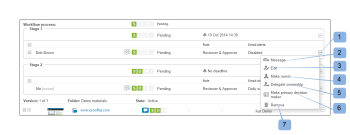
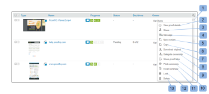

# View the Progress and Status of a Proof in Workfront Proof

>[!IMPORTANT]
>
>This article refers to functionality in the standalone product Workfront Proof. For information on proofing inside Adobe Workfront, see [Proofing](../../../review-and-approve-work/proofing/proofing.md).

## Understanding Proof Progress

Proof progress indicates the work done on a proof from the time you send the proof to reviewers to the time they make a decision on the proof.

<!--

Information in this article is also&nbsp;in Viewing the Progress and Status of a Proof in Workfront.

-->

* [Progress Icons](#progress-icons) 
* [Levels of Proof Progress](#levels-of-proof-progress)

### Progress Icons {#progress-icons}

The progress icons, S, O, C, and D, appear in the progress bar indicate proof progress.

They indicate the following information about a proof:

<table style="table-layout:auto"> 
 <col> 
 <col> 
 <thead> 
  <tr> 
   <td> 
<strong>Progress Icon</strong> 
 </td> 
   <td> 
<strong>Description</strong> 
 </td> 
  </tr> 
 </thead> 
 <tbody> 
  <tr> 
   <td> 
  
 </td> 
   <td> 
<strong>Sent</strong>. The proof has been sent to reviewers.
 </td> 
  </tr> 
  <tr> 
   <td> 
  
 
&nbsp;
 </td> 
   <td> 
<strong>Opened</strong>. A reviewer has opened the Proof details page or opened the proof itself in the proofing viewer.
 </td> 
  </tr> 
  <tr> 
   <td> 
  
 </td> 
   <td> 
<strong>Comments</strong>. Reviewers&nbsp;(users who can make comments) have made comments have been made on the proof.
 
If no reviewers are designated for the proof, this icon does not display.
 </td> 
  </tr> 
  <tr> 
   <td> 
  
 </td> 
   <td> 
<strong>Decision</strong>. A reviewer has made a decision on the proof.
 
If no approvers (decision makers) are designated for&nbsp;the proof,&nbsp;this icon does not display.&nbsp;
 </td> 
  </tr> 
 </tbody> 
</table>

These icons can appear in the following colors to indicate certain information about the proof's progress:

* **Green**. Complete.
* **White**. Not complete.
* **Orange**.&nbsp;Not&nbsp;complete and deadline is less than 24 hours. 
* **Red**. Not&nbsp;complete and past the deadline.

### Levels of Proof Progress {#levels-of-proof-progress}

Workfront Proof uses the progress icons to track a proof's progress at each of the following levels:

* For each reviewer, based on that person's activity on the proof.&nbsp;
* For each stage, based on the progress the reviewer on the stage who is most behind in the proofing process. For more information, see [Automated Workflow Stages overview](../../../review-and-approve-work/proofing/proofing-overview/stages.md).
* For the proof, based on the progress of the stage (group of reviewers) who is the most behind in the proofing process.

For an example of how Workfront Proof determines progress using the reviewer or stage that is most behind,&nbsp;suppose three reviewers on a proof need to make a&nbsp;decision. If two of them have made their&nbsp;decision&nbsp;but the third has not, the progress bar for the proof does not show&nbsp;the D in green because of the outstanding&nbsp;decision.

If the Primary Decision Maker setting is selected on a proof and the primary decision maker submits a decision, the D in the proof progress bar turns&nbsp;green for all reviewers because no other decisions are required.

Similarly, if the Only One Decision Required setting is selected on a proof and any reviewer submits a decision, the D in the proof progress bar turns&nbsp;green for all reviewers because no other decisions are required.

## Understanding Proof Status

The proof status displays&nbsp;the status of decisions that are required for&nbsp;the proof.

   
The standard status options are:

* Pending
* Approved
* Approved with Changes
* Changes Required
* Not Relevant&nbsp;

If custom decisions are configured in your account, the status options reflect your&nbsp;custom decision&nbsp;settings.

The status of the proof is driven by the “worst case” participant. For example, suppose&nbsp;there are three&nbsp;decisions&nbsp;on the proof: two have the status of **Accepted**&nbsp;and one has the status of **Rejected**. The "worst case" decision of Rejected over-rules the other decisions and the overall status of the proof is shown as **Rejected**.&nbsp;

## Viewing Progress and Status {#viewing-progress-and-status}

You can view progress and status for proofs, stages, and reviewers on each stage.

* [Proof Summary](#proof-summary) 
* [Stage Actions Menu](#stage-actions-menu) 
* [In the Summary section, you can also access the reviewer actions menus, provided you have edit rights on the proof. For more information, see Proof Permissions Profiles in Workfront Proof and Manage Proof Roles in Workfront Proof. The Reviewer actions menu (1) appears when you hover over the Reviewer's details and allows you to:](#in-the-summary-section-you-can-also-access-the-reviewer-actions-menus-provided-you-have-edit-rights-on-the-proof-for-more-information-see-proof-permissions-profiles-in-workfront-proof-and-manage-proof-roles-in-workfront-proof-the-reviewer-actions-menu-1-appears-when-you-hover-over-the-reviewer-s-details-and-allows-you-to) 
* [Proof Actions Menu](#proof-actions-menu)

### Proof Summary {#proof-summary}

Each proof in the folder has an expandable summary that lets you quickly view and edit the details of the proof.

To expand or collapse the summary:

1. Click the arrow to the left of the proof in the Dashboard or any list view.

The summary includes the following:

* Workflow (2)
* Version (3)
* Folder (4)
* State (5)  
  

In the summary, you can view and edit&nbsp;the following details of your proof:

* Proof progress (1)
* Progress of each stage (2)
* Deadline set for the stage (3)
* Reviewer details:

   * Number of comments and replies made by each reviewer (4)
   * Each reviewer's progress (5)
   * Decision (if a decision has included an electronic-signatures, an icon will be shown next to the decision indicating this.) (6)
   * Role on the proof (7)
   * Email alert settings (8)

>[!NOTE]
>
>&nbsp;Your ability to edit the proof details depends on youryour rights on the proof (see [Proof Permissions Profiles in Workfront Proof](../../../workfront-proof/wp-acct-admin/account-settings/proof-perm-profiles-in-wp.md) and [Manage Proof Roles in Workfront Proof](../../../workfront-proof/wp-work-proofsfiles/share-proofs-and-files/manage-proof-roles.md)).

 

### Stage Actions Menu  {#stage-actions-menu}

Every stage of your workflow has a separate menu, allowing you to perform bulk actions related to the reviewers in&nbsp;that stage.

The Stage actions menu appears when you hover over the Stage section (1) and allows you to

* Message all (2)
* Share (3)
* Delete stage (4)

>[!NOTE]
>
>&nbsp;The availability&nbsp;of these options depends on your rights on the proof (see [Proof Permissions Profiles in Workfront Proof](../../../workfront-proof/wp-acct-admin/account-settings/proof-perm-profiles-in-wp.md) and [Manage Proof Roles in Workfront Proof](../../../workfront-proof/wp-work-proofsfiles/share-proofs-and-files/manage-proof-roles.md)).

In the Summary section, you can also access the reviewer actions menus, provided you have edit rights on the proof. For more information, see [Proof Permissions Profiles in Workfront Proof](../../../workfront-proof/wp-acct-admin/account-settings/proof-perm-profiles-in-wp.md) and [Manage Proof Roles in Workfront Proof](../../../workfront-proof/wp-work-proofsfiles/share-proofs-and-files/manage-proof-roles.md).&nbsp;The Reviewer actions menu (1) appears when you hover over the Reviewer's details and allows you to:

* Send a message to the reviewer (2)
* Edit reviewer's details (3)- lets you edit the display name, proof role and email alert for that reviewer
* Make them the owner of the proof (4)
* Make them the primary decision maker (5)
* Remove from the proof (6)

>[!NOTE]
>
>&nbsp;The visibility of these options depends on your rights on the proof (see [Proof Permissions Profiles in Workfront Proof](../../../workfront-proof/wp-acct-admin/account-settings/proof-perm-profiles-in-wp.md) and [Manage Proof Roles in Workfront Proof](../../../workfront-proof/wp-work-proofsfiles/share-proofs-and-files/manage-proof-roles.md)).

 

### Proof Actions Menu {#proof-actions-menu}

Each proof also has a menu (1) that allows you to perform the below actions:

* You can access the Proof details page (2)
* Share the proof with other people (3)
* Send a message to reviewers (4)
* Create a new version of the proof (5)
* Copy the proof (6)
* Download the original file (7)
* Share proof links (8)
* Print comments (9)
* Request an Excel summary of the proof (10)
* Lock the proof (11)
* Delete the proof (12)

>[!NOTE]
>
>The availability of these options depends on your rights on the proof (see [Proof Permissions Profiles in Workfront Proof](../../../workfront-proof/wp-acct-admin/account-settings/proof-perm-profiles-in-wp.md) and [Manage Proof Roles in Workfront Proof](../../../workfront-proof/wp-work-proofsfiles/share-proofs-and-files/manage-proof-roles.md)).

For information about viewing proof progress and status within Workfront, see [Viewing Progress and Status](#viewing-progress-and-status).

For information about viewing progress and status in the Desktop Proofing Viewer, see [Review a Workflow in the proofing viewer](../../../workfront-proof/wp-work-proofsfiles/review-proofs-wpv/review-workflow.md).
