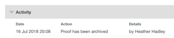

# Archive in [!DNL Workfront Proof]

>[!IMPORTANT]
>
>This article refers to functionality in the standalone product [!DNL Workfront Proof]. For information on proofing inside [!DNL Adobe Workfront], see [Proofing](../../../review-and-approve-work/proofing/proofing.md).

[!DNL Workfront Proof] archives proofs after a period of 60 days of inactivity.

If you have edit rights, you can manually archive a proof at any time. For information about edit rights, see [Proof Permissions Profiles in [!DNL Workfront Proof]](../../../workfront-proof/wp-acct-admin/account-settings/proof-perm-profiles-in-wp.md).

Archived proofs:

* Appear only in the Archived proofs view of the Views page (see "How to Tell if a Proof is Archived" below)
* Remain in your account indefinitely (unless they are deleted)
* Can be unarchived by anyone at any time (including reviewers who are not [!DNL Workfront Proof] users)
* Do count towards your storage limit
* Lock automatically when they are auto-archived
* Can be locked or unlocked when being manually archived

Archiving and unarchiving is logged in the Activity section of the proof. For more information, see [Manage Proof Details in [!DNL Workfront Proof]](../../../workfront-proof/wp-work-proofsfiles/manage-your-work/manage-proof-details.md).

>[!NOTE]
>
>You cannot archive files and folders.

## Manually Archiving Proofs

If you have edit rights, you can manually archive a proof at any time. For information about edit rights, see [Proof Permissions Profiles in [!DNL Workfront Proof]](../../../workfront-proof/wp-acct-admin/account-settings/proof-perm-profiles-in-wp.md).

It can take up to 24 hours for the archiving process to be completed.

1. On the Dashboard or a list view, select the checkbox for each proof you want to archive (see  [Manage Items on the Views Page in [!DNL Workfront Proof]](../../../workfront-proof/wp-work-proofsfiles/manage-your-work/manage-items-on-views-page.md) for information about list views).

1. Select **[!UICONTROL More]** > **[!UICONTROL Archive]**.\
   The [!UICONTROL Archive proofs] message box appears.

1. Click an option to specify whether you want the proof locked or unlocked while it is archived.\
   [!DNL Workfront Proof] archives the proof with the locking option you specify.

## Listing Archived Proofs

A proof that has been archived appears only in the **[!UICONTROL Archived proofs]** view, with the archived icon to the right of the proof name.

To display the Archived proofs view:

1. Click **[!UICONTROL Views]**, then click **[!UICONTROL All items]** > **[!UICONTROL Archived proofs]**.

   When you click the name of an archived proof in this list, the [!UICONTROL Proof details] page appears, displaying an **[!UICONTROL Unarchive]** button at the top of this page.

   Also, if you expand the **[!UICONTROL Activity]** section on this page, you can view an entry telling you when the proof was archived and who archived it.\
   \
   If the **[!UICONTROL Activity]** section does not display a name of the user who archived the proof, this means that the proof was archived automatically after 60 days of inactivity.\
   To view the contents of an archived proof, you must first unarchive it.

## Unarchiving Proofs

Anyone can unarchive a proof at any time. This includes reviewers who are not [!DNL Workfront Proof] users.

To unarchive a proof from the Archived proofs view:

1. Click **[!UICONTROL Views]**, then click **[!UICONTROL All items]** > **[!UICONTROL Archived proofs]**.

1. Click the check box next to any proof or proofs you want to unarchive.
1. Click **[!UICONTROL More]**, then click **[!UICONTROL Unarchive]** from the menu that appears.\
   A message appears at the top of the page to indicate that your proof is being unarchived.
