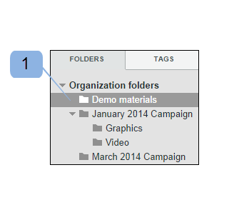
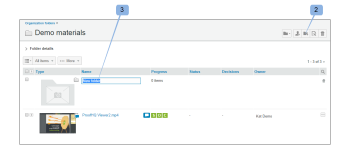
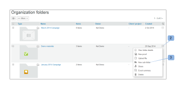
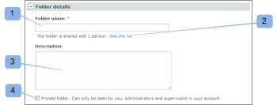

# Create Folders in [!DNL Workfront Proof]

>[!IMPORTANT]
>
>This article refers to functionality in the standalone product [!DNL Workfront Proof]. For information on proofing inside [!DNL Adobe Workfront], see [Proofing](../../../review-and-approve-work/proofing/proofing.md).

## Creating a new top-level folder {#creating-a-new-top-level-folder}

1. In the sidebar, click the drop-down arrow (1) next to the green **[!UICONTROL New proof]** button.
1. Select **[!UICONTROL New folder]**. (2)\
   The [!UICONTROL New folder] page is displayed.

1. Continue with [Configuring the new folder](#configuring-the-new-folder).\
   

## Creating a new sub-folder {#creating-a-new-sub-folder}

You can create sub-folders in either of the following ways:

* [Creating a sub-folder from the Folder details page](#creating-a-sub-folder-from-the-folder-details-page)
* [Creating a sub-folder from the Account folders page](#creating-a-sub-folder-from-the-account-folders-page)

>[!NOTE]
>
>When you create a new sub-folder, the share list is inherited from the parent folder.

### Creating a sub-folder from the [!UICONTROL Folder details] page {#creating-a-sub-folder-from-the-folder-details-page}

For information about the [!UICONTROL Folder details] page, see [Manage Folders and their Contents in Workfront Proof](../../../workfront-proof/wp-work-proofsfiles/organize-your-work/manage-folders-and-contents.md).

To create a sub-folder from the [!UICONTROL Folder details] page:

1. In the Sidebar, click the folder name in the [!UICONTROL My folders] list (1) to access the folder details page

1. Click the new sub-folder button (2) at the top of the page.\
   A new folder appears in the list of the items in the folder.
1. Type a name for the new sub-folder. (3)
1. Press **[!UICONTROL Enter]**.\
   Or\
   Click outside of the folder name field.

1. (Optional) Edit the details of the new sub-folder on the Folder details page.
1. Continue with [Configuring the new folder](#configuring-the-new-folder).

### Creating a sub-folder from the Account folders page {#creating-a-sub-folder-from-the-account-folders-page}

1. Click [Your account name] folders in the Sidebar to access the Account folders page (1)\
   

1. Find the folder that you would like to add a sub-folder to and open the [!UICONTROL actions] menu (2)
1. Select [!UICONTROL New sub-folder] from the menu (3)\
   The [!UICONTROL New folder] page is displayed.
1. Continue with [Configuring the new folder](#configuring-the-new-folder).

## Configuring the new folder {#configuring-the-new-folder}

After you begin creating a new folder (as described in either [Creating a new top-level folder](#creating-a-new-top-level-folder) or [Creating a new sub-folder](#creating-a-new-sub-folder)), you can set the configuration options as described in this section.

* [Breadcrumb navigation](#breadcrumb-navigation) (1)
* [Folder details](#folder-details) (2)
* [Client details](#client-details) (3)
* [Share](#share) (4)

### Breadcrumb navigation {#breadcrumb-navigation}

The breadcrumb navigation shows you if you are creating a top-level folder or a sub-folder) (1)

### Folder details {#folder-details}

In this section you can add (and check) the following information to the folder you are creating:

* Folder name - this field is mandatory (1)
* Clicking on the [!UICONTROL See the list] link (2) will bring up a pop up with a list of people with whom this folder is shared - this information is particularly useful when you are creating sub-folders, as sub-folders will automatically be shared with the same people as the parent folder
* Description (3) - here you can add a brief description of the folder, this will be visible on the Folder details page
* Make the folder private (4) - ticking the box will make this folder private (so visible only to the people you explicitly share the folder with and the users in your account with the profiles of [Proof Permissions Profiles in [!DNL Workfront Proof]](../../../workfront-proof/wp-acct-admin/account-settings/proof-perm-profiles-in-wp.md), [Proof Permissions Profiles in [!DNL Workfront Proof]](../../../workfront-proof/wp-acct-admin/account-settings/proof-perm-profiles-in-wp.md) or [Proof Permissions Profiles in [!DNL Workfront Proof]](../../../workfront-proof/wp-acct-admin/account-settings/proof-perm-profiles-in-wp.md) ). Please see [Understand Folder Permissions in [!DNL Workfront Proof]](../../../workfront-proof/wp-work-proofsfiles/organize-your-work/folder-permissions.md) to find out more about private and public folders in Workfront Proof.

### Client details {#client-details}

In this section you can fill out the details of your client - this will allow you to sort the My folders page by client/project name:

* Client name (1)
* Project name (2)

### Share {#share}

In the [!UICONTROL Share] section you can:

* Assign a new owner of the folder (1) - the creator of the folder will remain listed on the folder and cannot be removed, however you can make another user in your account the owner which will give them edit rights on the folder.
* Share the folder with other [!DNL Workfront Proof] users by typing in their email address (2) - note that folders can only be shared with people who have their own [!DNL Workfront Proof] logins.
* Set the permissions for the people you share the folder with (3). This is useful for sharing private folders with users from your account - you can decide if users with the [Proof Permissions Profiles in [!DNL Workfront Proof]](../../../workfront-proof/wp-acct-admin/account-settings/proof-perm-profiles-in-wp.md) profile should be allowed to create, edit and delete items in the folder.
* Remove a user from the folder share list by clicking on the trash icon (4) to the right of the user's name.
* Remove everyone from the folder share list by clicking the topmost trash icon (5) - note that you will not be able to remove the creator or owner of the folder.

Please also see [Share Folders in [!DNL Workfront Proof]](../../../workfront-proof/wp-work-proofsfiles/organize-your-work/share-folders.md).

