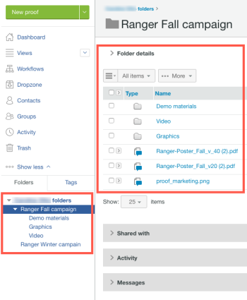

# Folders in Workfront Proof

>[!IMPORTANT]
>
>This article refers to functionality in the standalone product Workfront Proof. For information on proofing inside Adobe Workfront, see [Proofing](../../../review-and-approve-work/proofing/proofing.md).

Folders are the best way to organize your work in your Workfront Proof account. You can create a folder structure to mirror the way folders are organized on your computer, with separate folder structures for each client, job or campaign.

Advantages of using folders include the following:

* **Limiting access to confidential client data**: If you don't want some of your users to see some of your proofs, you can make the folders where they are stored private. For more information, see [Understand Folder Permissions in Workfront Proof](../../../workfront-proof/wp-work-proofsfiles/organize-your-work/folder-permissions.md).

* **Performing bulk actions on proofs and files**: You can conveniently manage proofs and files grouped into folders, by performing&nbsp;bulk actions on them. For example, you can share multiple items in one action. For more information, see [Manage Folders and their Contents in Workfront Proof](../../../workfront-proof/wp-work-proofsfiles/organize-your-work/manage-folders-and-contents.md).

* **Sharing folders with other Workfront Proof users**: When you share a folder, it appears in the other user's sidebar and they have Read Only access to all items in the folder. If you are closely cooperating with another Workfront Proof account, it may be a good idea to set up a Partner relationship between your Workfront Proof accounts. This way, you will be able to share your folders with the whole company all at once, which means that the folders will be automatically shared with new users from the Partner account.&nbsp;For more information, see&nbsp; [Share Folders in Workfront Proof](../../../workfront-proof/wp-work-proofsfiles/organize-your-work/share-folders.md).

* **Group proofs that you want to work on together or that you want reviewers to work on together**: When you or another reviewer opens one of the proofs, launching the proofing viewer, all of the proofs in the folder are also available there. Without leaving the proofing viewer, you can view the other proofs, sort and search for them, and compare them to each other. For more information, see "Working with Multiple Proofs in the proofing viewer."

You can create your folders one by one. For more information, see&nbsp; [Create Folders in Workfront Proof](../../../workfront-proof/wp-work-proofsfiles/organize-your-work/create-folders.md).
