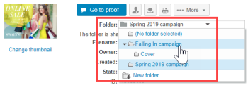
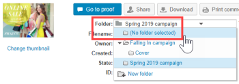

# Manage Folders and their Contents in [!DNL Workfront Proof]

>[!IMPORTANT]
>
>This article refers to functionality in the standalone product [!DNL Workfront Proof]. For information on proofing inside [!DNL Adobe Workfront], see [Proofing](../../../review-and-approve-work/proofing/proofing.md).

One of the benefits of organizing your projects and proofs into folders is the ability to manage them on the [!UICONTROL Folder details] page. This page is a control center for your project, from here you can conveniently manage individual proofs and files as well as perform bulk actions.

## Grouping Items So Reviewers Can Work On Them Together

You can use folders to group proofs that you want reviewers to work on together. When a reviewer opens one of the proofs in the folder to launch the proofing viewer, all the other proofs in the folder are available—the reviewer can work on any proof in the folder without leaving the proofing viewer. For more information, see [Work with multiple proofs in the proofing viewer](../../../workfront-proof/wp-work-proofsfiles/review-proofs-wpv/work-with-multiple-proofs.md).

## Adding New Items to a Folder

When you are creating a proof or uploading a file, you can select the folder where you want to store it in the [!UICONTROL Organize] section on the [!UICONTROL New proof] page or the [!UICONTROL New file] page.

For more information, see [Generate Proofs in [!DNL Workfront Proof]](../../../workfront-proof/wp-work-proofsfiles/create-proofs-and-files/generate-proofs.md) or [Upload Files and Web Content to [!DNL Workfront Proof]](../../../workfront-proof/wp-work-proofsfiles/create-proofs-and-files/upload-files-web-content.md).

>[!NOTE]
>
>If you are currently viewing the folder to which you would like to add a new item, that folder appears automatically in the [!UICONTROL Organize] section when you open the New proof page or the [!UICONTROL New file] page.

## Adding Existing Items to a Folder

You can add an existing file or proof to a folder.

For more information, see [Manage Files in [!DNL Workfront Proof]](../../../workfront-proof/wp-work-proofsfiles/manage-your-work/manage-files.md) or [Manage Proof Details in Workfront Proof](../../../workfront-proof/wp-work-proofsfiles/manage-your-work/manage-proof-details.md).

1. (Conditional) Do one of the following:

   * If you are adding a proof to a folder, go to the [!UICONTROL Proof details] page as described in [[!UICONTROL Manage Proof Details] in [!DNL Workfront Proof]](../../../workfront-proof/wp-work-proofsfiles/manage-your-work/manage-proof-details.md)
   * If you are adding a file to a folder, go to the File details page as described in [Manage Files in [!DNL Workfront Proof]](../../../workfront-proof/wp-work-proofsfiles/manage-your-work/manage-files.md)."

1. Click the name of the **Folder** where the file or proof is located, then click the name of the folder where you want to move it.\
   

## Moving Items Out of a Folder

1. (Conditional) Do one of the following:

   * If you are moving a proof out of a folder, go to the [!UICONTROL Proof details] page as described in [[!UICONTROL Manage Proof Details] in [!DNL Workfront Proof]](../../../workfront-proof/wp-work-proofsfiles/manage-your-work/manage-proof-details.md)\

      Or\
      If you are moving a file out of a folder, go to the File details page as described in [Manage Files in [!DNL Workfront Proof]](../../../workfront-proof/wp-work-proofsfiles/manage-your-work/manage-files.md)."

1. Click the name of the **Folder** where the file or proof is located, then click **[!UICONTROL Move to]** > **[!UICONTROL (No folder selected)]**.\
   

## Managing A Folder and Its Items on the [!UICONTROL Folder Details] Page

You can easily manage your files from the [!UICONTROL Folder details] page.

>[!NOTE]
>
>If you are not the creator or owner of the file, the options available will depend on your user [Proof Permissions Profiles in [!DNL Workfront Proof]](../../../workfront-proof/wp-acct-admin/account-settings/proof-perm-profiles-in-wp.md).

1. On the **[!UICONTROL Folders]** tab in the left navigation menu, click any folder to open the [!UICONTROL Folder details] page.
1. If the folder contains only archived proofs, a message displays in yellow at the top of the page. If you click the link in the message, the folder view changes to the [!UICONTROL Archived proofs] view.
1. Click **[!UICONTROL Folder details]**, then do any of the following with the folder using the options that appear:

   * Add or change the thumbnail image for the folder.
   * View or edit the **Description**, **Parent folder**, **Owner**, **Client**, or **Project** associated with the folder.

   * Make the folder **Private**.
   * See when the folder was **Created**.
   * See the name of the folder's **Creator**.

1. (Optional)To change information associated with an item in the folder, click the **[!UICONTROL More]** icon to the right of the item, then use any of the options that appear.\
   \
   The options that appear depend on whether the item is a proof or a file.

   * **[!UICONTROL View proof details]** or **[!UICONTROL View file details]**: Opens the Proof details or File details page. For more information, see [Manage Files in [!DNL Workfront Proof]](../../../workfront-proof/wp-work-proofsfiles/manage-your-work/manage-files.md) or [Manage Proof Details in [!DNL Workfront Proof]](../../../workfront-proof/wp-work-proofsfiles/manage-your-work/manage-proof-details.md).

   * **[!UICONTROL Share]**: Lets you share the file with additional people. For more information, see [Share Files in [!UICONTROL Workfront Proof]](../../../workfront-proof/wp-work-proofsfiles/share-proofs-and-files/share-files.md).

   * **[!UICONTROL Message]**: Send an email to the people with whom the proof has been shared.
   * **[!UICONTROL New Version]**: Create a new version of the proof.
   * **[!UICONTROL Copy]**: Copy the proof with any proofing comments as a new version of an existing proof or as a new proof.
   * **[!UICONTROL Download original]**: Lets you download the original file. For more information, see [Download Files Stored in [!DNL Workfront Proof]](../../../workfront-proof/wp-work-proofsfiles/manage-your-work/download-files-stored.md).

   * **[!UICONTROL Delegate ownership]**: Delegate ownership of the proof to another user.
   * **[!UICONTROL Share proof links]**: Send an email containing a link to the proof.
   * **[!UICONTROL Print comments]**: Print the comments reviewers have made on the proof.
   * **[!UICONTROL Excel summary]**: Create an Excel file containing the print summary for the proof.
   * **[!UICONTROL Lock]**: Lock the proof so no other users can open it.
   * **[!UICONTROL Delete]**: Deletes the file from [!DNL Workfront] Proof.

1. (Optional) In the **[!UICONTROL Shared with]** section, to send a reminder to a reviewer on the proof, click the **[!UICONTROL More]** icon to the right of the user's name, then click **[!UICONTROL Message]**.\
   You can click **[!UICONTROL Remove]** to unshare the folder with the person.\
   Owners and creators of folders always appear on this list and are not be removable. If a user takes over the ownership of a folder, they automatically appear and are not be removable.\
   You can share a folder with individual users and Partner companies. If the folder is shared with a Partner company, you can see the full list of recipients by clicking the [!UICONTROL information] icon which appears when hovering over the row. For more information, see [Partner Accounts.](https://support.workfront.com/hc/en-us/sections/115000912107-Partner-accounts)

1. (Optional) Edit the Manager's permissions on private folders by clicking on that person's line under **[!UICONTROL Allow on folder]**, then specifying if you want the person to be able to create, edit and delete items from that folder. **NOTE** This option is available only for Managers from the same account as the folder owner who are added to private folders. Supervisors, Administrators and Billing Administrators have edit rights over all folders in the account and Observers cannot create any items. For information about permissions, see the [Proof Permissions Profiles in [!DNL Workfront Proof]](../../../workfront-proof/wp-acct-admin/account-settings/proof-perm-profiles-in-wp.md).

1. (Optional) Click **[!UICONTROL Activity]** to view all actions performed in the folder in chronological order.
1. (Optional) Click **[!UICONTROL Messages]** section to view the messages that have been sent to users on the folder.\
   When you hover over a message, you can click the **i** icon to the right to view the full message.\
   \
   A pop up with the full email displays:\
   

## Managing Sub-Folders

You can manage the sub-folders from the Folders detail page.

1. On the **[!UICONTROL Folders]** tab in the left navigation menu, click the name of the parent folder that contains the sub-folder to open the **[!UICONTROL Folder details]** page.

1. Click the **[!UICONTROL More]** menu to the right of the sub-folder.\
   

1. Click any of the following:

   * **[!UICONTROL View folder details]**: Opens the [!UICONTROL Folder details] page.
   * **[!UICONTROL New proof]**: Lets you add a new proof to the sub-folder.
   * **[!UICONTROL Upload file]**: Lets you upload a file to the sub-folder.
   * **[!UICONTROL New sub-folder]**: Creates a new sub-folder inside the sub-folder.
   * **[!UICONTROL Share]**: Lets you share the sub-folder with other users.
   * **[!UICONTROL Excel summary]**: Lets you request an Excel summary of the sub-folder.
   * **[!UICONTROL Delete]**: Lets you delete the sub-folder.
