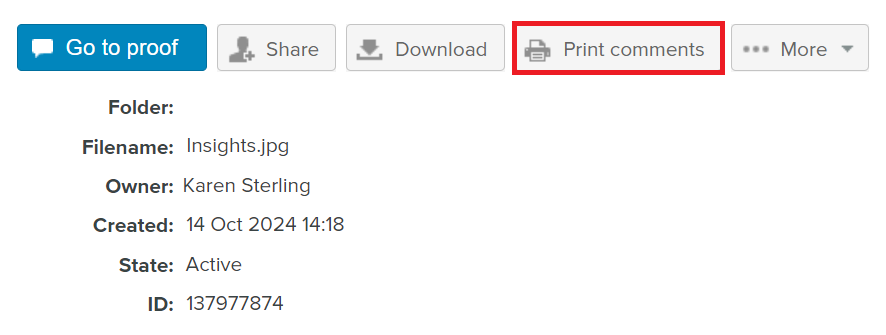
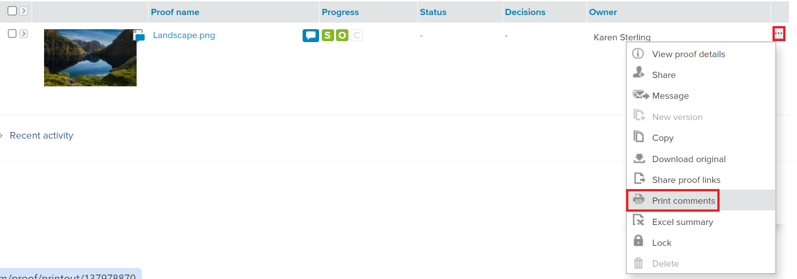
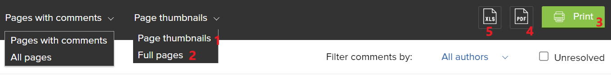
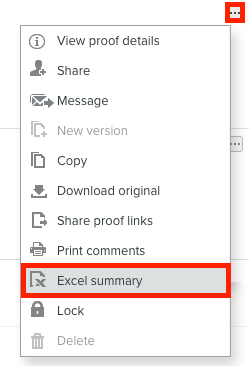

# Print and Export Comments in [!DNL Workfront Proof]

<!-- Audited: 4/2025 -->

>[!IMPORTANT]
>
>This article refers to functionality in the standalone product [!DNL Workfront Proof]. For information on proofing inside [!DNL Adobe Workfront], see [Proofing](../../../review-and-approve-work/proofing/proofing.md).

## Printing Comments

The Comments summary can be accessed directly from the following areas:

* [The Proof Viewer](#the-proof-viewer)
* [The Proof Details Page](#the-proof-details-page)
* [The [!DNL Proof] Actions Menu](#the-proof-actions-menu)

### The Proof Viewer {#the-proof-viewer}

You can print the proof's Comments summary, including the thumbnails or full-view image of the proof, by clicking on the **[!UICONTROL Print]** icon in the Proof Viewer.

To access the Proof Viewer, click the **Go to proof** button from the Proof details page.

### The Proof Details Page {#the-proof-details-page}

You can print the proof's comment summary by clicking the **[!UICONTROL Print]** icon on the Proof details page.

To access the Proof details page for a specific proof, click the proof's name from the list view.

### The [!DNL Proof] Actions Menu {#the-proof-actions-menu}

You can print the proof's comment summary by clicking the **[!UICONTROL Print]** icon in the [!UICONTROL Proof actions] menu.

To access the [!UICONTROL Comments Summary] page from a list view:

1. Click the **[!UICONTROL Actions]** menu.
1. Select **[!UICONTROL Print comments]**.

   

   On the Comments summary page, select from the following print options:

   * Thumbnail view (1)
   * Full page view (2)
   * Print the page (3)
   * Export the proof with comments to a PDF file (4)
   * Export the proof comments to an [!DNL Excel] file (5)

### Thumbnail View

The Thumbnail view shows each comment in order with the full thread for each comment. You can also sort comments and see the thumbnail for each comment with markups added.

To print the thumbnail view, click the **[!UICONTROL Printer]** icon in the top-right corner of the page and select one of the following:

* Sort by comment ID or page (1)
* Thumbnail for each comment with markups added (2)

### Full-Page View

The full-page view shows each page in order with the comments on that page and a pin indicating where the comment is located.

To print the full page view, click the **[!UICONTROL Printer]** icon in the top-right corner of the page.

## Exporting an [!DNL Excel] Summary

To export the [!DNL Excel] summary from the Proof actions menu:

1. Click the **Actions** icon to the right of the proof, then select **[!UICONTROL [!DNL Excel] summary]**. 
   

To download the [!DNL Excel] summary from the Proof details page:

1. Click the **More** button, then select **Export to Excel**.

   <!--
    -->

## Exporting to PDF

When you export to a PDF file, all comments will appear in the PDF reader. If a comment has multiple markups associated with it, the comment will appear multiple times in the comments list (once for each markup).

>[!IMPORTANT]
>
>The Export to PDF function is available only for static files.

To export a proof with its markups and comments to PDF:

1. On the left side of the screen, click **[!UICONTROL Views]**.
1. Click the **[!UICONTROL More]** button in-line with the specific proof, then select **[!UICONTROL Print comments]**.

1. In the top-right corner of the page, click the **Export to PDF** button. The PDF begins downloading and will be emailed to you once it's complete.
