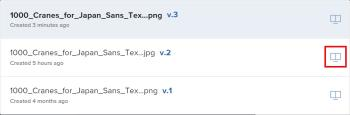
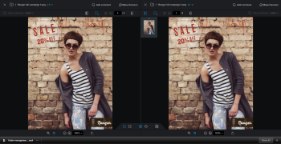
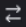

# Compare proofs in the proofing viewer

>[!IMPORTANT]
>
>This article refers to functionality in the standalone product [!DNL Workfront Proof]. For information on proofing inside [!DNL Adobe Workfront], see [Proofing](../../../review-and-approve-work/proofing/proofing.md).

You can view side-by-side comparisons of two proofs. These can be two versions of the same proof, or two completely separate proofs.

## Compare proof versions {#compare-proof-versions}

1. Open the proof that has multiple versions you want to compare.
1. In the upper-left corner of the proofing viewer that displays, click the name of the proof. Then, in the list of versions that appears, click the **Compare** icon next to the version you want to open and compare.

   

   The proofs display side by side, with the newer version on the left side.

   <!--
   
Separate breadcrumbs above each proof allow you to view and go to the work item associated with the proof:

   -->

   <!--
   
  

   -->

1. Continue with [Use the compare tools](#use-the-compare-tools).

## Compare separate proofs {#compare-separate-proofs}

You can compare two separate proofs.

* [Compare separate proofs in [!DNL Workfront]](#compare-separate-proofs-in-workfront)
* [Compare separate proofs in [!DNL Workfront Proof]](#compare-separate-proofs-in-workfront-proof)

### Compare separate proofs in [!DNL Workfront] {#compare-separate-proofs-in-workfront}

For information about comparing separate proofs from the document list within [!DNL Workfront], see the [Compare two different proofs](../../../review-and-approve-work/proofing/reviewing-proofs-within-workfront/review-a-proof/compare-proofs.md#comparing-two-proofs-from-a-document-list) section in the [Compare proofs](../../../review-and-approve-work/proofing/reviewing-proofs-within-workfront/review-a-proof/compare-proofs.md) article.

### Compare separate proofs in [!DNL Workfront Proof] {#compare-separate-proofs-in-workfront-proof}

>[!NOTE]
>
>The proofs you compare must be located in the same folder and at the same level of hierarchy within the folder structure. For more information about using folders to group proofs you want to compare, see [Work with multiple proofs in the proofing viewer](../../../workfront-proof/wp-work-proofsfiles/review-proofs-wpv/work-with-multiple-proofs.md)

1. Open one of the proofs you want to compare in the proofing viewer.
1. Click the **[!UICONTROL Compare Mode]** icon.

   \
   The viewing area splits in half and the proof displays both on the left and on the right side of the proofing viewer.

   

1. Click the [!UICONTROL folder] icon above the proof either on the left or the right side to list the other proofs within the same folder.

   

1. In the list, click the name of the proof that you want to compare with the proof currently open in the proofing viewer.

   

   Both proofs appear.

1. Continue with [Use the compare tools](#use-the-compare-tools).

## Use the compare tools {#use-the-compare-tools}

The proofing viewer provides various tools for comparing proofs effectively and efficiently.

* [Auto-compare proofs](#auto-compare-proofs)
* [Compare proofs in an overlay](#compare-proofs-in-an-overlay)
* [Simultaneous navigation comparison](#simultaneous-navigation-comparison)

### Auto-compare proofs {#auto-compare-proofs}

Auto-compare does a pixel-by-pixel comparison between two static or video proofs. Any differences detected are highlighted in red in the proof on the left.

Auto-compare is not available when you are comparing interactive proofs.

To auto-compare two proofs:

1. Begin comparing proofs in either of the following ways:

   * Compare two versions of the same proof (see [Compare proof versions](#compare-proof-versions) in this article).
   * Compare two separate proofs (see [Compare separate proofs](#compare-separate-proofs) in this article).

1. Click the **[!UICONTROL Autocompare]** icon.

   

   Any differences between the two proofs are highlighted in red in the proof on the left.

1. (Optional) Click the **[!UICONTROL Switch]** icon to change the active side so that differences are shown on the proof on the right side. By default, differences are shown on the proof on the left side.

   

1. (Optional) Click the **[!UICONTROL Color]** icon to change the color and opacity used when to highlight differences.

   

### Compare proofs in an overlay {#compare-proofs-in-an-overlay}

Overlay comparison enables you to view differences between two static proofs by viewing the two proofs as a single proof, while providing a vertical divider down the center of the proof. As you pan the proof across the vertical divider, the differences are displayed.

>[!NOTE]
>
>Overlay comparison is not available when you are comparing video or interactive proofs.

To enable overlay comparison:

1. Begin comparing proofs in either of the following ways:

   * Compare two versions of the same proof (see [Compare proof versions](#compare-proof-versions) in this article).
   * Compare two separate proofs (see [Compare separate proofs](#compare-separate-proofs) in this article).

1. Click the **[!UICONTROL Overlay]** icon.

   

   The two proofs are displayed as a single proof, with a vertical divider down the center of the proof.

1. Do either of the following:

   * Pan the proof across the vertical divider. As you pan, you see the proof on the left on the left side of the vertical divider, while the proof on the right is displayed on the right side.
   * Move the vertical divider to the left and right. As you move the divider, you see the proof on the left on the left side of the vertical divider, while the proof on the right is displayed on the right side.

### Simultaneous navigation comparison {#simultaneous-navigation-comparison}

Simultaneous navigation is enabled by default when comparing proofs. It is available when comparing a static proof and a static proof, or when comparing a video proof and video proof. It is not available when comparing a static proof and a video proof.

**Static proofs:** When enabled on static proofs, simultaneous navigation locks the zoom level and position of the two proofs when panning or scrolling. When a proof contains multiple pages and simultaneous navigation is enabled, changing pages in one proof results in the page changing in the other proof.

**Video proofs:** When enabled on video proofs, simultaneous navigation remembers the time difference on the timelines of the two proofs.

To enable simultaneous navigation if it is not already enabled:

1. Begin comparing proofs in either of the following ways:

   * Compare two versions of the same proof (see [Compare proof versions](#compare-proof-versions) in this article).
   * Compare two separate proofs (see [Compare separate proofs](#compare-separate-proofs) in this article).

1. Click the **[!UICONTROL Simultaneous Navigation]** icon.

   

1. (Optional) Click the **[!UICONTROL Reset]** icon at any time to reset the zoom level and position (for static proof) or the timeline (for video proofs).

   

## Exit compare mode

1. Close the proof that you no longer want to view by clicking the (x) icon in the upper-left corner of the proof.

   

   The proof that you do not close remains open in the proofing viewer.
