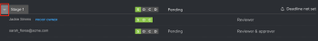

# Review a Workflow in the proofing viewer

>[!IMPORTANT]
>
>This article refers to functionality in the standalone product [!DNL Workfront Proof]. For information on proofing inside [!DNL Adobe Workfront], see [Proofing](../../../review-and-approve-work/proofing/proofing.md).

The [!UICONTROL Workflow] panel displays the workflow of your proof as it appears on the Proof Details page and in your email notifications.\
For more information about proof details, see [Manage Proof Details in [!DNL Workfront Proof]](../../../workfront-proof/wp-work-proofsfiles/manage-your-work/manage-proof-details.md).\
All assigned reviewers, including users and guests, can view the [!UICONTROL Workflow] panel.

To access the [!UICONTROL Workflow] panel:

1. If the left icon menu is not displayed, click the **[!UICONTROL Menu]** icon in the upper-left corner of the proofing viewer.

   

1. Click the **[!UICONTROL Workflow]** icon.

   The **[!UICONTROL Workflow]** panel appears.

   

   Each section on the Workflow panel shows the progress and status of the proof, stages, and reviewers.

   * View the overall **Proof Status** as determined by decisions and actions made on the proof by all reviewers in every stage.

      

   * Click the drop-down arrow next to individual stages to view stage progress, status, deadline, and reviewer information.

      

   * Within each stage, view a list of reviewers and their proof roles specific to the stage as well as the progress and status of each individual reviewer.

      

      For more information about understanding the progress and status of a proof, see [View the Progress and Status of a Proof in [!DNL Workfront Proof]](../../../workfront-proof/wp-work-proofsfiles/manage-your-work/view-progress-and-status-of-proof.md).
