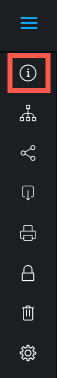

# View activity on a proof in the proofing viewer

>[!IMPORTANT]
>
>This article refers to functionality in the standalone product [!DNL Workfront Proof]. For information on proofing inside [!DNL Adobe Workfront], see [Proofing](../../../review-and-approve-work/proofing/proofing.md).

You can view the recent activity for a given proof. This includes all activity and decisions made by any user assigned to the proof. 

1. If the left toolbar is not displayed, click the **[!UICONTROL Menu]** icon on the upper-left corner of the proofing viewer.

   

1. In the toolbar on the left of the proofing viewer, click the **[!UICONTROL Proof Details]** button.

   

1. On the **[!UICONTROL Proof Details]** page that appears, with **[!UICONTROL Proof Details]** selected, view the proof's details, status, and progress.

1. For information about proof state, see [Understand Proof State in [!DNL Workfront Proof]](../../../workfront-proof/wp-work-proofsfiles/manage-your-work/proof-state.md).

1. For information about proof progress, see [View the Progress and Status of a Proof in [!DNL Workfront Proof]](../../../workfront-proof/wp-work-proofsfiles/manage-your-work/view-progress-and-status-of-proof.md).
1. Click **[!UICONTROL Proof activity]** to view the following information:

   * **Date**: The time and date the action took place.
   * **Action**: The action that occurred on the proof.
   * **Details**: The user who performed the action.
