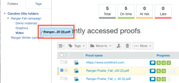
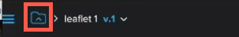

# Work with multiple proofs in the proofing viewer

>[!IMPORTANT]
>
>This article refers to functionality in the standalone product [!DNL Workfront Proof]. For information on proofing inside [!DNL Adobe Workfront], see [Proofing](../../../review-and-approve-work/proofing/proofing.md).

In [!DNL Workfront Proof], you can use folders to group proofs that you want to work on together or that you want reviewers to work on together. When you or another reviewer opens one of the proofs, launching the proofing viewer, all of the proofs in the folder are also available there. Without leaving the proofing viewer, you can view the other proofs, sort and search for them, and compare them to each other.

For general information about folders, see [Folders in [!DNL Workfront Proof]](../../../workfront-proof/wp-work-proofsfiles/organize-your-work/folders.md).

>[!NOTE]
>
>A reviewer's ability to open any proof in a folder depends on their access to the proof. For information about access to proofs, see [Generate Proofs in [!DNL Workfront Proof]](../../../workfront-proof/wp-work-proofsfiles/create-proofs-and-files/generate-proofs.md).

## Group proofs in a folder

1. In Workfront Proof (outside the proofing viewer), create a folder, as described in [Create Folders in [!DNL Workfront Proof]](../../../workfront-proof/wp-work-proofsfiles/organize-your-work/create-folders.md).
1. In the dashboard or a list view, group the proofs you want to work on together by dragging them into the folder you created.

   

## Review multiple proofs grouped in a folder

As a reviewer, you can work with multiple proofs in a folder without leaving the proofing viewer.

1. In [!DNL Workfront Proof], click the name of the folder to open it, then open a proof in the folder to launch the proofing viewer.

   Or

   Open a proof from a public URL or from an email notification, logging in to the system as required.

1. Click the folder icon in the upper-left corner of your proofing viewer.

   

   This opens the folder containing the current proof and the other proofs you added to it.

   

1. (Optional) Do any of the following with the proofs in the folder while you are using the proofing viewer:

   * To search the folder for the proof you want, click the **[!UICONTROL Search]** box in the upper-right corner above the list and start typing part of the name of the proof, then click the proof when it appears.
   * To sort the proofs by contents of a column, click **[!UICONTROL Name]**, **[!UICONTROL Created]**, **[!UICONTROL Status]**, or **[!UICONTROL Owner]** above the list. 

   * To compare two proofs in the folder, open one proof, then select the other one in the folder list and click the [!UICONTROL Compare] button on the far right of that proof (see [Compare proofs in the proofing viewer](../../../workfront-proof/wp-work-proofsfiles/review-proofs-wpv/compare-proofs.md) if you need more information about comparing two proofs).

      

      While you are comparing proofs, if you want to switch to a new proof, either on the left or right side of the proofing viewer, click the [!UICONTROL Compare] button above the proof.

      
