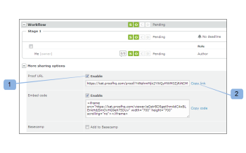

# Create a Mini proof in Workfront Proof

>[!IMPORTANT]
>
>This article refers to functionality in the standalone product Workfront Proof. For information on proofing inside Adobe Workfront, see [Proofing](../../../review-and-approve-work/proofing/proofing.md).

The Miniproof is a widget that lets you embed a proof in a web page, blog, or wiki.

The Miniproof shows the proof and all existing comments&nbsp;and mark-ups. You can work on the proof as if you were in Workfront Proof.

Here is an example of a Miniproof embedded in a Basecamp project:&nbsp;

* Name of the proof (1)
* Fullscreen (2): Opens the proof in the Proof Viewer (outside of the environment where the Miniproof was embedded)
* Help links (3)
* Actions menu (4)
* View comments in sidebar (5)

To embed a miniproof in a website, blog or wiki:

1. Go to the **Proof details** page of a proof, as described in [Manage Proof Details in Workfront Proof](../../../workfront-proof/wp-work-proofsfiles/manage-your-work/manage-proof-details.md).

1. Open the **More sharing options** section of the page
1. Ensure the embed code is enabled (1).
1. Click on the Copy code link (2) to copy the embed code to your clipboard.
1. Paste the code into the website, blog, or wiki you are working on to embed the Miniproof.

