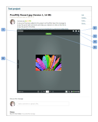

# Embed a Mini proof

>[!IMPORTANT]
>
>This article refers to functionality in the standalone product [!DNL Workfront Proof]. For information on proofing inside [!DNL Adobe Workfront], see [Proofing](../../../review-and-approve-work/proofing/proofing.md).

The Miniproof is a widget that lets you embed a proof in a web page, blog, or wiki. The Miniproof shows the proof and all existing comments and mark-ups. You can use it to work on the proof as if you were in [!DNL Workfront Proof].

Here is an example of a Miniproof embedded in a Basecamp project:

* Name of the proof (1)
* Fullscreen (2) - it will open the proof in the Proof Viewer (outside of the environment the Miniproof was embedded in)
* Help links (3)
* Actions menu (4)
* View comments in sidebar (5)

To embed a Miniproof in a web page, blog, or wiki:

1. Go to the **[!UICONTROL Proof details]** page of a proof (see "The Proof Details Page" in [Manage Proof Details in [!DNL Workfront Proof]](../../../workfront-proof/wp-work-proofsfiles/manage-your-work/manage-proof-details.md)).

1. Click **[!UICONTROL More sharing options]** to expand that section.
1. Next to **[!UICONTROL Embed code]**, make sure **[!UICONTROL Enable]** is selected.

1. Click **[!UICONTROL Copy code]** to copy the embed code to your clipboard.
1. Paste the code into the website, blog, or wiki where you want to embed the Miniproof.
