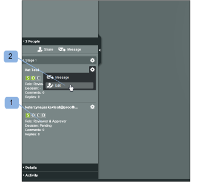
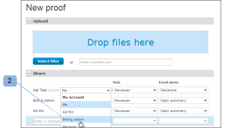

# Manage Proof Roles in [!DNL Workfront Proof]

<!-- Audited: 01/2024 -->

>[!IMPORTANT]
>
>This article refers to functionality in the standalone product [!DNL Workfront Proof]. For information on proofing inside [!DNL Adobe Workfront], see [Proofing](../../../review-and-approve-work/proofing/proofing.md).

Proof roles enable you to grant permissions to users who are limited by the permission profile that is configured on their user profile. (For more information about permission profiles, see [Proof Permissions Profiles in [!DNL Workfront Proof]](../../../workfront-proof/wp-acct-admin/account-settings/proof-perm-profiles-in-wp.md).)

Proof roles are different from account profiles. Your account profile relates to the overall permission level you have in your account and will affect the rights you have over all proofs in your account, even those which have not explicitly been shared with you.

For more information, see [Proof Permissions Profiles in [!DNL Workfront Proof]](../../../workfront-proof/wp-acct-admin/account-settings/proof-perm-profiles-in-wp.md).

## About Proof Roles

The following proof roles are granted to users for an individual proof at the time the user is invited to review the proof:

* [Read Only](#read-only)
* [Reviewer](#reviewer)
* [Approver](#approver)
* [Reviewer & Approver](#reviewer-approver)
* [Author](#author)
* [Moderator](#moderator)

The proof role defines what actions a reviewer can take in relation to that specific proof.

For example, if you are a Reviewer, you are being asked to review the proof by adding markups and comments. If you are a Reviewer & Approver, you are being asked to review and also make a decision on the proof.

Certain proof roles give a reviewer edit rights on the proof (even if their account profile doesn't) and lets them use some additional features like adding actions on comments, creating new versions, and adding more reviewers to the proof.

For more information, see the following articles:

* [Use actions on proof comments](../../../review-and-approve-work/proofing/reviewing-proofs-within-workfront/comment-on-a-proof/use-actions-on-comments-in-viewer.md)
* [Share a Proof in [!DNL Workfront Proof]](../../../workfront-proof/wp-work-proofsfiles/share-proofs-and-files/share-proof.md)

### Read Only

{#read-only}

 Can view a proof

 Cannot add markups

 Cannot add comments

 Cannot make a decision

 Cannot delete comments made by others

 Does not have edit rights on the proof

>[!NOTE]
>
>If a folder is shared with a user of [!DNL Workfront Proof], they will automatically be given Read Only rights to all existing and subsequently added items in the folder.

For more information, see [Share Folders in [!DNL Workfront Proof]](../../../workfront-proof/wp-work-proofsfiles/organize-your-work/share-folders.md).

### Reviewer {#reviewer}

 Can view a proof

 Can add markups

 Can add comments

![[!DNL cleaner].png](assets/cleaner.png) Can edit own comments if there are no replies

 Cannot make a decision

 Cannot edit or delete comments made by others

 Does not have edit rights on the proof

### Approver {#approver}

 Can view a proof

 Can make a decision

 Cannot add markups

 Cannot add comments

 Cannot edit or delete comments made by others

 Does not have edit rights on the proof

### Reviewer & Approver {#reviewer-approver}

 Can view a proof

 Can add markups

 Can add comments

![[!DNL cleaner].png](assets/cleaner.png) Can edit own comments if there are no replies

 Can make a decision

 Cannot edit or delete comments made by others

 Does not have edit rights on the proof

### Author {#author}

 Can add markups

 Can add comments

![[!DNL cleaner].png](assets/cleaner.png) Can edit own comments if there are no replies

 Can make a decision

 Can submit new versions

 Can create a copy of the proof

 Can share the proof with other people

 Can apply actions on comments

 Can resolve comments

 Cannot edit or delete comments made by others

>[!NOTE]
>
>This role can only be assigned to users of [!DNL Workfront Proof].

### Moderator {#moderator}

 Can add markups

 Can add comments

![[!DNL cleaner].png](assets/cleaner.png) Can edit own comments if there are no replies

 Can make a decision

 Can submit new versions

 Can add new reviewers

 Can apply actions on comments

 Can resolve comments

 Can delete comments and replies on the proof (made by themselves or others)

* Deleting the first comment in a comment thread will delete the whole thread
* Deleting replies in the comment thread will delete that reply only

 Cannot edit comments made by others

This role allows the person to manage and moderate the proof comments, giving them the opportunity to keep only relevant comments on the proof and remove non-relevant comments.

>[!NOTE]
>
>This role can only be assigned to users of [!DNL Workfront Proof].

## Assigning Proof Roles

You can assign proof roles when creating new proofs, creating new versions of existing proofs, or on existing proofs.

### New Proofs {#new-proofs}

Proof roles can be assigned to reviewers on the [!UICONTROL New proof] page during the proof creation process (1).

### New Versions {#new-versions}

When creating a new version of a proof, the reviewers from the previous version will automatically be shown (with the same role as the previous version).

You can edit the proof roles applied to reviewers when creating the new version (1).

### Existing Proofs {#existing-proofs}

If you want to change a person's role on an existing proof, you can do so on the [!UICONTROL Proof details] page by inline editing their role in the workflow section (1).

## Checking roles in the Proof Viewer

You can check the role of a reviewer directly from the Proof Viewer (1) and edit it (2) if necessary.

## Default Proof Roles

You can set your default proof role on the [!DNL Proofing Defaults] page in your Personal settings. This means that when you are added to a proof, your default proof role will be populated automatically. Please note that this role can be changed at the proof level by a user with edit rights on a proof.

>[!NOTE]
>
>Only users with Administrator or Billing Administrator profiles can change the proofing defaults for other users in their account.

For more information, see [Personal settings in [!DNL Workfront Proof]](../../../workfront-proof/wp-getstarted/personal-settings/personal-settings.md).

## Creators and Owners

Creators and Owners have full edit rights on the proof.

### Creators {#creators}

The proof creator is the person who uploads the proof in the first instance. The proof creator will be shown automatically in the people list for the proof (in their default role).

On the [!UICONTROL New proof] page you can assign a different proof role to the proof creator (other than their default role).

The proof creator cannot be changed or removed from a proof.

### Owners {#owners}

By default, the Creator is also the Owner of the proof; however, the Creator can make someone else the proof Owner when initially creating the proof (on the [!UICONTROL New proof] page).

To change the Owner on the New proof page:

1. Click on the change link displayed next to the Creator's name.
1. Select the new Owner from the drop-down menu. (2)

Once the proof has been created, it's still possible to change the owner. Anyone with edit rights on the proof will be able to change the proof ownership to another user via the [!UICONTROL Proof details] page (see below).

The ability to change the Owner of a proof is particularly useful from a workflow management point of view. It allows the person responsible for the project to take over the ownership of proofs, giving them edit rights on the proofs and the ability to view them in the [!UICONTROL My proofs] view.

To change the Owner of the proof via the [!UICONTROL Proof details] page:

* Click on the Actions menu next to the name of the person you would like to make the Owner.
* Select [!UICONTROL **Make owner**] from the drop-down menu.
* Alternatively, you can click into the [!UICONTROL **Owner**] field next to the proof image and choose the new Owner from the drop-down displayed.

Once this is done, the word "Owner" will be displayed next to that person's name.

>[!NOTE]
>
>Only a user from the same account or a partner account can be made the owner of a proof. A user in a partner account can be made the owner of a proof only when:
>
>* There is an existing partner relationship set up between the accounts. For more information, see [Partner accounts in [!DNL Workfront Proof]](../../../workfront-proof/wp-acct-admin/partner-accounts/partner-accounts.md).
>* There are no custom fields on the [!UICONTROL New proof] page.
>* The proof has not been assigned to a folder.
>* No tags have been applied to the proof.

To temporarily delegate proof ownership within [!DNL Workfront Proof], see [Designating Temporary Proof Owners in [!DNL Workfront Proof]](../../../workfront-proof/wp-getstarted/personal-settings/designate-temp-proof-owners.md).
