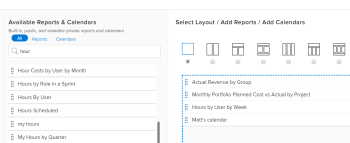

# Create a dashboard

You can create dashboards to quickly access information in reports, calendars, and external pages.

To learn more about dashboards, see [Get started with dashboards](../../../reports-and-dashboards/dashboards/understanding-dashboards/get-started-dashboards.md).

## Access requirements

You must have the following:

<table cellspacing="15"> 
 <caption style="text-align: left;">
  *To find out what plan, license type, or access you have, contact your <em>Workfront administrator</em>.
 </caption> 
 <col> 
 </col> 
 <col> 
 </col> 
 <tbody> 
  <tr> 
   <td> 
<em>Adobe Workfront</em> plan*
 </td> 
   <td>Any</td> 
  </tr> 
  <tr> 
   <td> 
<em>Workfront</em> license*
 </td> 
   <td> 
<em>Plan</em> 
 </td> 
  </tr> 
  <tr> 
   <td>Access level configurations* </td> 
   <td> 
Edit access to Reports, Dashboards, and Calendars
 
Note: If you still don't have access, ask your <em>Workfront administrator</em> if they set additional restrictions in your access level. For information on how a <em>Workfront administrator</em> can change your access level, see <a href="../../../administration-and-setup/add-users/configure-and-grant-access/create-modify-access-levels.md" class="MCXref xref">Create or modify custom access levels</a>.
 </td> 
  </tr> 
  <tr> 
   <td> 
Object permissions 
 </td> 
   <td> 
You will obtain Manage permissions to the new dashboard
 
For information on requesting additional access, see <a href="../../../workfront-basics/grant-and-request-access-to-objects/request-access.md" class="MCXref xref">Request access to objects in Adobe Workfront</a>. For more information on permissions for dashboards, see <a href="../../../workfront-basics/grant-and-request-access-to-objects/permissions-reports-dashboards-calendars.md" class="MCXref xref">Share reports, dashboards, and calendars in Adobe Workfront</a>.
 </td> 
  </tr> 
 </tbody> 
</table>

## Prerequisites

You must create any of the following objects before you can add them to a dashboard:

* `Reports`: For information on creating reports, see [Create a custom report](../../../reports-and-dashboards/reports/creating-and-managing-reports/create-custom-report.md).

* `Calendars`: For information on creating calendars, see [Calendar reports overview](../../../reports-and-dashboards/reports/calendars/calendar-reports-overview.md).

* `External pages`: For information on creating external pages, see [Embed an external web page in a dashboard](../../../reports-and-dashboards/dashboards/creating-and-managing-dashboards/embed-external-web-page-dashboard.md).

## Create a dashboard

<!--

To see a video of this process, see [link to video below/in new tab/in Video gallery].

-->

To see a video of this process, see [link to video below/in new tab/in Video gallery].

<ol> 
 <li value="1"> 
 <draft-comment>
    <MadCap:conditionalText data-mc-conditions="QuicksilverOrClassic.Quicksilver">
     Click the Main Menu icon 
     , then click 
     Dashboards.
    </MadCap:conditionalText>
   </draft-comment><MadCap:conditionalText data-mc-conditions="QuicksilverOrClassic.Quicksilver">
    Click the Main Menu icon 
    , then click 
    Dashboards.
   </MadCap:conditionalText> 
 </li> 
 <li value="2">Click New Dashboard. The New Dashboard dialog box displays.</li> 
 <li value="3">Specify the following: 
  <table cellspacing="0">
   <col>
   <col>
   <tbody>
    <tr>
     <td role="rowheader">Name</td>
     <td>
This is the name of your dashboard.

If you do not specify a name, the name of the first report on the dashboard becomes the name of the dashboard, by default.
</td>
    </tr>
    <tr>
     <td role="rowheader">Description (Optional)</td>
     <td>This is a description of your dashboard.</td>
    </tr>
   </tbody>
  </table></li> 
 <li value="4"> 
Select a layout by clicking the radio button corresponding to it.
 
The single-column layout is the default.
 
For information about report layout on dashboards, see <a href="../../../reports-and-dashboards/dashboards/understanding-dashboards/understand-how-reports-display-dashboard.md" class="MCXref xref">Understand how reports display on a dashboard</a>.
 </li> 
 <li value="5"> 
Add existing reports, calendars, or external pages by searching for them in the Search by name or type ... field, then dragging them to the layout pane, when they appear in the list.
 <note type="note">
   When searching for an item, the search returns any of the 2,000 most recently created reports. Report names that include unicode characters are not returned in search results. As a best practice, avoid including unicode characters when naming objects in 
   <em>Workfront</em> by typing names rather than copying and pasting names from another source. 
  </note> 
 <draft-comment>
    
   </draft-comment> 
 </li> 
 <li value="6">(Optional) Click Add External Page to add an External Page to the dashboard.  For more information about creating external pages and embedding them into dashboards, see <a href="../../../reports-and-dashboards/dashboards/creating-and-managing-dashboards/embed-external-web-page-dashboard.md" class="MCXref xref">Embed an external web page in a dashboard</a>.</li> 
 <li value="7">Click Save + Close. A timestamp is displayed in the upper-right corner of the dashboard. The timestamp includes the date, time, and time zone when the dashboard was last refreshed.</li> 
</ol>

<!--
<h2 data-mc-conditions="QuicksilverOrClassic.Draft mode">Video walk-through</h2>
-->

## Video walk-through

This video was recorded in *[the new Workfront experience or Workfront Classic]*. However, the content also applies to *[the new Workfront experience or Workfront Classic]*.

<!--

Add link to this video: 

-->

Add link to this video: 

<!--

For more in-depth training on reports and dashboards, see [Learning Path for reports and dashboards].

-->

For more in-depth training on reports and dashboards, see [Learning Path for reports and dashboards].
