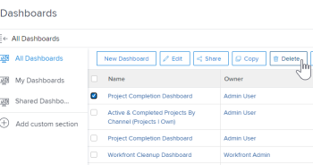
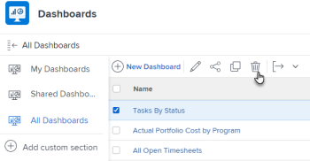

# Delete a dashboard {#delete-a-dashboard}

The highlighted information on this page refers to functionality not yet generally available. It is available only in the Preview Sandbox environment.

If you no longer have use for a dashboard, you can remove it from *`Adobe Workfront`*.

## Access requirements {#access-requirements}

You must have the following:

<table style="width: 100%;margin-left: 0;margin-right: auto;mc-table-style: url('../../../Resources/TableStyles/TableStyle-List-options-in-steps.css');" class="TableStyle-TableStyle-List-options-in-steps" cellspacing="0"> 
 <col class="TableStyle-TableStyle-List-options-in-steps-Column-Column1"> 
 <col class="TableStyle-TableStyle-List-options-in-steps-Column-Column2"> 
 <tbody> 
  <tr class="TableStyle-TableStyle-List-options-in-steps-Body-LightGray"> 
   <td class="TableStyle-TableStyle-List-options-in-steps-BodyE-Column1-LightGray" role="rowheader">Adobe Workfront plan*</td> 
   <td class="TableStyle-TableStyle-List-options-in-steps-BodyD-Column2-LightGray"> 
Any
 </td> 
  </tr> 
  <tr class="TableStyle-TableStyle-List-options-in-steps-Body-MediumGray"> 
   <td class="TableStyle-TableStyle-List-options-in-steps-BodyE-Column1-MediumGray" role="rowheader">Adobe Workfront license*</td> 
   <td class="TableStyle-TableStyle-List-options-in-steps-BodyD-Column2-MediumGray"> 
Plan 
 </td> 
  </tr> 
  <tr class="TableStyle-TableStyle-List-options-in-steps-Body-LightGray"> 
   <td class="TableStyle-TableStyle-List-options-in-steps-BodyE-Column1-LightGray" role="rowheader">Access level configurations*</td> 
   <td class="TableStyle-TableStyle-List-options-in-steps-BodyD-Column2-LightGray"> 
Edit access to Reports, Dashboards, and Calendars
 
Note: If you still don't have access, ask your Workfront administrator if they set additional restrictions in your access level. For information on how a Workfront administrator can change your access level, see <a href="create-modify-access-levels.md" class="MCXref xref">Create or modify custom access levels</a>.
 </td> 
  </tr> 
  <tr class="TableStyle-TableStyle-List-options-in-steps-Body-MediumGray"> 
   <td class="TableStyle-TableStyle-List-options-in-steps-BodyB-Column1-MediumGray" role="rowheader">Object permissions</td> 
   <td class="TableStyle-TableStyle-List-options-in-steps-BodyA-Column2-MediumGray"> 
Manage permissions to the dashboard
 
For information on requesting additional access, see <a href="request-access.md" class="MCXref xref">Request access to objects in Adobe Workfront</a>.
 </td> 
  </tr> 
 </tbody> 
</table>

&#42;To find out what plan, license type, or access you have, contact your *`Workfront administrator`*.

## Delete a dashboard from the Actions menu {#delete-a-dashboard-from-the-actions-menu}

If you want to delete a dashboard, you can delete it using the Actions menu.

For information on deleting a dashboard with an external page embedded, see [Delete a dashboard from the Dashboards area](#delete).

To delete a dashboard:

1.  Go to the dashboard that you want to edit.
1.  Click `Dashboard Actions`, then click `Delete`.

   

1. To confirm that you want to delete the dashboard, click `Yes, Delete it.`  
   The dashboard is removed from *`Workfront`*.

## Delete a dashboard from the Dashboards area {#delete-a-dashboard-from-the-dashboards-area}

If you are deleting multiple dashboards, you can delete the dashboards from the Dashboards `<MadCap:conditionalText data-mc-conditions="QuicksilverOrClassic.Quicksilver"> area</MadCap:conditionalText>`. This is also the only way to delete a dashboard with an external page.

To delete multiple dashboards:

1.  Click the `Main Menu` icon  in the upper-right corner of *`Workfront`*, then click `Dashboards`.
1.  Select each dashboard in the list that you want to delete, then click `Delete` ` 

   `.

   

   

1. To confirm that you want to delete the dashboard, click `Yes, Delete it.`  
   The dashboard is removed from *`Workfront`*.

