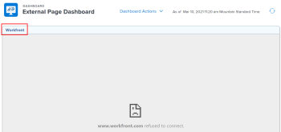
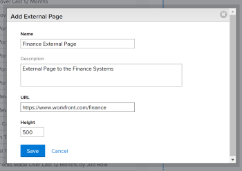

# Embed an external web page in a dashboard {#embed-an-external-web-page-in-a-dashboard}

The highlighted information on this page refers to functionality not yet generally available. It is available only in the Preview Sandbox environment.

You can embed an external web page in a dashboard to provide access to related information from other systems within *`Adobe Workfront`* or to other *`Workfront`* pages.

For example, if your organization has a web-based document repository, wiki, or other content management system that contains project information that is regularly accessed through a URL, you can display that information into *`Workfront`* by creating an external page on a dashboard.

>[!IMPORTANT] {type="important"}
>
>For security reasons, some websites do not allow you to embed web pages as an iframe. If the web page you want to embed in a dashboard does not allow this, the page does not display in the dashboard. However, you can still access the external page by clicking the name of the dashboard.  
>  
>To allow embedding for a website you own, work with your web administrator to adjust the `X-Frame-Options` setting. For more information, see [X-Frame-Options](https://developer.mozilla.org/en-US/docs/Web/HTTP/Headers/X-Frame-Options).

## Access requirements {#access-requirements}

You must have the following:

<table style="width: 100%;margin-left: 0;margin-right: auto;mc-table-style: url('../../../Resources/TableStyles/TableStyle-List-options-in-steps.css');" class="TableStyle-TableStyle-List-options-in-steps" cellspacing="0"> 
 <col class="TableStyle-TableStyle-List-options-in-steps-Column-Column1"> 
 <col class="TableStyle-TableStyle-List-options-in-steps-Column-Column2"> 
 <tbody> 
  <tr class="TableStyle-TableStyle-List-options-in-steps-Body-LightGray"> 
   <td class="TableStyle-TableStyle-List-options-in-steps-BodyE-Column1-LightGray" role="rowheader">Adobe Workfront plan*</td> 
   <td class="TableStyle-TableStyle-List-options-in-steps-BodyD-Column2-LightGray"> 
Any
 </td> 
  </tr> 
  <tr class="TableStyle-TableStyle-List-options-in-steps-Body-MediumGray"> 
   <td class="TableStyle-TableStyle-List-options-in-steps-BodyE-Column1-MediumGray" role="rowheader">Adobe Workfront license*</td> 
   <td class="TableStyle-TableStyle-List-options-in-steps-BodyD-Column2-MediumGray"> 
Plan 
 </td> 
  </tr> 
  <tr class="TableStyle-TableStyle-List-options-in-steps-Body-LightGray"> 
   <td class="TableStyle-TableStyle-List-options-in-steps-BodyE-Column1-LightGray" role="rowheader">Access level configurations*</td> 
   <td class="TableStyle-TableStyle-List-options-in-steps-BodyD-Column2-LightGray"> 
Edit access to Reports, Dashboards, and Calendars
 
Note: If you still don't have access, ask your Workfront administrator if they set additional restrictions in your access level. For information on how a Workfront administrator can change your access level, see <a href="create-modify-access-levels.md" class="MCXref xref">Create or modify custom access levels</a>.
 </td> 
  </tr> 
  <tr class="TableStyle-TableStyle-List-options-in-steps-Body-MediumGray"> 
   <td class="TableStyle-TableStyle-List-options-in-steps-BodyB-Column1-MediumGray" role="rowheader">Object permissions</td> 
   <td class="TableStyle-TableStyle-List-options-in-steps-BodyA-Column2-MediumGray"> 
Manage permissions to the dashboard
 
For information on requesting additional access, see <a href="request-access.md" class="MCXref xref">Request access to objects in Adobe Workfront</a>.
 </td> 
  </tr> 
 </tbody> 
</table>

&#42;To find out what plan, license type, or access you have, contact your *`Workfront administrator`*.

## Prerequisites {#prerequisites}

You must create a dashboard before you can embed an external page in it.

For information on creating dashboards, see [Create a dashboard](create-dashboard.md).

## Embed an external page in a dashboard {#embed-an-external-page-in-a-dashboard}

>[!IMPORTANT] {type="important"}
>
>You can remove an External Page from a dashboard if it's no longer needed. However, you cannot delete an external page after it is created in *`Workfront`*. You can delete an external page only using the API. For more information, see [Remove an External Page from a dashboard in Adobe Workfront](remove-external-page-from-dashboard.md). 

1. Locate the URL of the page to display in *`Workfront`* and copy the URL located in the address bar.  

   >[!NOTE]
   >
   >If you are sharing URLs to *`Workfront`* objects, remember that some URLs expire over time. For example, document URLs expire after they have been opened. This is configured as a security measure, and by design they are considered as non-static URLs and should not be shared.

1.  `<MadCap:conditionalText data-mc-conditions="QuicksilverOrClassic.Quicksilver"> Click the  Main Menu icon , then click  Dashboards.</MadCap:conditionalText>` 
1. To edit an existing dashboard, select the dashboard you want to embed the website page in, then click `Dashboard Actions`, and select `Edit` from the menu.  
   Or  
   To create a new dashboard, click `New Dashboard`.  
   For more information about creating a dashboard, see [Create a dashboard](create-dashboard.md).

1. Click `Add External Page`.

   

1. Specify a `Name` for the external page.
1. Specify a `Description`.
1. Paste the URL you copied earlier into the `URL` field.  
   You can specify the following types of URLs:
    
    
    * An https (encrypted) URL to a web page.  
      Only https (encrypted) pages load with the URL.  
          
    
    
    * A template URL that contains session information for a specific website.  
      For example: *https://localhost/?session={!$$SESSION}*  
      You must be logged into the specified website to display the External Page.  
      For information about how to obtain a SessionID from *`Workfront`*, see [API basics](api-basics.md).  
      Your *`Workfront administrator`* may configure your system preferences in a way that does not allow the use of session information in your external pages, for security reasons. In this case, the external page does not load on the dashboard.  
      For more information about system security preferences, see [Configure system security preferences](configure-security-preferences.md).  
          
    
    
    
    

1. Click `Save`.  
   The page is automatically added to the dashboard. If future dashboards are created, the external page can be added. The external page will be found among the Available Reports.

## Update an external page in a dashboard {#update-an-external-page-in-a-dashboard}

To update the information for an external page used in a dashboard:

1.   `<MadCap:conditionalText data-mc-conditions="QuicksilverOrClassic.Quicksilver"> Click the  Main Menu icon , then click  Dashboards.</MadCap:conditionalText>` 
1.  Select the dashboard that you want to update, then click `Edit` `<MadCap:conditionalText data-mc-conditions="QuicksilverOrClassic.Quicksilver"> </MadCap:conditionalText>`.

   

   

1.  On the right side of the screen, locate the external page you want to update and click the `Edit` icon.  
   

1.  In the `Edit External Page` dialog, update the fields you want to change, then click `Save`.
1.  (Optional) Click the `Delete` icon  to remove the external page from the dashboard. For more information, see [Remove an External Page from a dashboard in Adobe Workfront](remove-external-page-from-dashboard.md). 
1.  In the bottom-left corner, click `Save + Close`.

## View external pages in a report {#view-external-pages-in-a-report}

You can view all external pages in *`Workfront`* in an External Page report. 

1.  Go to the `Main Menu` icon  > `Reports`.
1.  Click `New Report` > select `External Page`.

   

1.  (Optional) Update the View, Filters, or Groupings tabs of the report. 

   For more information, see [Create a custom report](create-custom-report.md). 

1.  Click `Save+Close`. 

   You can view the name and the URL associated with the external pages in your system in the new report. 

   

