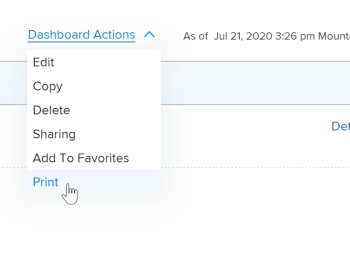

# Export a dashboard {#export-a-dashboard}

You can export a dashboard to a .pdf file using the print options available in your web browser.

>[!NOTE]
>
>When you print content from a webpage, formatting of the content can be affected.  
>For example, the header of a report in a dashboard may be cut off from the rows in a report list.

## Access requirements {#access-requirements}

You must have the following:

<table style="width: 100%;margin-left: 0;margin-right: auto;mc-table-style: url('../../../Resources/TableStyles/TableStyle-List-options-in-steps.css');" class="TableStyle-TableStyle-List-options-in-steps" cellspacing="0"> 
 <col class="TableStyle-TableStyle-List-options-in-steps-Column-Column1"> 
 <col class="TableStyle-TableStyle-List-options-in-steps-Column-Column2"> 
 <tbody> 
  <tr class="TableStyle-TableStyle-List-options-in-steps-Body-LightGray"> 
   <td class="TableStyle-TableStyle-List-options-in-steps-BodyE-Column1-LightGray" role="rowheader">Adobe Workfront plan*</td> 
   <td class="TableStyle-TableStyle-List-options-in-steps-BodyD-Column2-LightGray"> 
Any
 </td> 
  </tr> 
  <tr class="TableStyle-TableStyle-List-options-in-steps-Body-MediumGray"> 
   <td class="TableStyle-TableStyle-List-options-in-steps-BodyE-Column1-MediumGray" role="rowheader">Adobe Workfront license*</td> 
   <td class="TableStyle-TableStyle-List-options-in-steps-BodyD-Column2-MediumGray"> 
Work or higher
 </td> 
  </tr> 
  <tr class="TableStyle-TableStyle-List-options-in-steps-Body-LightGray"> 
   <td class="TableStyle-TableStyle-List-options-in-steps-BodyE-Column1-LightGray" role="rowheader">Access level configurations*</td> 
   <td class="TableStyle-TableStyle-List-options-in-steps-BodyD-Column2-LightGray"> 
View access to Reports, Dashboards, and Calendars
 
Note: If you still don't have access, ask your Workfront administrator if they set additional restrictions in your access level. For information on how a Workfront administrator can change your access level, see <a href="create-modify-access-levels.md" class="MCXref xref">Create or modify custom access levels</a>.
 </td> 
  </tr> 
  <tr class="TableStyle-TableStyle-List-options-in-steps-Body-MediumGray"> 
   <td class="TableStyle-TableStyle-List-options-in-steps-BodyB-Column1-MediumGray" role="rowheader">Object permissions</td> 
   <td class="TableStyle-TableStyle-List-options-in-steps-BodyA-Column2-MediumGray"> 
View permissions to the dashboard
 
For information on requesting additional access, see <a href="request-access.md" class="MCXref xref">Request access to objects in Adobe Workfront</a>.
 </td> 
  </tr> 
 </tbody> 
</table>

&#42;To find out what plan, license type, or access you have, contact your *`Workfront administrator`*.

## Prerequisites {#prerequisites}

The dashboard must be created before you can export it.

For information on creating dashboards, see [Create a dashboard](create-dashboard.md).

## Export a dashboard to a .pdf file: {#export-a-dashboard-to-a-pdf-file}

1. Go to the dashboard you want to export.
1.  Click `Dashboard actions`, then select `Print`.

   

   The Print dialog opens.

1.  Depending on your web browser, select the appropriate print options to complete the .pdf. file export:

<table style="mc-table-style: url('../../../Resources/TableStyles/TableStyle-HeaderRow.css');width: 2000px;" class="TableStyle-TableStyle-HeaderRow" cellspacing="15"> 
 <col class="TableStyle-TableStyle-HeaderRow-Column-Column1" style="width: 410px;"> 
 <col class="TableStyle-TableStyle-HeaderRow-Column-Column1" style="width: 1588px;"> 
 <thead> 
  <tr class="TableStyle-TableStyle-HeaderRow-Head-Header1"> 
   <th class="TableStyle-TableStyle-HeaderRow-HeadE-Column1-Header1">Web browser</th> 
   <th class="TableStyle-TableStyle-HeaderRow-HeadD-Column1-Header1">Print dialog selections</th> 
  </tr> 
 </thead> 
 <tbody> 
  <tr class="TableStyle-TableStyle-HeaderRow-Body-LightGray"> 
   <td class="TableStyle-TableStyle-HeaderRow-BodyE-Column1-LightGray">Google Chrome</td> 
   <td class="TableStyle-TableStyle-HeaderRow-BodyD-Column1-LightGray"> 
    <ol> 
     <li value="1">In the Destination field, select Save as PDF, then modify any other print options you want to change.</li> 
     <li value="2">Click Save.</li> 
     <li value="3">(Optional) Edit the File name, then select a new folder destination for the file.</li> 
     <li value="4">Click Save to save the .pdf file to your hard drive.  </li> 
    </ol> </td> 
  </tr> 
  <tr class="TableStyle-TableStyle-HeaderRow-Body-MediumGray"> 
   <td class="TableStyle-TableStyle-HeaderRow-BodyE-Column1-MediumGray">Internet Explorer, Microsoft Edge, and Mozilla Firefox</td> 
   <td class="TableStyle-TableStyle-HeaderRow-BodyD-Column1-MediumGray"> 
Note: If you're using Internet Explorer version 11, you may not be able to use Print to PDF functionality without installing a third-party plugin.
 
    <ol> 
     <li value="1">In the Printer or Select Printer field, select Microsoft Print to PDF, then modify any other print options you want to change.</li> 
     <li value="2">Click Print.</li> 
     <li value="3">Enter a File name</li> 
     <li value="4">(Optional) Select a new folder destination for the file.</li> 
     <li value="5">Click Save.</li> 
    </ol> </td> 
  </tr> 
  <tr class="TableStyle-TableStyle-HeaderRow-Body-LightGray"> 
   <td class="TableStyle-TableStyle-HeaderRow-BodyB-Column1-LightGray">Safari</td> 
   <td class="TableStyle-TableStyle-HeaderRow-BodyA-Column1-LightGray"> 
    <ol> 
     <li value="1">In the bottom-left corner, click the drop-down arrow, then select Save as PDF.</li> 
     <li value="2">Enter a File name.</li> 
     <li value="3">(Optional) Modify other print options you want to change, including selecting a new folder destination for the file.</li> 
     <li value="4">Click Save.</li> 
    </ol> </td> 
  </tr> 
 </tbody> 
</table>

