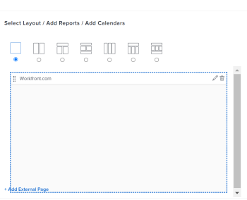

# Remove an External Page from a dashboard in  *`Adobe Workfront`* {#remove-an-external-page-from-a-dashboard-in-adobe-workfront}

The highlighted information on this page refers to functionality not yet generally available. It is available only in the Preview Sandbox environment.

You can remove an External Page from a dashboard if it's no longer needed.

However, you cannot delete an external page after it is created in *`Adobe Workfront`*. You can delete an external page only using the API. For information about the *`Workfront`* API, see [API basics](api-basics.md). For information about creating external pages, see [Embed an external web page in a dashboard](embed-external-web-page-dashboard.md).

## Access requirements {#access-requirements}

You must have the following access to perform the steps in this article:

<table style="width: 100%;margin-left: 0;margin-right: auto;mc-table-style: url('../../../Resources/TableStyles/TableStyle-List-options-in-steps.css');" class="TableStyle-TableStyle-List-options-in-steps" cellspacing="0"> 
 <col class="TableStyle-TableStyle-List-options-in-steps-Column-Column1"> 
 <col class="TableStyle-TableStyle-List-options-in-steps-Column-Column2"> 
 <tbody> 
  <tr class="TableStyle-TableStyle-List-options-in-steps-Body-LightGray"> 
   <td class="TableStyle-TableStyle-List-options-in-steps-BodyE-Column1-LightGray" role="rowheader">Adobe Workfront plan*</td> 
   <td class="TableStyle-TableStyle-List-options-in-steps-BodyD-Column2-LightGray"> 
Any
 </td> 
  </tr> 
  <tr class="TableStyle-TableStyle-List-options-in-steps-Body-MediumGray"> 
   <td class="TableStyle-TableStyle-List-options-in-steps-BodyE-Column1-MediumGray" role="rowheader">Adobe Workfront license*</td> 
   <td class="TableStyle-TableStyle-List-options-in-steps-BodyD-Column2-MediumGray"> 
Plan 
 </td> 
  </tr> 
  <tr class="TableStyle-TableStyle-List-options-in-steps-Body-LightGray"> 
   <td class="TableStyle-TableStyle-List-options-in-steps-BodyE-Column1-LightGray" role="rowheader">Access level configurations*</td> 
   <td class="TableStyle-TableStyle-List-options-in-steps-BodyD-Column2-LightGray"> 
Edit access to Reports, Dashboards,&nbsp;Calendars
 
Note: If you still don't have access, ask your Workfront administrator if they set additional restrictions in your access level. For information on how a Workfront administrator can modify your access level, see <a href="create-modify-access-levels.md" class="MCXref xref">Create or modify custom access levels</a>.
 </td> 
  </tr> 
  <tr class="TableStyle-TableStyle-List-options-in-steps-Body-MediumGray"> 
   <td class="TableStyle-TableStyle-List-options-in-steps-BodyB-Column1-MediumGray" role="rowheader">Object permissions</td> 
   <td class="TableStyle-TableStyle-List-options-in-steps-BodyA-Column2-MediumGray"> 
Manage permissions to the dashboard
 
For information on requesting additional access, see <a href="request-access.md" class="MCXref xref">Request access to objects in Adobe Workfront</a>.
 </td> 
  </tr> 
 </tbody> 
</table>

&#42;To find out what plan, license type, or access you have, contact your *`Workfront administrator`*.

## Remove an external page from a dashboard {#remove-an-external-page-from-a-dashboard}

1.   `<MadCap:conditionalText data-mc-conditions="QuicksilverOrClassic.Quicksilver"> Click the  Main Menu icon , then click  Dashboards.</MadCap:conditionalText>` 
1.  Select the dashboard from which you want to remove the external page, then click `Edit` `<MadCap:conditionalText data-mc-conditions="QuicksilverOrClassic.Quicksilver"> </MadCap:conditionalText>`.

   

1.  On the right side of the screen, locate the external page you want to remove and click the `Delete`icon .

      

1.  Click `Save + Close` in the lower-left corner.

   This removes the external page from the selected dashboard. The external page remains in  *`Workfront`* and can be accessed from a report.&nbsp;For information, see the "View external pages in a report" section in the article [Embed an external web page in a dashboard](embed-external-web-page-dashboard.md).

