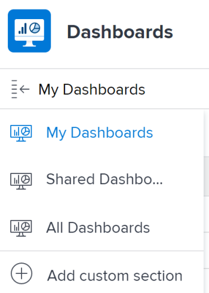
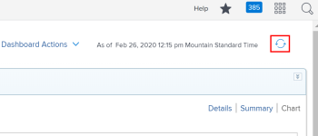

# Get started with dashboards {#get-started-with-dashboards}

The purpose of a dashboard is to provide quick access to information. You can gather information in reports and you can then place them on dashboards to make the information easier to access.

## Access requirements {#access-requirements}

You must have the following:

<table class="TableStyle-TableStyle-HeaderRow" style="mc-table-style: url('../../../Resources/TableStyles/TableStyle-HeaderRow.css');caption-side: bottom;" cellspacing="15"> 
 <caption style="text-align: left;">
  *To find out what plan, license type, or access you have, contact your Workfront administrator.
 </caption> 
 <col class="TableStyle-TableStyle-HeaderRow-Column-Column1" style="width: 300px;"> 
 </col> 
 <col class="TableStyle-TableStyle-HeaderRow-Column-Column1"> 
 </col> 
 <tbody> 
  <tr class="TableStyle-TableStyle-HeaderRow-Body-LightGray"> 
   <td class="TableStyle-TableStyle-HeaderRow-BodyE-Column1-LightGray" style="font-weight: bold;"> 
Adobe Workfront plan*
 </td> 
   <td class="TableStyle-TableStyle-HeaderRow-BodyD-Column1-LightGray">Any</td> 
  </tr> 
  <tr class="TableStyle-TableStyle-HeaderRow-Body-MediumGray"> 
   <td class="TableStyle-TableStyle-HeaderRow-BodyE-Column1-MediumGray" style="font-weight: bold;"> 
Workfront licenses overview*
 </td> 
   <td class="TableStyle-TableStyle-HeaderRow-BodyD-Column1-MediumGray"> 
Review or higher
 </td> 
  </tr> 
  <tr class="TableStyle-TableStyle-HeaderRow-Body-LightGray"> 
   <td class="TableStyle-TableStyle-HeaderRow-BodyE-Column1-LightGray">Access level* </td> 
   <td class="TableStyle-TableStyle-HeaderRow-BodyD-Column1-LightGray"> 
View or higher access to Reports, Dashboards, and Calendars
 
Note: If you still don't have access, ask your Workfront administrator if they set additional restrictions in your access level. For information on how a Workfront administrator can change your access level, see <a href="create-modify-access-levels.md" class="MCXref xref">Create or modify custom access levels</a>.
 </td> 
  </tr> 
  <tr class="TableStyle-TableStyle-HeaderRow-Body-MediumGray"> 
   <td class="TableStyle-TableStyle-HeaderRow-BodyB-Column1-MediumGray" style="text-align: left;"> 
Object permissions 
 </td> 
   <td class="TableStyle-TableStyle-HeaderRow-BodyA-Column1-MediumGray"> 
View permissions to the dashboard
 
For information on requesting additional access, see <a href="request-access.md" class="MCXref xref">Request access to objects in Adobe Workfront</a>. For more information on permissions for dashboards, see <a href="permissions-reports-dashboards-calendars.md" class="MCXref xref">Share reports, dashboards, and calendars in Adobe Workfront</a>.
 </td> 
  </tr> 
 </tbody> 
</table>

## Objects that you can add to a dashboard {#objects-that-you-can-add-to-a-dashboard}

You can populate a dashboard with the following items in *`Adobe Workfront`*:

* Reports  
  For more information about creating reports, see [Create a custom report](create-custom-report.md).

* Calendars  
  For more information about creating calendars, see [Calendar reports overview](calendar-reports-overview.md).

* External Pages  
  For more information about creating external pages, see [Embed an external web page in a dashboard](embed-external-web-page-dashboard.md).

For more information about creating a dashboard, see [Create a dashboard](create-dashboard.md).

## Share dashboards {#share-dashboards}

You can share a dashboard with users in the following ways:

* Sharing on an individual basis.  
  For more information about sharing dashboards, see [Share reports, dashboards, and calendars in Adobe Workfront](permissions-reports-dashboards-calendars.md) and [Share a dashboard in Adobe Workfront](share-dashboard.md).

* Add a custom `<MadCap:conditionalText data-mc-conditions="QuicksilverOrClassic.Quicksilver"> section</MadCap:conditionalText>` to any area or object in *`Workfront`* and add a dashboard to it.  
  `<MadCap:conditionalText data-mc-conditions="QuicksilverOrClassic.Quicksilver"> For more information on creating custom sections, see  <a href="simplified-left-navigation.md" class="MCXref xref">Simplified left navigation in the new Adobe Workfront experience</a>.</MadCap:conditionalText>`

* Place the dashboards on layout templates which you can share with users.  
  For more information about sharing dashboards through layout templates, see [Customize the left panel using a layout template](customize-left-panel.md).

* Print a hard copy of them to share with users.  
  For more information about printing dashboards, see [Print a dashboard](print-dashboard.md).

* Export them as a .pdf file so you can email them to users.  
  For more information about exporting a dashboard to a .pdf file, see [Export a dashboard](export-dashboard.md).  

When you share a dashboard with users, all the reports, calendars, and external pages that are on the dashboard are also shared with the same users by default.

>[!NOTE]
>
>If a user is deleted, any dashboards they have created are no longer accessible. To learn more, see [Delete users](delete-a-user.md).

## Display dashboards {#display-dashboards}

You can display a dashboard in the following ways:

* Access the `<MadCap:conditionalText data-mc-conditions="QuicksilverOrClassic.Quicksilver"> section</MadCap:conditionalText>` that it is placed on and the dashboard placed on the `<MadCap:conditionalText data-mc-conditions="QuicksilverOrClassic.Quicksilver"> section</MadCap:conditionalText>` displays.  
  `<MadCap:conditionalText data-mc-conditions="QuicksilverOrClassic.Quicksilver"> For more information on placing dashboards on custom sections, see  <a href="simplified-left-navigation.md" class="MCXref xref">Simplified left navigation in the new Adobe Workfront experience</a>.</MadCap:conditionalText>`

* Search for and manually access it when you find it.

## Access a dashboard {#access-a-dashboard}

1.  Click the `Main Menu` , then click `Dashboards`.
1.   `<MadCap:conditionalText data-mc-conditions="QuicksilverOrClassic.Quicksilver"> Hover over the left sidebar, then s</MadCap:conditionalText>`elect any of the following:

    
    
    *  `My Dashboards`: Dashboards you have built are listed here.
    
    
      >[!TIP] {type="tip"}
      >
      >If you don't have Edit access to&nbsp;Reports,&nbsp;Dashboards, and Calendars in your access level, you cannot create dashboards. In this case, the My Dashboards list is empty.
    
    
    
    * `Shared Dashboards`: Dashboards that are created by other users and shared with you are listed here.
    * `All Dashboards`: Both your and other users' dashboards that are shared with you are listed here.
    
    
   

1. Click the name of a dashboard to display it.  
   The dashboard displays the information included in the reports, calendars, or external pages that populate it.
1. (Optional and conditional) Click the `Reload` icon in the upper right of the dashboard to refresh the information on the dashboard.  
   The information on the dashboard is synchronized in real time when you first access it. If you have displayed the dashboard for a while in your browser, the information inside the reports on the dashboard could become outdated. The date and time when the dashboard was last refreshed is listed to the left of this icon.  
   

## Delete dashboards {#delete-dashboards}

If you want to remove a dashboard from *`Workfront`*, you can delete it.

To learn more, see [Delete a dashboard](delete-dashboard.md).
