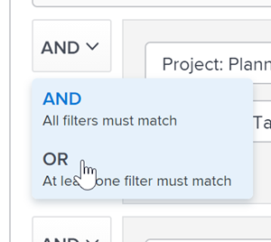

# Configure filter rules in Reporting Canvas

After you add a table to a report, you can set up filter rules to limit the information that displays in the table. With the right access, you can also modify a table in an existing report at any time.

<!--
[insert more in-depth info here on filters rules, and/or, modifiers, etc.]
-->

There are 3 components in a filter rule:

<table cellspacing="0"> 
 <col> 
 <col> 
 <tbody> 
  <tr> 
   <td role="rowheader">Field</td> 
   <td> 
The field that contains the information that you want to filter for.
 </td> 
  </tr> 
  <tr> 
   <td role="rowheader">Operator</td> 
   <td> 
&nbsp;
 </td> 
  </tr> 
  <tr> 
   <td role="rowheader">Value</td> 
   <td> 
The information that you want to filter for.
 </td> 
  </tr> 
 </tbody> 
</table>

` `**Example: **`` If you wanted to limit results in your report to only display projects that are owned by Jane Doe, you could create a filter rule with the field "Project Owner," the operator "Equal To," and the value "Jane Doe."

Or you could display only projects that have an assigned project owner, which would have the field "Project Owner" and the operator "Is Not Blank."

If you want your report to display results for both of these filter rules, you would add the link/connective AND.

[Insert image?]

##  

## Access requirements

You must have the following access to perform the steps in this article:

<table cellspacing="0"> 
 <col> 
 <col> 
 <tbody> 
  <tr> 
   <td role="rowheader">Adobe Workfront plan*</td> 
   <td> 
Any
 </td> 
  </tr> 
  <tr> 
   <td role="rowheader">Workfront license*</td> 
   <td> 
Plan
 </td> 
  </tr> 
  <tr> 
   <td role="rowheader">Access level configurations*</td> 
   <td> 
Edit access to create reports, calendars, and dashboards
 
Note: If you still don't have access, ask your Workfront administrator if they set additional restrictions in your access level. For information on how a Workfront administrator can modify your access level, see <a href="../../administration-and-setup/add-users/configure-and-grant-access/create-modify-access-levels.md" class="MCXref xref">Create or modify custom access levels</a>.
 </td> 
  </tr> Object permissions Manage access to the report For information on requesting additional access, see Request access to objects in Adobe Workfront. 
 </tbody> 
</table>

&#42;To find out what plan, license type, or access you have, contact your Workfront administrator.

## Prerequisites

Before you begin, you must enroll in the Reporting Canvas beta program.

<!--
For more information, see [link to Beta enrollment info].
-->

## Configure filter rules for a table

<ol> 
 <li value="1"> 
Go to an existing report, click the More Menu icon  in the report header, then select Edit.
 </li> 
 <li value="2"> 
Locate the table in the report, then click the <b>Edit</b> icon  in the table header.
 <note type="tip">
   If a table has not been configured yet, an Edit button displays instead.
    
   <!--
    [insert image of table header]
   -->
  </note> </li> 
 <li value="3"> 
In the right panel, locate the field that you want to filter by.
 
  <ol> 
   <li value="1"> 
(Optional) Enter text in the Search box.
 <!--
     Up to X fields display.
    --> </li> 
   <li value="2">(Conditional) If you don't see the field that you want, click More fields to display more options. [insert screenshot here]</li> 
  </ol> </li> 
 <li value="4"> 
Select the field, then drag it to the Filter section.
 
A filter rule displays.
 </li> 
 <li value="5"> 
Select the modifier that you want from the drop-down menu:
 
  <table cellspacing="0"> 
   <col> 
   <col> 
   <tbody> 
    <tr> 
     <td role="rowheader">Equal To </td> 
     <td> 
This only returns an exact match of the searched value.
 </td> 
    </tr> 
    <tr> 
     <td role="rowheader">Not Equal To </td> 
     <td> 
This only returns results that are not exact match of the searched value.
 </td> 
    </tr> 
    <tr> 
     <td role="rowheader">Is Blank </td> 
     <td> 
The field exists for the object but the field has not yet been given a value.
 </td> 
    </tr> 
    <tr> 
     <td role="rowheader">Is Not Blank </td> 
     <td> 
The field you are filtering for exists and has been given a value.
 </td> 
    </tr> 
    <tr> 
     <td role="rowheader">Is Less Than </td> 
     <td> 
This searches for all results with a value less than what is entered, not including the entered value.
 </td> 
    </tr> 
    <tr> 
     <td role="rowheader">Is Less Than Or Equal To </td> 
     <td> 
This searches for all results with a value less than or equal to the entered value.
 </td> 
    </tr> 
    <tr> 
     <td role="rowheader">Is Greater Than </td> 
     <td> 
This searches for all results with a value greater than the value entered, not including the entered value.
 </td> 
    </tr> 
    <tr> 
     <td role="rowheader">Is Greater Than Or Equal To </td> 
     <td> 
This searches for all results with values greater than or equal to the entered value.
 </td> 
    </tr> 
    <tr> 
     <td role="rowheader">Between </td> 
     <td> 
Provides 2 required field values and searches for all results within range of both fields including the entered values.
 </td> 
    </tr> 
    <tr> 
     <td role="rowheader">Contains </td> 
     <td> 
This searches for the specified text throughout an entire text string.
 
For example, using "Contains Inf" captures anything with "Inf" or "inf" in it, such as the word "Infinity".
 <note type="note">
       Adobe Workfront searches for the exact word or phrase that you are specifying for each filter statement. For example, if you are searching for any project that contains the phrase "new project" in the name, Workfront does not display projects that have just "new" or just "project", or "new main project" in the name. The filter finds only projects with the exact phrase "new project" in the name.
      </note> </td> 
    </tr> 
    <tr> 
     <td role="rowheader">Does Not Contain </td> 
     <td> 
This filters for items that are missing the value specified.
 
For example, "does not contain inf" captures anything with without "Inf" or "inf" in the name.
 </td> 
    </tr> 
   </tbody> 
  </table> </li> 
 <li value="6"> 
Enter the last value to complete the filter rule.
 <note type="note">
   Values entered are not case sensitive. For example, using "Contains Inf" captures anything with "Inf" or "inf" in it, such as the word "Infinity".
    
  </note> </li> 
 <li value="7"> 
(Optional) To add another filter rule, drag the field to the Drop to add another rule drop area in the Filters section, then repeat Steps 5-6.
 </li> 
 <li value="8"> 
(Conditional) If you want to add a filter rule set, do the following:
 
  <ol> 
   <li value="1"> 
Drag the field that you want to add to the <b>Add a rule set</b> drop area.
 
&nbsp;
 </li> 
   <li value="2"> 
Drag the next field for your filter rule set to the Drop to add another rule drop area.
 
&nbsp;
 </li> 
  </ol> </li> 
 <li value="9"> 
(Conditional) If you have filter rule sets or multiple filter rules, select the operator drop-down, then select <b>AND</b> or <b>OR</b>.
 
  
 
  <table cellspacing="0"> 
   <col> 
   <col> 
   <tbody> 
    <tr> 
     <td role="rowheader"> 
AND
 </td> 
     <td> 
When you join filter rules or rule sets with the AND operator, you indicate that you want all rules at the same level to be met.
 
By default, the statements in a filter are joined by the AND operator.
 
Example: </b>"><b>Example: </b>&nbsp;
 </td> 
    </tr> 
    <tr> 
     <td role="rowheader"> 
OR
 </td> 
     <td> 
When you join filter rules or rule set with the OR operator you indicate that you want at least one rule—or rule set—at that level to be met.
 
Example: </b>"><b>Example: </b>&nbsp;
 </td> 
    </tr> 
   </tbody> 
  </table> <note type="important">
   If you have an AND operator selected, all filter criteria must apply for a result to display in the report.
    depending on the level of the operator
    AND operators and OR operators at the same level—connecting rule sets or connecting filters within a rule set—always match. If you change one of them, all operators at the same level update.
  </note> </li> 
</ol>

## Configure filter rules for a page filter

This is coming, One of the 3 dimmed options in the right panel when you edit. Will get rid of need for prompts.

<ol> 
 <li value="1"> 
Go to an existing report, click the More Menu icon  in the report header, then select Edit.
 </li> <!--
 --> 
</ol>

