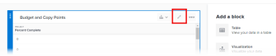

# Create a formula field in `Reporting Canvas`

<!--
Intro
-->

## Access requirements

You must have the following access to perform the steps in this article:

<table cellspacing="0"> 
 <col> 
 <col> 
 <tbody> 
  <tr> 
   <td role="rowheader">Adobe Workfront plan*</td> 
   <td> 
Any
 </td> 
  </tr> 
  <tr> 
   <td role="rowheader">Workfront license*</td> 
   <td> 
Plan
 </td> 
  </tr> 
  <tr> 
   <td role="rowheader">Access level configurations*</td> 
   <td> 
Edit access to create reports, calendars, and dashboards
 
Note: If you still don't have access, ask your Workfront administrator if they set additional restrictions in your access level. For information on how a Workfront administrator can modify your access level, see <a href="../../administration-and-setup/add-users/configure-and-grant-access/create-modify-access-levels.md" class="MCXref xref">Create or modify custom access levels</a>.
 </td> 
  </tr> Object permissions Manage access to the report For information on requesting additional access, see Request access to objects in Adobe Workfront. 
 </tbody> 
</table>

&#42;To find out what plan, license type, or access you have, contact your `Workfront administrator`.

## Prerequisites

Before you begin, you must enroll in the `Reporting Canvas` beta program.

<!--
For more information, see [link to Beta enrollment info].
-->

## Create a formula field for a report

<ol> 
 <li value="1"> 
Start creating or editing a report table, as described in <a href="../../reports-and-dashboards/new-reporting-experience/add-or-edit-report-table.md" class="MCXref xref">Add or edit a report table in Reporting Canvas</a>.
 </li> 
 <li value="2"> 
If you haven't done so yet, click Edit to configure the table.
 <note type="note"> 
   
If the table was already added when you opened the report, the Edit button does not display. To edit the table, click the Edit icon  in the table header.
 
   
  
 
  </note> </li> 
 <li value="3"> 
Click <b>New</b> at the top of the <b>Fields</b> list.
 <!--
   Show this in a screenshot when the UI is more stable
  --> </li> <!--
  In the new window that opens, drag or double-click [not sure if double-click will work] any Function or Field available in the system to add it to your formula field. Describe how to use the field definition area and field preview area as these become more developed in the UI A good example here would be helpful.
 --> 
</ol>

