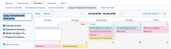

# Copy a calendar report

If you created a calendar, you can copy the calendar and use it as a starting point for a new calendar.

Additionally, if you have Manage access to a calendar to which you are not the owner, you can copy the calendar&nbsp;and become the owner of the copied calendar.

## Access requirements

You must have the following access to perform the steps in this article:

<table cellspacing="0"> 
 <col> 
 </col> 
 <col> 
 </col> 
 <tbody> 
  <tr> 
   <td role="rowheader">Adobe Workfront plan*</td> 
   <td> 
Any
 </td> 
  </tr> 
  <tr> 
   <td role="rowheader">Adobe Workfront license*</td> 
   <td> 
Plan 
 </td> 
  </tr> 
  <tr> 
   <td role="rowheader">Access level configurations*</td> 
   <td> 
Edit access to&nbsp;Reports, Dashboards, and Calendars
 
Note: If you still don't have access, ask your Workfront administrator if they set additional restrictions in your access level. For information on how a Workfront administrator can modify your access level, see <a href="../../../administration-and-setup/add-users/configure-and-grant-access/create-modify-access-levels.md" class="MCXref xref">Create or modify custom access levels</a>.
 </td> 
  </tr> 
  <tr> 
   <td role="rowheader">Object permissions</td> 
   <td> 
Manage access to the calendar report
 
For information on requesting additional access, see <a href="../../../workfront-basics/grant-and-request-access-to-objects/request-access.md" class="MCXref xref">Request access to objects in Adobe Workfront</a>.
 </td> 
  </tr> 
 </tbody> 
</table>

&#42;To find out what plan, license type, or access you have, contact your Workfront administrator.

## Copy a calendar report

1. Go to the calendar you want to copy.
1. On the `Calendar` toolbar, click `Calendar Actions`, then select `Copy` from the drop-down list.  
   A copy of the calendar opens.  
     
   All the projects and calendar groupings in the original calendar display in the copy of the calendar. Only objects placed by&nbsp;calendar filters export to the newly copied calendar. Any events manually added to the original calendar must be manually added to the copied calendar.  
   Only you have access to the copied calendar. Users with access to the original calendar do not have access to the copied calendar. You can grant access to the newly-created calendar by sharing it with other users. To learn about sharing calendars, see [Share a calendar report](../../../reports-and-dashboards/reports/calendars/share-a-calendar-report.md).

1. (Optional) Rename the calendar.

