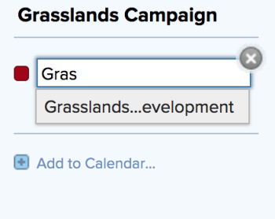
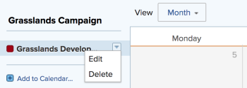

# Edit an existing calendar report {#edit-an-existing-calendar-report}

You can modify an existing calendar by adding or deleting a link&nbsp;to a project. You can also modify calendar groupings associated with a calendar report.

## Access requirements {#access-requirements}

You must have the following access to perform the steps in this article:

<table style="width: 100%;margin-left: 0;margin-right: auto;mc-table-style: url('../../../Resources/TableStyles/TableStyle-List-options-in-steps.css');" class="TableStyle-TableStyle-List-options-in-steps" cellspacing="0"> 
 <col class="TableStyle-TableStyle-List-options-in-steps-Column-Column1"> 
 </col> 
 <col class="TableStyle-TableStyle-List-options-in-steps-Column-Column2"> 
 </col> 
 <tbody> 
  <tr class="TableStyle-TableStyle-List-options-in-steps-Body-LightGray"> 
   <td class="TableStyle-TableStyle-List-options-in-steps-BodyE-Column1-LightGray" role="rowheader">Adobe Workfront plan*</td> 
   <td class="TableStyle-TableStyle-List-options-in-steps-BodyD-Column2-LightGray"> 
Any
 </td> 
  </tr> 
  <tr class="TableStyle-TableStyle-List-options-in-steps-Body-MediumGray"> 
   <td class="TableStyle-TableStyle-List-options-in-steps-BodyE-Column1-MediumGray" role="rowheader">Adobe Workfront license*</td> 
   <td class="TableStyle-TableStyle-List-options-in-steps-BodyD-Column2-MediumGray"> 
Plan 
 </td> 
  </tr> 
  <tr class="TableStyle-TableStyle-List-options-in-steps-Body-LightGray"> 
   <td class="TableStyle-TableStyle-List-options-in-steps-BodyE-Column1-LightGray" role="rowheader">Access level configurations*</td> 
   <td class="TableStyle-TableStyle-List-options-in-steps-BodyD-Column2-LightGray"> 
Edit access to&nbsp;Reports, Dashboards, and Calendars
 
Note: If you still don't have access, ask your Workfront administrator if they set additional restrictions in your access level. For information on how a Workfront administrator can modify your access level, see <a href="create-modify-access-levels.md" class="MCXref xref">Create or modify custom access levels</a>.
 </td> 
  </tr> 
  <tr class="TableStyle-TableStyle-List-options-in-steps-Body-MediumGray"> 
   <td class="TableStyle-TableStyle-List-options-in-steps-BodyB-Column1-MediumGray" role="rowheader">Object permissions</td> 
   <td class="TableStyle-TableStyle-List-options-in-steps-BodyA-Column2-MediumGray"> 
Manage access to the calendar report
 
For information on requesting additional access, see <a href="request-access.md" class="MCXref xref">Request access to objects in Adobe Workfront</a>.
 </td> 
  </tr> 
 </tbody> 
</table>

&#42;To find out what plan, license type, or access you have, contact your *`Workfront administrator`*.

## Edit an existing calendar report {#edit-an-existing-calendar-report-1}

1. Click the Main Menu icon  in the upper-right corner of *`Workfront`*, then click `Calendars`.

1. (Optional) To change the name of the calendar report, click the calendar name field, then make the desired changes.  
     
   If you have shared the calendar report with other users or teams, the modified calendar name is automatically updated in their calendar view.

1. (Optional) To add a project to the calendar report:
    
    
    1. Click `Add to Calendar.`
    1. In the `Project name` field, begin typing the name of a project from which you want to add calendar&nbsp;events,&nbsp;then click the name when it displays in the drop-down list.  
         
       Items from the project and its associated tasks and issues are added to the calendar report.
    
    
    
1. (Optional) To add a calendar grouping or to modify an existing calendar grouping:
    
    
    1. Hover over the project name, click the drop-down arrow next to the project name, then click `Edit`.  
           
    
    
    1. Choose how you want to group your items:
    
        
        
        * [Use Planned Dates in a calendar report](use-planned-dates.md)
        * [Use Projected Dates in a calendar report](Use projected dates.md)
        * [Use custom date fields in a calendar report](use-custom-dates.md)
        
        
    
    
    

