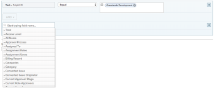
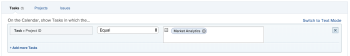

# Use custom date fields in a calendar report

A calendar report is a dynamic report that provides a visual representation of your work.&nbsp;You can use custom date fields in a calendar report for the following objects:

* Tasks
* Issues
* Projects

## Access requirements

You must have the following access to perform the steps in this article:

<table cellspacing="0"> 
 <col> 
 </col> 
 <col> 
 </col> 
 <tbody> 
  <tr> 
   <td role="rowheader"><em>Adobe Workfront</em> plan*</td> 
   <td> 
Any
 </td> 
  </tr> 
  <tr> 
   <td role="rowheader"><em>Adobe Workfront</em> license*</td> 
   <td> 
<em>Plan</em> 
 </td> 
  </tr> 
  <tr> 
   <td role="rowheader">Access level configurations*</td> 
   <td> 
Edit access to&nbsp;Reports, Dashboards, and Calendars
 
Note: If you still don't have access, ask your <em>Workfront administrator</em> if they set additional restrictions in your access level. For information on how a <em>Workfront administrator</em> can modify your access level, see <a href="../../../administration-and-setup/add-users/configure-and-grant-access/create-modify-access-levels.md" class="MCXref xref">Create or modify custom access levels</a>.
 </td> 
  </tr> 
  <tr> 
   <td role="rowheader">Object permissions</td> 
   <td> 
Manage access to the calendar report
 
For information on requesting additional access, see <a href="../../../workfront-basics/grant-and-request-access-to-objects/request-access.md" class="MCXref xref">Request access to objects in Adobe Workfront</a>.
 </td> 
  </tr> 
 </tbody> 
</table>

&#42;To find out what plan, license type, or access you have, contact your *Workfront administrator*.

## Prerequisites

1. You must have custom date fields and a value within the field available in your *Workfront* instance. If you don't have a custom form set up with custom dates, follow the instructions in the first two sections in [Create or edit a custom form](../../../administration-and-setup/customize-workfront/create-manage-custom-forms/create-or-edit-a-custom-form.md). 

1. Attach the custom form to a project, task, or issue you plan to add to the calendar, and specify a date. For more information, see [Add a custom form to an object](../../../workfront-basics/work-with-custom-forms/add-a-custom-form-to-an-object.md).

## Set up the group of items

You can choose how you want the group of items to display on your calendar.

<ol> <draft-comment>
  <li value="1" data-mc-conditions="QuicksilverOrClassic.Quicksilver">Click the Main Menu icon  in the upper-right corner of <em>Adobe Workfront</em>, then click Calendars.</li>
 </draft-comment>
 <li value="1" data-mc-conditions="QuicksilverOrClassic.Quicksilver">Click the Main Menu icon  in the upper-right corner of <em>Adobe Workfront</em>, then click Calendars.</li> 
 <li value="2"> 
Select the calendar you want to add a new group of items to.  Or Click + New Calendar and enter the calendar name. <note type="note">
    You must have Edit access to Reports, Dashboards, and Calendars in your access level to create a calendar report.
   </note>
 </li> 
 <li value="3">On the left, click Add to Calendar, then click Add advanced items.</li> 
 <li value="4"> 
Specify the following: 
   <table cellspacing="0">
    <col>
    <col>
    <tbody>
     <tr>
      <td role="rowheader">Name this group of items</td>
      <td>Type a name for the group of items.</td>
     </tr>
     <tr>
      <td role="rowheader">Color</td>
      <td>Select a color for the group of items. All items display in the selected color on the calendar report.</td>
     </tr>
     <tr>
      <td role="rowheader">Date Field</td>
      <td>Choose Custom dates. </td>
     </tr>
     <tr>
      <td role="rowheader">On the calendar, show</td>
      <td>
Choose how you want the dates to show:

       <ul>
        <li>Single Date: The calendar displays the object on a single date.</li>
        <li>Duration (Start to End): The calendar displays the object over a span of days. <note type="note">
          If you choose 
          Duration, the end date specified must be after the start date or the item won't show on the calendar.
         </note></li>
       </ul></td>
     </tr><draft-comment>
      <tr data-mc-conditions="">
       <td role="rowheader">Custom Dates</td>
       <td>
Enter the custom date name attached to the object you want to track.
</td>
      </tr>
     </draft-comment>
     <tr data-mc-conditions="">
      <td role="rowheader">Custom Dates</td>
      <td>
Enter the custom date name attached to the object you want to track.
</td>
     </tr>
    </tbody>
   </table>
 </li> 
 <li value="5">Continue to the following section.</li> 
</ol>

## Add objects to the group of items

After you set up how you want items to display, you need to add the objects you want to see on the calendar to the grouping.

<ol> 
 <li value="1">In the What would you like to add to the calendar? section, select 
  <ul>
   <li>Tasks</li>
   <li>Projects</li>
   <li>Issues</li>
  </ul></li> 
 <li value="2">Click Add Tasks, Add Projects, or Add Issues, depending on the object type you are adding to the calendar. </li> 
 <li value="3">In the drop-down menu, begin typing the field name, then select the&nbsp;field source of the object you want to display on the calendar (for example,&nbsp;Late Tasks).</li> 
 <li value="4"> 
Set a condition statement for the calendar grouping.
 
  
 
To learn about setting conditions, see <a href="../../../reports-and-dashboards/reports/reporting-elements/filter-condition-modifiers.md" class="MCXref xref">Filter and condition modifiers</a>.
 </li> 
 <li value="5"> 
(Optional) Specify additional objects for the calendar grouping by repeating Steps 1-4.
 </li> 
 <li value="6"> 
In the Set the Tasks/Projects/Issues labels to be the...&nbsp;field, select how the objects in this calendar grouping are labeled in the calendar. <note type="note">
    If the default label&nbsp;options are not available for a certain object, the object name is&nbsp;shown instead. For example, when the Parent Task label is selected and&nbsp;there is no parent task associated with the object,&nbsp;
    <em>Adobe Workfront</em> displays the object name you are viewing in the calendar.
   </note>
 </li> 
 <li value="7">Click Save.</li> 
</ol>

