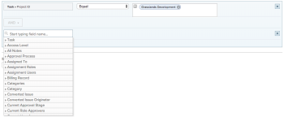

# Use Planned Dates in a calendar report {#use-planned-dates-in-a-calendar-report}

A calendar report is a dynamic report that provides a visual representation of your work.&nbsp;You can use Planned Date fields in a calendar report for the following objects:

* Tasks
* Issues
* Projects

## Access requirements {#access-requirements}

You must have the following access to perform the steps in this article:

<table style="width: 100%;margin-left: 0;margin-right: auto;mc-table-style: url('../../../Resources/TableStyles/TableStyle-List-options-in-steps.css');" class="TableStyle-TableStyle-List-options-in-steps" cellspacing="0"> 
 <col class="TableStyle-TableStyle-List-options-in-steps-Column-Column1"> 
 </col> 
 <col class="TableStyle-TableStyle-List-options-in-steps-Column-Column2"> 
 </col> 
 <tbody> 
  <tr class="TableStyle-TableStyle-List-options-in-steps-Body-LightGray"> 
   <td class="TableStyle-TableStyle-List-options-in-steps-BodyE-Column1-LightGray" role="rowheader">Adobe Workfront plan*</td> 
   <td class="TableStyle-TableStyle-List-options-in-steps-BodyD-Column2-LightGray"> 
Any
 </td> 
  </tr> 
  <tr class="TableStyle-TableStyle-List-options-in-steps-Body-MediumGray"> 
   <td class="TableStyle-TableStyle-List-options-in-steps-BodyE-Column1-MediumGray" role="rowheader">Adobe Workfront license*</td> 
   <td class="TableStyle-TableStyle-List-options-in-steps-BodyD-Column2-MediumGray"> 
Plan 
 </td> 
  </tr> 
  <tr class="TableStyle-TableStyle-List-options-in-steps-Body-LightGray"> 
   <td class="TableStyle-TableStyle-List-options-in-steps-BodyE-Column1-LightGray" role="rowheader">Access level configurations*</td> 
   <td class="TableStyle-TableStyle-List-options-in-steps-BodyD-Column2-LightGray"> 
Edit access to&nbsp;Reports, Dashboards, and Calendars
 
Note: If you still don't have access, ask your Workfront administrator if they set additional restrictions in your access level. For information on how a Workfront administrator can modify your access level, see <a href="create-modify-access-levels.md" class="MCXref xref">Create or modify custom access levels</a>.
 </td> 
  </tr> 
  <tr class="TableStyle-TableStyle-List-options-in-steps-Body-MediumGray"> 
   <td class="TableStyle-TableStyle-List-options-in-steps-BodyB-Column1-MediumGray" role="rowheader">Object permissions</td> 
   <td class="TableStyle-TableStyle-List-options-in-steps-BodyA-Column2-MediumGray"> 
Manage access to the calendar report
 
For information on requesting additional access, see <a href="request-access.md" class="MCXref xref">Request access to objects in Adobe Workfront</a>.
 </td> 
  </tr> 
 </tbody> 
</table>

&#42;To find out what plan, license type, or access you have, contact your *`Workfront administrator`*.

## Set up the group of items {#set-up-the-group-of-items}

You can choose how you want the group of items to display on your calendar. 

1. Click the `Main Menu` icon  in the upper-right corner of *`Adobe Workfront`*, then click `Calendars`.

1.  Select the calendar you want to add a new group of items to.   
   Or  
   Click `+ New Calendar` and enter the calendar name.  

   >[!NOTE]
   >
   >You must have Edit access to Reports, Dashboards, and Calendars in your access level to create a calendar report.

1. On the left, click `Add to Calendar`, then click `Add advanced items`.

1.  Specify the following:  

<table style="width: 100%;mc-table-style: url('../../../Resources/TableStyles/TableStyle-List-options-in-steps.css');" class="TableStyle-TableStyle-List-options-in-steps" cellspacing="0">
 <col class="TableStyle-TableStyle-List-options-in-steps-Column-Column1">
 <col class="TableStyle-TableStyle-List-options-in-steps-Column-Column2">
 <tbody>
  <tr class="TableStyle-TableStyle-List-options-in-steps-Body-LightGray">
   <td class="TableStyle-TableStyle-List-options-in-steps-BodyE-Column1-LightGray" role="rowheader">Name this group of items</td>
   <td class="TableStyle-TableStyle-List-options-in-steps-BodyD-Column2-LightGray">Type a name for the group of items.</td>
  </tr>
  <tr class="TableStyle-TableStyle-List-options-in-steps-Body-MediumGray">
   <td class="TableStyle-TableStyle-List-options-in-steps-BodyE-Column1-MediumGray" role="rowheader">Color</td>
   <td class="TableStyle-TableStyle-List-options-in-steps-BodyD-Column2-MediumGray">Select a color for the group of items. All items display in the selected color on the calendar report.</td>
  </tr>
  <tr class="TableStyle-TableStyle-List-options-in-steps-Body-LightGray">
   <td class="TableStyle-TableStyle-List-options-in-steps-BodyE-Column1-LightGray" role="rowheader">Date Field</td>
   <td class="TableStyle-TableStyle-List-options-in-steps-BodyD-Column2-LightGray">
Choose Planned dates. For more information on planned dates, see 

    <ul>
     <li><a href="project-planned-start-date.md" class="MCXref xref">Overview of the project Planned Start Date </a></li>
     <li><a href="task-planned-start-date.md" class="MCXref xref">Overview of the task Planned Start Date</a></li>
     <li><a href="project-planned-completion-date.md" class="MCXref xref">Overview of the project Planned Completion Date </a> </li>
    </ul></td>
  </tr>
  <tr class="TableStyle-TableStyle-List-options-in-steps-Body-MediumGray">
   <td class="TableStyle-TableStyle-List-options-in-steps-BodyE-Column1-MediumGray" role="rowheader">On the calendar, show</td>
   <td class="TableStyle-TableStyle-List-options-in-steps-BodyD-Column2-MediumGray">
Choose how you want the dates to show:

    <ul>
     <li>Start Date Only: The calendar displays the object on a single date.</li>
     <li>End Date Only: The calendar displays the object on a single date.</li>
     <li>Duration (Start to End): The calendar displays the object over a span of days.</li>
    </ul></td>
  </tr>
  <tr class="TableStyle-TableStyle-List-options-in-steps-Body-LightGray" data-mc-conditions="">
   <td class="TableStyle-TableStyle-List-options-in-steps-BodyB-Column1-LightGray" role="rowheader">Switch to actual dates when available</td>
   <td class="TableStyle-TableStyle-List-options-in-steps-BodyA-Column2-LightGray">
The calendar automatically switches to actual dates when they are available.  Choose Yes or No to switch to actual dates when available. For more information on Actual Dates, see

    <ul>
     <li><a href="project-actual-start-date.md" class="MCXref xref">Overview of the project Actual Start Date </a></li>
     <li><a href="project-actual-completion-date.md" class="MCXref xref">Overview of the project Actual Completion Date </a></li>
    </ul></td>
  </tr>
 </tbody>
</table>

1. Continue to the following section.

## Add objects to the group of items {#add-objects-to-the-group-of-items}

After you set up how you want items to display, you need to add the objects you want to see on the calendar to the grouping.

1. In the `What would you like to add to the calendar?` section, select  

    
    
    * `Tasks`
    * `Projects`
    * `Issues`
    
    

1. Click `Add Tasks`, `Add Projects`, or `Add Issues`, depending on the object type you are adding to the calendar.  
   

1. In the drop-down menu, begin typing the field name, then select the field source of the object you want to display on the calendar (for example,  `Late Tasks`).
1.  Set a condition statement for the calendar grouping.

   

   To learn about setting conditions, see [Filter and condition modifiers](filter-condition-modifiers.md).

1.  (Optional) Specify additional objects for the calendar grouping by repeating Steps 1-4.
1.  In the `Set the Tasks/Projects/Issues labels to be the...`&nbsp;field, select how the objects in this calendar grouping are labeled in the calendar.  

   >[!NOTE]
   >
   >If the default label options are not available for a certain object, the object name is shown instead. For example, when the Parent Task label is selected and there is no parent task associated with the object,  *`Adobe Workfront`* displays the object name you are viewing in the calendar.

1. Click `Save`.

