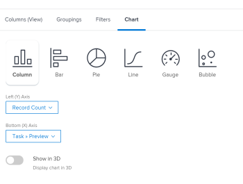

# Add a chart to a report

You can enhance your reports by adding a chart. You can add charts to existing reports or to reports that you are creating.

Before you add a chart to a report, you should create a View and a Grouping for the report. Most charts cannot be added unless the information is grouped in the report. The only chart that can be added without a grouping is a gauge chart.  
For information about how to create a View, see [Views overview in Adobe Workfront](../../../reports-and-dashboards/reports/reporting-elements/views-overview.md).  
For more information about groupings, see [Groupings overview in Adobe Workfront](../../../reports-and-dashboards/reports/reporting-elements/groupings-overview.md).

If your report displays too many items, a chart is not created. In this case, you must also add a Filter to the report to reduce the number of results in your report.  
For more information about filters, see [Filters overview in Adobe Workfront](../../../reports-and-dashboards/reports/reporting-elements/filters-overview.md).

## Access requirements

You must have the following access to perform the steps in this article:

<table cellspacing="0"> 
 <col> 
 <col> 
 <tbody> 
  <tr> 
   <td role="rowheader"><em>Adobe Workfront</em> plan*</td> 
   <td> 
Any
 </td> 
  </tr> 
  <tr> 
   <td role="rowheader"><em>Adobe Workfront</em> license*</td> 
   <td> 
<em>Plan</em> 
 </td> 
  </tr> 
  <tr> 
   <td role="rowheader">Access level configurations*</td> 
   <td> 
Edit access to&nbsp;Reports,&nbsp;Dashboards,&nbsp;Calendars
 
Edit access to Filters,&nbsp;Views, Groupings
 
Note: If you still don't have access, ask your <em>Workfront administrator</em> if they set additional restrictions in your access level. For information on how a <em>Workfront administrator</em> can modify your access level, see <a href="../../../administration-and-setup/add-users/configure-and-grant-access/create-modify-access-levels.md" class="MCXref xref">Create or modify custom access levels</a>.
 </td> 
  </tr> 
  <tr> 
   <td role="rowheader">Object permissions</td> 
   <td> 
Manage permissions to a report
 
For information on requesting additional access, see <a href="../../../workfront-basics/grant-and-request-access-to-objects/request-access.md" class="MCXref xref">Request access to objects in Adobe Workfront</a>.
 </td> 
  </tr> 
 </tbody> 
</table>

&#42;To find out what plan, license type, or access you have, contact your *Workfront administrator*.

## Add a chart to a report

<ol> 
 <li value="1">Go to an existing report or create a new report. For more information about creating a new report, see <a href="../../../reports-and-dashboards/reports/creating-and-managing-reports/create-custom-report.md" class="MCXref xref">Create a custom report</a>.</li> 
 <li value="2">(Conditional) If you went to an existing report, click Report Actions > Edit.</li> 
 <li value="3">Ensure that the Columns (View) tab has been updated to meet the needs of the report. For information about how to create or modify the View for the report, see <a href="../../../reports-and-dashboards/reports/reporting-elements/views-overview.md" class="MCXref xref">Views overview in Adobe Workfront</a>.</li> 
 <li value="4"> 
Click the Groupings tab and add a grouping.
 
  
Tips: </b>">
   <b>Tips: </b> 
   <ul> 
    <li> 
You can only add a chart to a report when the report results are grouped.<draft-comment>
       <MadCap:conditionalText data-mc-conditions="QuicksilverOrClassic.Quicksilver"> 
       </MadCap:conditionalText>
      </draft-comment><MadCap:conditionalText data-mc-conditions="QuicksilverOrClassic.Quicksilver"> 
      </MadCap:conditionalText>
 </li> 
    <li> 
Text-mode groupings are not supported in charts. For more information about text-mode groupings, see<a href="../../../reports-and-dashboards/reports/text-mode/edit-text-mode-in-grouping.md" class="MCXref xref">Edit text mode in a grouping</a>. 
 </li> 
    <li> 
 <draft-comment>
       <MadCap:conditionalText data-mc-conditions="QuicksilverOrClassic.Quicksilver">
        If you add a single grouping that represents one metric, all charts but a pie chart display each result in the grouping as the same color.
       </MadCap:conditionalText>
      </draft-comment><MadCap:conditionalText data-mc-conditions="QuicksilverOrClassic.Quicksilver">
       If you add a single grouping that represents one metric, all charts but a pie chart display each result in the grouping as the same color.
      </MadCap:conditionalText> 
 </li> 
   </ul> 
  
 
For more information about groupings, see <a href="../../../reports-and-dashboards/reports/reporting-elements/groupings-overview.md" class="MCXref xref">Groupings overview in Adobe Workfront</a>.
 </li> 
 <li value="5">Select the Chart tab.</li> 
 <li value="6">Click a chart type to select it. <draft-comment>
   
  </draft-comment></li> 
 <li value="7"> 
You can add the following types of charts to a <em>Adobe Workfront</em> report:
 
  <ul> 
   <li> 
<a href="#column-chart" class="MCXref xref">Column chart</a> 
 </li> 
   <li> 
<a href="#bar-chart" class="MCXref xref">Bar chart</a> 
 </li> 
   <li> 
<a href="#pie-chart" class="MCXref xref">Pie chart</a> 
 </li> 
   <li> 
<a href="#line-chart" class="MCXref xref">Line chart</a> 
 </li> 
   <li> 
<a href="#gauge-chart" class="MCXref xref">Gauge chart</a> 
 </li> 
   <li><a href="#bubble-chart" class="MCXref xref">Bubble chart</a> </li> 
  </ul> </li> 
 <li value="8">Click Save + Close to save the chart and the report.</li> 
</ol>

### Column chart

To add a `Column` chart to your report:

<ol> 
 <li value="1">Start adding a chart to your report, as described in <a href="#adding-a-chart-to-a-report" class="MCXref xref">Add a chart to a report</a>.</li> 
 <li value="2">In the Left (Y) Axis field, select the values that you want to include on the Y axis of the chart, as well as how you want the information to be summarized.</li> 
 <li value="3">In the Bottom (X) Axis field, select the Grouping that you want to include in the chart.</li> 
 <li value="4">(Optional) Select Custom Colors to assign your preferred colors to each of the columns. For more information about customizing chart colors, see <a href="#using-custom-colors" class="MCXref xref">Customize chart colors</a>.</li> 
 <li value="5">(Optional) Select Show in 3D to display the chart in a 3-dimensional view.</li> 
 <li value="6">(Optional) Group Columns: Select this option to define how you want the columns to be grouped. Select from the following options:
  <ul>
   <li>Click one of the following options to select how the grouped columns are going to display: - Side by side - Stacked - Stacked to 100%</li>
   <li>Select the Grouping that you want to include in the chart.</li>
   <li>(Optional) Select Custom Colors to customize the colors of the columns. For more information about customizing chart colors, see <a href="#using-custom-colors" class="MCXref xref">Customize chart colors</a>.</li>
  </ul></li> 
 <li value="7">(Optional) Select Combination Chart to include an additional value in the chart, as well as how you want the information to be summarized. Consider the following options:
  <ul>
   <li>Plot on Secondary Axis: Select this option to plot the data on the right-hand side of the chart.</li>
   <li>Chart Type: Select whether you want this additional value to be displayed as a line or a third column. <draft-comment>
     
    </draft-comment></li>
  </ul></li> 
 <li value="8">Click Save + Close to save the chart and the report.</li> 
</ol>

### Bar chart

To add a `Bar` chart to your report:

<ol> 
 <li value="1">Start adding a chart to your report, as described in <a href="#adding-a-chart-to-a-report" class="MCXref xref">Add a chart to a report</a>.</li> 
 <li value="2">In the Bottom (X) Axis field, select the values that you want to include on the X axis of the chart, as well as how you want the information to be summarized.</li> 
 <li value="3">In the Left (Y) Axis field, select the Grouping that you want to include in the chart.</li> 
 <li value="4">(Optional) Select Custom Colors to customize the colors of the bars. For more information about customizing chart colors, see <a href="#using-custom-colors" class="MCXref xref">Customize chart colors</a>.</li> 
 <li value="5">(Optional) Select Show in 3D to display the chart in a 3-dimensional view.</li> 
 <li value="6">(Optional)Group Bars: Select this option to define how you want the bars to be grouped. Select from the following options: 
  <ul>
   <li>Click one of the following options to select how the grouped bars are going to display: - Side by side - Stacked - Stacked to 100%</li>
   <li>Select the Grouping that you want to include in the chart.</li>
   <li>(Optional) Select Custom Colors to customize the colors of your columns. For more information about customizing chart colors, see <a href="#using-custom-colors" class="MCXref xref">Customize chart colors</a>.</li>
  </ul></li> 
 <li value="7">(Optional) Select Combination Chart to include an additional value in the chart, as well as how you want the information to be summarized. <draft-comment>
   
  </draft-comment></li> 
 <li value="8">Click Save + Close to save the chart and the report.</li> 
</ol>

### Pie chart

To add a `Pie` chart to your report:

<ol> 
 <li value="1">Start adding a chart to your report, as described in <a href="#adding-a-chart-to-a-report" class="MCXref xref">Add a chart to a report</a>.</li> 
 <li value="2">In the Values field, select the values that you want to be displayed on the report, as well as how you want them to be summarized. In the Wedges field, select the Grouping that you want to include in the chart. The Grouping is represented by the wedges of the chart.</li> 
 <li value="3">(Optional) Select Custom Colors to customize the colors of the wedges on the chart. For more information about customizing chart colors, see <a href="#using-custom-colors" class="MCXref xref">Customize chart colors</a>.</li> 
 <li value="4">(Optional) Select Show in 3D to display the chart in a 3-dimensional view.</li> 
 <li value="5"> In the Show Results As field, select how you want the results to display in the chart. Consider the following options:
  <ul>
   <li>Percentage: The chart results display as a percentage.</li>
   <li>Numbers: The chart results display as a number. <draft-comment>
     
    </draft-comment> </li>
  </ul></li> 
 <li value="6">Click Save + Close to save the chart and the report.</li> 
</ol>

### Line chart

To add a `Line` chart to your report:

<ol> 
 <li value="1">Start adding a chart to your report, as described in <a href="#adding-a-chart-to-a-report" class="MCXref xref">Add a chart to a report</a>.</li> 
 <li value="2">In the Left (Y) Axis field, select the values that you want to include on the Y axis of the chart, as well as how you want the information to be summarized.</li> 
 <li value="3">In the Bottom (X) Axis field, select the Grouping that you want to include in the chart.</li> 
 <li value="4">(Optional) Select a color to customize the color of the line.</li> 
 <li value="5">(Optional) Select Group Lines, to select an additional grouping for the chart. (Optional) Select Custom Colors to customize the colors for your new grouping. For more information about customizing chart colors, see <a href="#using-custom-colors" class="MCXref xref">Customize chart colors</a>.</li> 
 <li value="6">(Optional) Select Combination Chart to combine your lines by an additional value. Consider from the following options:
  <ul>
   <li>Select the value that you want to include in the chart, as well as how you want the information to be summarized. </li>
   <li>Select the Plot on Secondary Axisfield to plot the data on the right-hand side of the chart. <draft-comment>
     
    </draft-comment></li>
  </ul></li> 
 <li value="7">Click Save + Close to save the chart and the report.</li> 
</ol>

### Gauge chart

A `Gauge` chart displays the number of records that meet a certain criteria in a gauge format. The indicator of the gauge points to the number of records that meet the criteria selected in the view and grouping of the report. A report grouping is not required to configure a gauge chart.

To add a `Gauge` chart to your report:

<ol> 
 <li value="1">Start adding a chart to your report, as described in <a href="#adding-a-chart-to-a-report" class="MCXref xref">Add a chart to a report</a>.</li> 
 <li value="2">In the Values field, select the values that you want to be displayed on the report, as well as how you want them to be summarized. If you select Record Count, the values displayed are the object of the report.</li> 
 <li value="3">In the Indicators field, select the Grouping that you want to include in the chart. The Grouping is represented by the indicator line on the chart. If you have a Grouping that contains two items, two indicators are displayed on the chart. For example, if you have a Grouping of Project Status, and there are two project statuses (Current and On Hold), your Gauge chart contains two gauge indicators. They will point to the number of projects that are in that status. (Optional) Select Total in the Indicators field to display the total of the objects selected in the Values field.</li> 
 <li value="4">In the Value Range field, specify the range of values and the color to represent those values to display on the Gauge chart.</li> 
 <li value="5">(Optional) Click Add Another Value Range to add additional value ranges to the chart. <draft-comment>
   
  </draft-comment></li> 
 <li value="6">Click Save + Close to save the chart and the report.</li> 
</ol>

### Bubble chart

You can display up to three fields of one object in a `Bubble` chart. This means you can display up to four data points in a bubble chart. Each entity with three associated fields is displayed as a circle that expresses two of the fields within its location within the X and Y axes. The third field is represented by the size of the circle.

To add a `Bubble` chart to your report:

<ol> 
 <li value="1">Start adding a chart to your report, as described in <a href="#adding-a-chart-to-a-report" class="MCXref xref">Add a chart to a report</a>.</li> 
 <li value="2">In the Left (Y) Axis field, select the values that you want to include on the Y axis of the chart. The values come from the view of the report. Specify how you want the information to be summarized.</li> 
 <li value="3">In the Bottom (X) Axis field, select the values that you want to include on the X axis of the chart. The values come from the view of the report. Specify how you want the information to be summarized. <note type="note">
   Ensure that you have at least one column that is summarized for this field to be active.
    For more information about summarizing the information in a report column, see 
   <a href="../../../reports-and-dashboards/reports/creating-and-managing-reports/create-custom-report.md" class="MCXref xref">Create a custom report</a>.
  </note></li> 
 <li value="4">In the Bubble Size field, select the values that you want to represent by the size of the bubbles in the chart. The values come from the view of the report. Specify how you want the information to be summarized. <note type="note">
    Ensure that you have at least one column that is summarized for this field to be active.
    For more information about summarizing the information in a report column, see 
   <a href="../../../reports-and-dashboards/reports/creating-and-managing-reports/create-custom-report.md" class="MCXref xref">Create a custom report</a>.
  </note></li> 
 <li value="5">In the Bubbles field, select the Grouping that you want to include in the chart. The Grouping is represented by the placement of the bubbles on the chart.</li> 
 <li value="6">In the Bubble Color field, select the field that you want to be represented by the colors of the bubbles. The Bubble Color can be a Grouping you define in the report, but it can only be fields from the object you selected as Bubbles. For example, if you selected Task Name, you can add Task Status, but not Project Status as a Bubble Color. <draft-comment>
   
  </draft-comment></li> 
 <li value="7">Click Save + Close to save the changes to the interface builder.</li> 
</ol>

## Export a chart

You can export a chart to a .pdf file.

To export a chart:

1. Click `Export` to export the chart to .pdf.  
   A .pdf file is downloaded to your computer.

1. Open the .pdf file.  
   The exported file includes the following information:

  * An image of the chart.
  * A title which is the name of the report.
  * A unique file name which is the name of the report.
  * A footer with the date and time the report was exported and the page number.

## Customize chart colors

You can let *Workfront* select the colors of the elements in your chart, or you can customize them while you are adding a chart to your reports.

<!--
<MadCap:conditionalText data-mc-conditions="QuicksilverOrClassic.Quicksilver">
If your chart contains a single Grouping that represents one metric—such as a task report that shows the amount of tasks grouped by Actual Completion Date—each result in the Grouping is displayed in the same color.
</MadCap:conditionalText>
-->

`<MadCap:conditionalText data-mc-conditions="QuicksilverOrClassic.Quicksilver">  If your chart contains a single Grouping that represents one metric—such as a task report that shows the amount of tasks grouped by Actual Completion Date—each result in the Grouping is displayed in the same color.</MadCap:conditionalText>`

You can only choose one color for fields displayed in the View of the report. You can choose several colors—one for each option—for fields displayed in the Grouping of the report.

>[!IMPORTANT]
>
>For date fields, you can only select one color for your chart elements.

To customize chart colors:

<ol> 
 <li value="1">While building a report, go to the Chart tab in the report builder.</li> 
 <li value="2">Select a chart type to add to your report. For more information about adding a chart to your report, see <a href="#adding-a-chart-to-a-report" class="MCXref xref">Add a chart to a report</a>.</li> 
 <li value="3">Click Custom Colors when this field is available. The Custom Colors dialog box displays.  <note type="note">
    You can associate custom colors with any field that you can group by and with some fields that can be displayed in a view, including custom fields. The custom fields or custom options of the fields you choose in the Custom Color dialog box are case sensitive.
    
  </note></li> 
 <li value="4">Consider selecting any of the following options: 
  <ul>
   <li>Use one color: All the elements of the chart will display in the selected color. 
    <ol>
     <li value="1">Start typing the name of a option of the field selected, then select a color. This option displays in the selected color on the chart.</li>
     <li value="2">(Optional) Specify a hexadecimal color value for your color, instead of selecting one from the color samples available Or Click the color picker that displays after clicking the hexadecimal code, and select another color.</li>
    </ol></li>
   <li>Add Color: Continue to add custom colors for all other possible options of the field selected.</li>
   <li>Remove All: Select this option to remove all colors and options of the field selected above.</li>
   <li>Advanced Options: Select from the following choices:
    <ul>
     <li>No Value: Select this field and a custom color to display the column of the chart that groups "no value" items. These are items that cannot be grouped by any of the options of the field selected in your grouping.</li>
     <li>All Other Values: Select this field and a custom color to display all other chart elements whose options are not selected above. <note type="note">
        The colors you have used most recently display at the top of the Custom Colors dialog box. When you mouse over a color that has been used recently, the name of the field associated with it displays.
        
      </note></li>
    </ul></li>
  </ul></li> 
 <li value="5">Click the "x" in the upper-right corner of the Custom Colors to close the Custom Colors dialog box. The colors you have selected are automatically saved.</li> 
 <li value="6">Click Save + Close to save the chart and run the report.</li> 
</ol>

## Remove a chart from a report

To remove a chart from a report:

1. Open the `Chart` tab of the report builder. 
1. Mouse over the icon of the chart type you chose and an "x" button will appear on the upper right corner of the icon. 
1. Click the "x" to remove the chart. 
1. Click `Save + Close`.

## Limitations while working with charts

Be aware of the following limitations as you are working with charts:

* The `Chart Preview` section to the right of the report builder does not contain actual data from your report. You must save the chart and view it from the `Chart` tab in order to see the chart with your data.

* Some chart elements are not editable:
* `<li>You cannot change the font type, nor size on the values of each element.</li>` `<li>You cannot change the names of your axes in the chart.</li>` 

* You cannot edit the legend of the chart.
* When using calculated fields for your groupings, you cannot click the chart elements.
* The most amount of data points you can display in a chart is four, in a bubble chart. All other chart types display two or a maximum of three data points.

