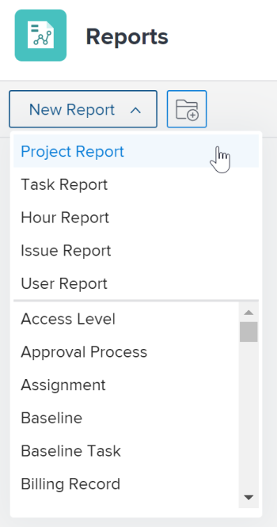
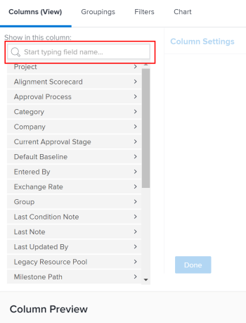

# Create a custom report

The highlighted information on this page refers to functionality not yet generally available. It is available only in the Preview Sandbox environment.

Understanding how to create reports helps you provide access to the information your organization needs within *Adobe Workfront*. You can use any of the built-in reports available in *Workfront*, or you can build your own reports from scratch.

For more information on built-in reports, see [Use Adobe Workfront built-in reports](../../../reports-and-dashboards/reports/using-built-in-reports/use-workfront-built-in-reports.md). For information on creating a report by copying it, see [Create a copy of a report](../../../reports-and-dashboards/reports/creating-and-managing-reports/create-copy-report.md).

## Access requirements

You must have the following access to perform the steps in this article:

<table cellspacing="0"> 
 <col> 
 <col> 
 <tbody> 
  <tr> 
   <td role="rowheader"><em>Adobe Workfront</em> plan*</td> 
   <td> 
Any
 </td> 
  </tr> 
  <tr> 
   <td role="rowheader"><em>Adobe Workfront</em> license*</td> 
   <td> 
<em>Plan</em> 
 </td> 
  </tr> 
  <tr> 
   <td role="rowheader">Access level configurations*</td> 
   <td> 
Edit access to&nbsp;Reports,&nbsp;Dashboards,&nbsp;Calendars
 
Edit access to Filters,&nbsp;Views, Groupings
 
Note: If you still don't have access, ask your <em>Workfront administrator</em> if they set additional restrictions in your access level. For information on how a <em>Workfront administrator</em> can modify your access level, see <a href="../../../administration-and-setup/add-users/configure-and-grant-access/create-modify-access-levels.md" class="MCXref xref">Create or modify custom access levels</a>.
 </td> 
  </tr> 
  <tr> 
   <td role="rowheader">Object permissions</td> 
   <td> 
You will obtain manage permissions to the report you create
 
For information on requesting additional access, see <a href="../../../workfront-basics/grant-and-request-access-to-objects/request-access.md" class="MCXref xref">Request access to objects in Adobe Workfront</a>.
 </td> 
  </tr> 
 </tbody> 
</table>

&#42;To find out what plan, license type, or access you have, contact your *Workfront administrator*.

## Create a report

To watch a video of how to create a report, see this [Video walk-through](#walk-thr) below.

<ol> 
 <li value="1"> <draft-comment>
   
Click the Main Menu icon  in the upper-right corner, then click Reports.

  </draft-comment>
Click the Main Menu icon  in the upper-right corner, then click Reports.
 </li> 
 <li value="2"> 
Click New Report, then select the object type that you want for the report.
 
The report builder loads.
 
For specific information about available object reports, see the section <a href="../../../workfront-basics/navigate-workfront/workfront-navigation/understand-objects.md#reporting-on-objects" class="MCXref xref">Report on objects</a> in the article <a href="../../../workfront-basics/navigate-workfront/workfront-navigation/understand-objects.md" class="MCXref xref">Understand objects in Adobe Workfront</a>.
 
 <draft-comment>
    
   </draft-comment> 
 <note type="tip">
   You can also create a report by making a copy of an existing report. For more information, see 
   <a href="../../../reports-and-dashboards/reports/creating-and-managing-reports/create-copy-report.md" class="MCXref xref">Create a copy of a report</a>.
  </note> </li> 
 <li value="3"> 
In the report builder, add the following to your report:
 
  <table cellspacing="15"> 
   <col> 
   <col> 
   <thead> 
    <tr> 
     <th>Feature</th> 
     <th>Description</th> 
    </tr> 
   </thead> 
   <tbody> 
    <tr> 
     <td>Columns (View)</td> 
     <td> 
Adding columns to your report determines what information your report contains.
 
To learn how to add a column, see <a href="#add-columns" class="MCXref xref">Add columns (view) to a report</a>. 
 </td> 
    </tr> 
    <tr> 
     <td>Groupings</td> 
     <td> 
Adding groupings to your report determines how your report is organized.
 
To learn how to add a grouping, see <a href="#add-groupings" class="MCXref xref">Add groupings to a report</a>.
 </td> 
    </tr> 
    <tr> 
     <td>Filters</td> 
     <td> 
Adding filter rules to your report determines information you see in your report.
 
To learn how to add a filter, see <a href="#add-filters" class="MCXref xref">Add filters to a report</a>.
 </td> 
    </tr> 
    <tr> 
     <td>Chart</td> 
     <td> 
Adding a chart to your report determines how the information in your report is presented visually.
 
To learn how to add a chart, see <a href="#add-a-chart" class="MCXref xref">Add a chart to a report</a>.
 </td> 
    </tr> 
   </tbody> 
  </table> </li> 
 <li value="4"> 
At any point during the report creation process, click Apply to save your changes.
 </li> 
 <li value="5"> 
After you are finished, click Save + Close.
 </li> 
</ol>

### Add columns (view) to a report

<ol> 
 <li value="1"> 
Start creating a report as described in the <a href="#how-to" class="MCXref xref">Create a report</a> section in this article.
 </li> 
 <li value="2"> 
In the report builder, select the Columns (View) tab to identify the columns to appear in the report.
 </li> 
 <li value="3"> 
(Optional) Click Apply an Existing View to use an existing view.
 
For more information about creating a new view, see <a href="../../../reports-and-dashboards/reports/reporting-elements/views-overview.md" class="MCXref xref">Views overview in Adobe Workfront</a>.
 </li> 
 <li value="4"> 
To add a new column, click Add Column.
 
Or
 
To change an existing column, select the column that you want to change, then click the (x) next to the current name.
 </li> 
 <li value="5"> 
Begin typing the field that you want to add. If the field is available, it populates for each object where it can be associated. Click the name of the field to add it to the column.
 
For more information about the fields you see in the columns, see <a href="../../../workfront-basics/navigate-workfront/workfront-navigation/workfront-terminology-glossary.md" class="MCXref xref">Glossary of Adobe Workfront terminology</a>.
 
 <draft-comment>
    
   </draft-comment> 
 </li> 
 <li value="6"> 
(Optional) In the Column Settings area, select Sort by this column to sort the values in the column either in ascending on descending alphabetical order, then indicate whether the list should use this column as its first sort.
 
You can have multiple levels of sorts in a report view if you want to sort by the value in one column first, the value in a second column secondly, etc.
 
If multiple results are identical according to the first sorting criteria, they sort in the order of the second sorting criteria. If multiple results are identical according to the first and second sorting criteria, they sort according to the third sorting, etc.
 <note type="note">
   If you add a field that references an object that is too far removed from the object that you're reporting on, you may not be able to sort by this field.
    For example, an issue report cannot sort by the Project Owner field because it references 3 additional objects: Project, Owner, and Name. However, you can still add this field to an issue report and see the information for it.
    To learn more about cross-object references in reports, see the section "Advanced Reporting Part 1 of 3" in the 
   <a href="https://one.workfront.com/s/learningpath2/workfront-reporting-MC7MZT2BOL2ZC2LMJ4MA3EMHOCNY?tabset-dc70e=2" target="_blank">Reports and Dashboards Learning Path</a>.
    
  </note> </li> 
 <li value="7"> 
(Optional) If you are using groupings and you want to summarize (aggregate) the information in a column, click the Summarize this column by drop-down list in the Column Settings area, then select the option you want to use to aggregate the information in the column. 
 
The aggregated information displays in the column in the grouping rows:
 
  
 <draft-comment>
   
  

  </draft-comment>
  
 
For more information about summarizing data in a column, see <a href="../../../reports-and-dashboards/reports/reporting-elements/views-overview.md" class="MCXref xref">Views overview in Adobe Workfront</a>. 
 <note type="note">  
   
The following exceptions apply for parent objects (for example, parent tasks) when you are aggregating values for the following fields in groupings:
 
   <ul> 
    <li>All the number and currency fields except Actual Hours (for example, Planned/ Actual Labor Cost, Planned/ Actual Expense Cost, Planned/ Actual Cost, Planned Hours) aggregate only the values for the children tasks, and standalone tasks. They do not aggregate the values for the parent tasks or parents of parents. </li> 
    <li>Actual Hours aggregate the values for the main parent and the standalone tasks; they do not aggregate the numbers for the parents of parent tasks or the children tasks. </li> 
    <li>Custom data fields for number and currency values aggregate all tasks: parents, children, parents of parents, and standalone tasks. </li> 
   </ul> 
  </note> 
For more information about using groupings in a report, see <a href="../../../reports-and-dashboards/reports/reporting-elements/groupings-overview.md" class="MCXref xref">Groupings overview in Adobe Workfront</a>.
 </li> 
 <li value="8"> 
(Optional) Click Advanced Options to specify the following information for the column:
 
  <table cellspacing="0"> 
   <col> 
   <col> 
   <tbody> 
    <tr> 
     <td role="rowheader">Custom Column Label</td> 
     <td> 
Specify a custom label for the column. This label replaces the default label.
 </td> 
    </tr> 
    <tr> 
     <td role="rowheader">Field Format</td> 
     <td> 
Select the format in which you want the values to be displayed for fields in the column.
 </td> 
    </tr> 
    <tr> 
     <td role="rowheader">Show this column when on a Dashboard</td> 
     <td> 
Select this option to show this column on a dashboard, when the report is displayed side by side with another report. When this option is unselected, this column is not displayed when viewing the report on a dashboard where reports are displayed side by side.
 </td> 
    </tr> 
    <tr> 
     <td role="rowheader">Column Rules</td> 
     <td> 
Click Add a Rule for this Column to add conditional formatting to the column. After you add a rule, you can define field and text styles for how fields that match that rule are displayed. Click Add Rule after you have finished defining the rule. For more information about conditional formatting in a view, see <a href="../../../reports-and-dashboards/reports/reporting-elements/use-conditional-formatting-views.md" class="MCXref xref">Use conditional formatting in Views</a>.
 </td> 
    </tr> 
   </tbody> 
  </table> </li> 
 <li value="9"> 
Click Apply to apply your changes so far and continue editing the report with the following options.
 
Click Save + Close if you are finished editing the columns in the report and you want to save the report.
 </li> 
</ol>

### Add groupings to a report

<ol> 
 <li value="1"> 
Start creating a report as described in the <a href="#how-to" class="MCXref xref">Create a report</a> section in this article.
 </li> 
 <li value="2"> 
In the report builder, select the Groupings tab to identify how you want to group items in the report.
 </li> 
 <li value="3"> 
Click Add Grouping to add a new grouping.
 
Or
 
Choose Apply an Existing Grouping to select an existing grouping
 
 <draft-comment>
    
   </draft-comment> 
 </li> 
 <li value="4"> 
Start typing the field that you want to add as a grouping. If the field is available, it populates for each object where it can be associated. Click the name of the field to add it to that grouping.
 </li> 
 <li value="5"> 
(Optional) You can choose to build a grouping in text mode, by clicking Switch to Text Mode. For more information about using text mode, see <a href="../../../reports-and-dashboards/reports/text-mode/understand-text-mode.md" class="MCXref xref">Text Mode overview</a>.
 
For more information about creating new groupings, see <a href="../../../reports-and-dashboards/reports/reporting-elements/groupings-overview.md" class="MCXref xref">Groupings overview in Adobe Workfront</a>.
 </li> <draft-comment>
  <li value="6" data-mc-conditions="QuicksilverOrClassic.Quicksilver"> 
(Optional) Select Collapse this grouping by default if you want the results in this grouping to display collapsed rather than expanded.
 
This setting is disabled by default and the results of the grouping always display in an expanded list.
 
   
Tips: </b>"> <b>Tips: </b> 
    <ul> 
     <li> 
When you manually adjust groupings when viewing a list, <em>Workfront</em> remembers your manual preference until you log out. When you log back in, the list displays according to this setting.
 </li> 
     <li> 
The results of a grouping always display expanded after accessing them from a chart element.
 </li> 
    </ul> 
   
 </li>
 </draft-comment>
 <li value="6" data-mc-conditions="QuicksilverOrClassic.Quicksilver"> 
(Optional) Select Collapse this grouping by default if you want the results in this grouping to display collapsed rather than expanded.
 
This setting is disabled by default and the results of the grouping always display in an expanded list.
 
  
Tips: </b>"> <b>Tips: </b> 
   <ul> 
    <li> 
When you manually adjust groupings when viewing a list, <em>Workfront</em> remembers your manual preference until you log out. When you log back in, the list displays according to this setting.
 </li> 
    <li> 
The results of a grouping always display expanded after accessing them from a chart element.
 </li> 
   </ul> 
  
 </li> 
 <li value="7"> 
(Optional) You can choose to build a matrix grouping, to show your results in a grid format. 
 
For more information about building a matrix report, see <a href="../../../reports-and-dashboards/reports/creating-and-managing-reports/create-matrix-report.md" class="MCXref xref">Create a matrix report</a>.
 </li> 
 <li value="8"> 
Click Apply to apply your changes so far and continue editing the report with the following options.
 
Click Save + Close if you are finished editing the groupings in the report and you want to save the report.
 </li> 
</ol>

### Add filters to a report

<ol> 
 <li value="1"> 
Start creating a report as described in the <a href="#how-to" class="MCXref xref">Create a report</a> section in this article.
 </li> 
 <li value="2"> 
In the report builder, select the Filters tab to identify the amount of information that you want the report to include.
 </li> 
 <li value="3"> 
Click Add a Filter Rule to add a custom filter. Or Choose Apply an Existing Filter to use an existing filter.
 
 <draft-comment>
    
   </draft-comment> 
 </li> 
 <li value="4"> 
If you clicked Add a Filter Rule, start typing the field that you want to add as a filter. If the field is available, it populates for each object where it can be associated. Click the name of the field to add it to that filter. Use filter modifiers to build your filter. For more information about filter modifiers, see <a href="../../../reports-and-dashboards/reports/reporting-elements/filter-condition-modifiers.md" class="MCXref xref">Filter and condition modifiers</a>.
 
For more information about creating new filters, see <a href="../../../reports-and-dashboards/reports/reporting-elements/filters-overview.md" class="MCXref xref">Filters overview in Adobe Workfront</a>.
 </li> 
 <li value="5"> 
(Optional) You can choose to build a filter in text mode by clicking Switch to Text Mode.
 
For more information about using text mode, see <a href="../../../reports-and-dashboards/reports/text-mode/understand-text-mode.md" class="MCXref xref">Text Mode overview</a>.
 </li> 
 <li value="6"> 
Click Apply when you are finished editing the filters in the report to apply your changes so far and continue editing the report with the following options.
 
Click Save + Close if the report and you want to save the report.
 </li> 
</ol>

### Add a chart to a report

<ol> 
 <li value="1"> 
Start creating a report as described in the <a href="#how-to" class="MCXref xref">Create a report</a> section in this article.
 </li> 
 <li value="2"> 
In the report builder, select the Chart tab, then select the type of chart you want to add.
 
 <draft-comment>
    
   </draft-comment> 
 
For more information about building a chart in a report, see <a href="../../../reports-and-dashboards/reports/creating-and-managing-reports/add-chart-report.md" class="MCXref xref">Add a chart to a report</a>.
 </li> 
 <li value="3"> 
Click Apply to apply your changes so far and continue editing the report with the following options.
 
Click Save + Close if you are finished editing the report and you want to save the report.
 </li> 
</ol>

## Video walk-through

View the following video to learn how to create a report. This video was recorded in *Workfront Classic*. However, the content also applies to *the new Workfront experience*.

<!--
<h2 data-mc-conditions="QuicksilverOrClassic.Draft mode">Additional information</h2>
-->

## Additional information

<!--
<ul data-mc-conditions="QuicksilverOrClassic.Draft mode"> <draft-comment>
<li data-mc-conditions="QuicksilverOrClassic.Quicksilver"> 
<a href="https://one.workfront.com/s/basic-report-creation-program">Basic Report Creation Program for the new Workfront experience</a> 
 </li>
</draft-comment>
<li data-mc-conditions="QuicksilverOrClassic.Quicksilver"> 
<a href="https://one.workfront.com/s/basic-report-creation-program">Basic Report Creation Program for the new Workfront experience</a> 
 </li>
<li><a href="../../../reports-and-dashboards/reports/reporting/get-started-reports-workfront.md" class="MCXref xref">Get started with reports in Adobe Workfront</a> </li>
<li><a href="../../../reports-and-dashboards/reports/using-built-in-reports/use-workfront-built-in-reports.md" class="MCXref xref">Use Adobe Workfront built-in reports</a> </li>
<li><![CDATA[
]]><a href="../../../reports-and-dashboards/reports/text-mode/understand-text-mode.md" class="MCXref xref">Text Mode overview</a></li>
<li><a href="../../../reports-and-dashboards/reports/creating-and-managing-reports/edit-report-settings.md" class="MCXref xref">Edit report settings</a> </li>
<li><a href="../../../reports-and-dashboards/reports/reporting-elements/understand-wildcard-filter-variables.md" class="MCXref xref">Wildcard filter variables</a> </li>
<li><a href="../../../reports-and-dashboards/reports/creating-and-managing-reports/add-chart-report.md" class="MCXref xref">Add a chart to a report</a> </li>
</ul>
-->

* [Basic Report Creation Program for the new Workfront experience](https://one.workfront.com/s/basic-report-creation-program) 
* [Get started with reports in Adobe Workfront](../../../reports-and-dashboards/reports/reporting/get-started-reports-workfront.md) 
* [Use Adobe Workfront built-in reports](../../../reports-and-dashboards/reports/using-built-in-reports/use-workfront-built-in-reports.md) 
* <![CDATA[        			]]> [Text Mode overview](../../../reports-and-dashboards/reports/text-mode/understand-text-mode.md)
* [Edit report settings](../../../reports-and-dashboards/reports/creating-and-managing-reports/edit-report-settings.md) 
* [Wildcard filter variables](../../../reports-and-dashboards/reports/reporting-elements/understand-wildcard-filter-variables.md) 
* [Add a chart to a report](../../../reports-and-dashboards/reports/creating-and-managing-reports/add-chart-report.md)

