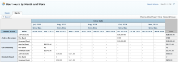
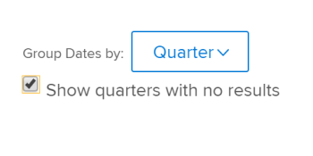

# Create a matrix report

Matrix reports present summary information in an aggregated table format, making it easier to view than if it were displayed in a list like in a traditional report.

## When to use a matrix report

You can create a matrix report for any report that contains 2 or more Groupings. A traditional report can contain up to 3 Groupings, and a matrix report can contain up to 4 Groupings.

For example, you want to create an Hour report that displays the hours logged during a 3-month period, and you want the report to be organized according to who entered the hours, as well as by month and week.

## How data displays in a matrix report

Information in the matrix report is always displayed as a numerical value. In most cases, columns that contain a numerical value are best for displaying in a matrix report (such as hours logged and actual cost).

However, other columns (such as Status) can still be displayed in the matrix report as shown in the following graphic:  

## Access requirements

You must have the following access to perform the steps in this article:

<table cellspacing="0"> 
 <col> 
 <col> 
 <tbody> 
  <tr> 
   <td role="rowheader"><em>Adobe Workfront</em> plan*</td> 
   <td> 
Any
 </td> 
  </tr> 
  <tr> 
   <td role="rowheader"><em>Adobe Workfront</em> license*</td> 
   <td> 
<em>Plan</em> 
 </td> 
  </tr> 
  <tr> 
   <td role="rowheader">Access level configurations*</td> 
   <td> 
Edit access to&nbsp;Reports,&nbsp;Dashboards,&nbsp;Calendars
 
Edit access to Filters,&nbsp;Views, Groupings
 
Note: If you still don't have access, ask your <em>Workfront administrator</em> if they set additional restrictions in your access level. For information on how a <em>Workfront administrator</em> can modify your access level, see <a href="../../../administration-and-setup/add-users/configure-and-grant-access/create-modify-access-levels.md" class="MCXref xref">Create or modify custom access levels</a>.
 </td> 
  </tr> 
  <tr> 
   <td role="rowheader">Object permissions</td> 
   <td> 
Manage permissions to a report
 
For information on requesting additional access, see <a href="../../../workfront-basics/grant-and-request-access-to-objects/request-access.md" class="MCXref xref">Request access to objects in Adobe Workfront</a>.
 </td> 
  </tr> 
 </tbody> 
</table>

&#42;To find out what plan, license type, or access you have, contact your *Workfront administrator*.

## Set up a matrix report

<ol> 
 <li value="1">Create a traditional report that contains numerical data in the report output. For information about how to create a report, see <a href="../../../reports-and-dashboards/reports/creating-and-managing-reports/create-custom-report.md" class="MCXref xref">Create a custom report</a>.</li> 
 <li value="2">Go to the report that you created in Step 1, click Report Actions, then select Edit.</li> 
 <li value="3">(Conditional) If you already created a View and you want o apply it to this report, click Apply an Existing View, then select the View from the drop-down list.</li> 
 <li value="4">(Conditional) If you want to create a new View for the report, complete the following steps:  
  <ol> 
   <li value="1">Click the Columns (View) tab, then select a column that you want to be summarized in the matrix report.</li> 
   <li value="2">
In the Column Settings area, click the Summarize this column by drop-down list, then select one of the available options for summarizing the information.
<note type="important">
     If this option is not selected, the information from the column is not displayed correctly in the matrix report.
    </note>

     <draft-comment>
      
     </draft-comment>
</li> 
   <li value="3">Repeat this process for each column in the Columns (View) tab, then click Done.</li> 
  </ol></li> 
 <li value="5">Click the Groupings tab.</li> 
 <li value="6">(Conditional) If you already created a Grouping and you want to apply it to this report, click Apply an Existing Grouping, then select the Grouping from the drop-down list.</li> 
 <li value="7">(Conditional) If you want to create a new matrix Grouping for the report,complete the following steps:  
  <ol> 
   <li value="1">Select Switch to Matrix Grouping in the upper-right corner of the builder interface. </li> 
   <li value="2">In the Row Groupings section, identify the row grouping, which establishes the horizontal groupings of the table.</li> 
   <li value="3">(Optional) To add an additional row grouping, click Add secondary Row Grouping.</li> 
   <li value="4">In the Column Groupings section, identify the column grouping, which establish the vertical groupings of the table.</li> 
   <li value="5">(Optional) To add an additional column grouping, click Add secondary Column Grouping.</li> 
   <li value="6">(Conditional) If you add a grouping by date, also specify whether the results are grouped by day, week, month, quarter or year. <draft-comment>
     
    </draft-comment> </li> 
   <li value="7">(Conditional) If you selected to group by date and to show results by quarter, for example, specify whether you want to show quarters with no data by selecting the Show quarters with no results checkbox. <draft-comment>
     
    </draft-comment>  <note type="note">  The 
     Show quarters with no results field is only available for matrix groupings, and not for standard groupings. 
      Only the quarters with no data that are located in-between two quarters with valid data will display zero for the data values in the matrix tab. The quarters that have no data that are located at the beginning and the end of the timeframe selected by your filter do not appear at all in the matrix grouping. The quarters with no results will not display in a grouping on the Details tab of the report. 
    </note></li> 
  </ol></li> 
 <li value="8">(Optional and conditional) Click Matrix Settings, then select from the following options: Show Record Counts: Select this option to display a row with the total number of entries for the given field. Show Value Column: Select this option to display the following information in the matrix: 
  <ul> 
   <li>Record Counts</li> 
   <li>
The Value column
 <note type="note"> This column contains information that describes what the data in each row represents. 
      The following exceptions apply for parent objects (for example, parent tasks) when you are aggregating values for the following fields in groupings: 
       
     <ul> 
      <li>All the number and currency fields except Actual Hours (for example, Planned/ Actual Labor Cost, Planned/ Actual Expense Cost, Planned/ Actual Cost, Planned Hours) aggregate only the values for the children tasks, and standalone tasks. They do not aggregate the values for the parent tasks or parents of parents.</li> 
      <li>Actual Hours aggregate the values for the main parent and the standalone tasks; they do not aggregate the numbers for the parents of parent tasks or the children tasks.</li> 
      <li>Custom data fields for number and currency values aggregate all tasks: parents, children, parents of parents, and standalone tasks. If you created the matrix report to display Planned Hours or Actual Hours in the Value column, be aware that hours or cost information for any parent objects (such as parent tasks) are not displayed in the matrix report. To view hours on parent objects, you must view the Details tab.</li> 
     </ul> 
    </note></li> 
  </ul>
Conditional Rules: Set up any formatting rules for values that are aggregated. After you add a rule, you can define field and text styles for how fields that match that rule are displayed. Click Add Rule after you have finished defining the rule, then Done to save the rule.
</li> 
 <li value="9">Click the Filters tab to define what information will display in the report.</li> 
 <li value="10">(Conditional) If you already created a Filter and you want to apply it to this report, click Apply an Existing Filter, then select the Filter from the drop-down list.</li> 
 <li value="11">(Conditional) If you want to create a new Filter for this report, see <a href="../../../reports-and-dashboards/reports/reporting-elements/filter-condition-modifiers.md" class="MCXref xref">Filter and condition modifiers</a><draft-comment>
   <MadCap:conditionalText data-mc-conditions="QuicksilverOrClassic.Draft mode">
     and 
    <a href="../../../reports-and-dashboards/reports/reporting-elements/advanced-filter-condition-qualifiers.md" class="MCXref xref">Advanced Filter and condition qualifiers </a> 
   </MadCap:conditionalText>
  </draft-comment><MadCap:conditionalText data-mc-conditions="QuicksilverOrClassic.Draft mode">
    and 
   <a href="../../../reports-and-dashboards/reports/reporting-elements/advanced-filter-condition-qualifiers.md" class="MCXref xref">Advanced Filter and condition qualifiers </a> 
  </MadCap:conditionalText> for information about the various qualifiers that you can use when building filters.</li> 
 <li value="12">Click Save+Close to save and view the matrix report.</li> 
</ol>

