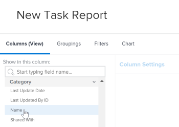
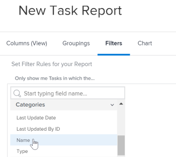

# Reference a custom form in a report

You can reference the custom forms of an object in the Views, Filters, and Groupings of a report for that object.

You can reference the content of custom forms to include in a report, or you can reference information about the custom forms themselves to include in a report.

## Access requirements

You must have the following access to perform the steps in this article:

<table cellspacing="0"> 
 <col> 
 <col> 
 <tbody> 
  <tr> 
   <td role="rowheader"><em>Adobe Workfront</em> plan*</td> 
   <td> 
Any
 </td> 
  </tr> 
  <tr> 
   <td role="rowheader"><em>Adobe Workfront</em> license*</td> 
   <td> 
<em>Plan</em> 
 </td> 
  </tr> 
  <tr> 
   <td role="rowheader">Access level configurations*</td> 
   <td> 
Edit access to&nbsp;Reports,&nbsp;Dashboards,&nbsp;Calendars
 
Edit access to Filters,&nbsp;Views, Groupings
 
Note: If you still don't have access, ask your <em>Workfront administrator</em> if they set additional restrictions in your access level. For information on how a <em>Workfront administrator</em> can modify your access level, see <a href="../../../administration-and-setup/add-users/configure-and-grant-access/create-modify-access-levels.md" class="MCXref xref">Create or modify custom access levels</a>.
 </td> 
  </tr> 
  <tr> 
   <td role="rowheader">Object permissions</td> 
   <td> 
Manage permissions to a report
 
For information on requesting additional access, see <a href="../../../workfront-basics/grant-and-request-access-to-objects/request-access.md" class="MCXref xref">Request access to objects in Adobe Workfront</a>.
 </td> 
  </tr> 
 </tbody> 
</table>

&#42;To find out what plan, license type, or access you have, contact your *Workfront administrator*.

## Prerequisites

The custom form must exist before you can reference it in a report.

For more information on creating custom forms, see [Create or edit a custom form](../../../administration-and-setup/customize-workfront/create-manage-custom-forms/create-or-edit-a-custom-form.md).

## Reference the content of custom forms

You can reference fields within custom forms. After a custom form is applied to an object, all of the fields associated with that custom form are available to be referenced in a report as any other field on the object would be.

>[!NOTE]
>
>For fields that have multiple options, all options are available in the Filters and Prompts of the report, including those which are hidden.   
>For more information about hiding choices from a custom field with multiple options, see the article [Create or edit a custom form](../../../administration-and-setup/customize-workfront/create-manage-custom-forms/create-or-edit-a-custom-form.md).

When creating the report, simply use the object type of the form as the field source, and use the name of the custom field as the field name.

For example, you might have a custom form applied to all projects that includes the custom field `Consultant`. To create a report that lists all of the projects where Olivia Kim is the consultant, use the `Project` object type as the field source, and use `Consultant` as the field name. Set the filter qualifier to `Equal`, then type Olivia Kim.

<!--

-->

For more information about creating a report, see the article [Create a custom report](../../../reports-and-dashboards/reports/creating-and-managing-reports/create-custom-report.md).

## Reference information about custom forms

You can reference information about custom forms, such as the name of any custom forms associated with an object.

​Depending on the element (View, Filter, or Grouping), you can reference either:

* The primary custom form applied to an object:

  This is the form that appears first on the Details page of the object.

* All custom forms (if more than one custom form is applied to an object)

You can reference custom forms on Views, Filters, and Groupings:

* [Reference custom forms in a report View (Column)](#referencing-custom-forms-in-a-report-view-(column)) 
* [Reference custom forms in a report Filter](#referencing-custom-forms-in-a-report-filter) 
* [Reference custom forms in a report Grouping](#referencing-custom-forms-in-a-report-grouping)

### Reference custom forms in a report View (Column)

To display all custom forms associated with an object:

<ol> 
 <li value="1"> 
Begin creating a report as described in the article <a href="../../../reports-and-dashboards/reports/creating-and-managing-reports/create-custom-report.md" class="MCXref xref">Create a custom report</a>.
 </li> 
 <li value="2"> 
On the Columns tab, expand the object type that the custom form that you want to reference is applied to, then click Category Name. For example, to display all custom forms associated with a task, expand the Task field source, then click the Category Name field name. <draft-comment>
    
   </draft-comment>
 </li> 
</ol>

To display only the primary custom form associated with the object:

<ol> 
 <li value="1"> 
Begin creating a report as described in the article <a href="../../../reports-and-dashboards/reports/creating-and-managing-reports/create-custom-report.md" class="MCXref xref">Create a custom report</a>.
 </li> 
 <li value="2"> 
On the Columns tab, expand the Category field source, then click the Name field name. <draft-comment>
    
   </draft-comment>
 </li> 
</ol>

### Reference custom forms in a report Filter

To filter on all custom forms associated with the object type:

<ol> 
 <li value="1"> 
Begin creating a report as described in the article <a href="../../../reports-and-dashboards/reports/creating-and-managing-reports/create-custom-report.md" class="MCXref xref">Create a custom report</a>.
 </li> 
 <li value="2"> 
On the Filters tab, expand Categories, then click Name. <draft-comment>
    
   </draft-comment>
 </li> 
 <li value="3"> 
Select the condition qualifier that you want to use:
 
  <ul> 
   <li>Is Blank</li> 
   <li>Is Not Blank</li> 
   <li>Contains</li> 
   <li>Does Not Contain</li> 
   <li>Equal</li> 
   <li>Not Equal </li> 
  </ul> 
For more information about each qualifier, see the article <a href="../../../reports-and-dashboards/reports/reporting-elements/filter-condition-modifiers.md" class="MCXref xref">Filter and condition modifiers</a>.   <note type="note">  If the field you are filtering for has multiple options and you use the 
    Not Equal or 
    Does Not Contain qualifiers, this filters out the results that contain only the choice you specify. If the field contains additional options including the one specified, those results are not filtered from the report. This includes filtering for multiple Custom Forms if they are attached to the same object. 
   </note>
 </li> 
 <li value="4"> 
Begin typing the name of the custom form that you want to filter on, then click the name when it appears in the drop-down list.
 </li> 
 <li value="5"> 
(Optional) Click Add another Filter Rule, then repeat steps 2-4 to create additional filter rules.
 </li> 
 <li value="6"> 
Click Save+Close.
 </li> 
</ol>

To filter only on the primary custom form associated with the object type:

<ol> 
 <li value="1"> 
Begin creating a report as described in the article <a href="../../../reports-and-dashboards/reports/creating-and-managing-reports/create-custom-report.md" class="MCXref xref">Create a custom report</a>.
 </li> 
 <li value="2"> 
On the Filters tab, expand the Category field source, then click the Name field name. <draft-comment>
    
   </draft-comment> 
 </li> 
 <li value="3"> 
Select the condition qualifier that you want to use:
 
  <ul> 
   <li>Is Blank</li> 
   <li>Is Not Blank</li> 
   <li>Contains</li> 
   <li>Does Not Contain</li> 
   <li>Equal</li> 
   <li>Not Equal </li> 
  </ul> 
For more information about each qualifier, see the article <a href="../../../reports-and-dashboards/reports/reporting-elements/filter-condition-modifiers.md" class="MCXref xref">Filter and condition modifiers</a>.
 </li> 
 <li value="4"> 
Begin typing the name of the custom form that you want to filter on, then click the name when it appears in the drop-down list.
 </li> 
 <li value="5"> 
(Optional) Click Add another Filter Rule, then repeat steps 2-4 to create additional filter rules.
 </li> 
 <li value="6"> 
Click Save+Close.
 </li> 
</ol>

### Reference custom forms in a report Grouping

>[!NOTE]
>
>You can group items only by the primary custom form that is associated with the object; you cannot group items by all forms that are associated with the object.

<ol> 
 <li value="1"> 
Begin creating a report as described in the article <a href="../../../reports-and-dashboards/reports/creating-and-managing-reports/create-custom-report.md" class="MCXref xref">Create a custom report</a>.
 </li> 
 <li value="2"> 
On the Groupings tab, expand Category, then click Name. <draft-comment>
    
   </draft-comment>
 </li> 
</ol>

