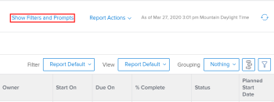

# Run a report {#run-a-report}

You can run any report that you have access to View.

## Access requirements {#access-requirements}

You must have the following access to perform the steps in this article:

<table style="width: 100%;margin-left: 0;margin-right: auto;mc-table-style: url('../../../Resources/TableStyles/TableStyle-List-options-in-steps.css');" class="TableStyle-TableStyle-List-options-in-steps" cellspacing="0"> 
 <col class="TableStyle-TableStyle-List-options-in-steps-Column-Column1"> 
 </col> 
 <col class="TableStyle-TableStyle-List-options-in-steps-Column-Column2"> 
 </col> 
 <tbody> 
  <tr class="TableStyle-TableStyle-List-options-in-steps-Body-LightGray"> 
   <td class="TableStyle-TableStyle-List-options-in-steps-BodyE-Column1-LightGray" role="rowheader">Adobe Workfront plan*</td> 
   <td class="TableStyle-TableStyle-List-options-in-steps-BodyD-Column2-LightGray"> 
Any
 </td> 
  </tr> 
  <tr class="TableStyle-TableStyle-List-options-in-steps-Body-MediumGray"> 
   <td class="TableStyle-TableStyle-List-options-in-steps-BodyE-Column1-MediumGray" role="rowheader">Adobe Workfront license*</td> 
   <td class="TableStyle-TableStyle-List-options-in-steps-BodyD-Column2-MediumGray"> 
Plan 
 </td> 
  </tr> 
  <tr class="TableStyle-TableStyle-List-options-in-steps-Body-LightGray"> 
   <td class="TableStyle-TableStyle-List-options-in-steps-BodyE-Column1-LightGray" role="rowheader">Access level configurations*</td> 
   <td class="TableStyle-TableStyle-List-options-in-steps-BodyD-Column2-LightGray"> 
View access to&nbsp;Reports,&nbsp;Dashboards,&nbsp;Calendars
 
Note: If you still don't have access, ask your Workfront administrator if they set additional restrictions in your access level. For information on how a Workfront administrator can modify your access level, see <a href="create-modify-access-levels.md" class="MCXref xref">Create or modify custom access levels</a>.
 </td> 
  </tr> 
  <tr class="TableStyle-TableStyle-List-options-in-steps-Body-MediumGray"> 
   <td class="TableStyle-TableStyle-List-options-in-steps-BodyB-Column1-MediumGray" role="rowheader">Object permissions</td> 
   <td class="TableStyle-TableStyle-List-options-in-steps-BodyA-Column2-MediumGray"> 
View permissions to a report
 
For information on requesting additional access, see <a href="request-access.md" class="MCXref xref">Request access to objects in Adobe Workfront</a>.
 </td> 
  </tr> 
 </tbody> 
</table>

&#42;To find out what plan, license type, or access you have, contact your *`Workfront administrator`*.  

## Run a report {#run-a-report-1}

1.  `<MadCap:conditionalText data-mc-conditions="QuicksilverOrClassic.Quicksilver"> Click the  Main Menu icon   in the upper-right corner of  Adobe Workfront, then click  Reports.</MadCap:conditionalText>` 
1.  Select from the following options:

    
    
    * `My Reports:` Reports that you have created.
    * `Shared With Me:` Reports that other users have shared with you.
    * `All Reports:` All reports in the system that you have access to.
    
    

1. Click the name of the report that you want to run.  
   Or  
   If the report was created using prompts, select the appropriate information from the drop-down menus, then click `Run Report`.  
   For more information about prompts, see [Add a prompt to a report](add-prompt-report.md).  
   The contents of the report display with a timestamp in the upper-right corner of the report that includes the date, time, and time zone when the report was run from the context of the user who ran the report.

1. (Optional) Click the `Reload icon`  to refresh the results in a report if the report has been displayed in your browser for a while.  

1. (Conditional) If the report uses filters or prompts, click `Show Filters and Prompts` to display a list of filters and prompts that are being used on the report you are viewing. If the report contains only filters or only prompts, `Show Filters` or `Show Prompts` appears instead.  
     
   Information displays below the report name on the left side of the page. For prompts, this is information about the prompt selections made at the time the report was run, as described in Step 4.

1. If you are using Custom Prompts, they do not display. Only the system prompts display. Custom Filters always display.  

## View a cached report {#view-a-cached-report}

Your report might be cached if it has been displayed in your browser for a while. You can force a cached report to reload when you perform any of the following actions:

* Edit the report settings and save the report.
* Change the View, Group, or Filter.
* Click the `Reload icon`  
  This option is available in the upper-right corner of the page within the message box that indicates the time that the report was saved, or it is available in the upper-right corner of the dashboard that the report is placed on. For more information about reloading dashboards, see the section "Display Dashboards" in the article [Get started with dashboards](get-started-dashboards.md).

* Access any page of the report beyond the first page by navigating to the Summary, Matrix, or Chart tabs.

