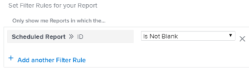

# Report delivery overview

You can schedule&nbsp;reports to&nbsp;be automatically delivered to users on a defined schedule, or you can send reports on one-time basis, manually. When you send a report from *Adobe Workfront*, the user receives an email with the *Workfront* report in a separate attachment.

For information about setting up a report for delivery, see the article [Schedule an automatic report delivery](../../../reports-and-dashboards/reports/creating-and-managing-reports/set-up-automatic-report-delivery.md).

You cannot schedule reports for delivery, nor deliver them manually in the Preview Sandbox environment. For more information about the Preview Sandbox, see the article [The Adobe Workfront Preview Sandbox Environment](../../../administration-and-setup/set-up-workfront/workfront-testing-environments/wf-preview-sandbox-environment.md).  
For more information about delivering reports in the Preview Sandbox environment, see the article [Send a report in the Preview Sandbox environment](../../../reports-and-dashboards/reports/creating-and-managing-reports/send-report-preview-sandbox-environment.md).

## Report delivery limits

Consider the following when scheduling reports for delivery:

* You can schedule up to 10 repeating report deliveries for any given report.
* You can schedule a report to be delivered only if you are the creator of the report. If you need to send a report that you did not create, you can send it on a manual basis.

## Export limits

There are several size limits that affect how reports display in *Workfront* and how they export through a manual export, a delivered report, or through the API:

* `5MB file size:`&nbsp;File size limit for any exported report scheduled for delivery.&nbsp;If an exported file attached to an email is larger than 5MB, a link where the file can be downloaded is emailed instead of the attached exported report.&nbsp;

<ul> 
 <li> 
50,000&nbsp;rows:&nbsp;The number of rows of data allowed in a report export for .pdf and Tab Delimited files.  
 
For Excel .xls files, this limit is 65,000 rows. 
 
For Excel .xlsx files, this limit is 100,000 rows. 
 
These limits exclude the column headings, as well as rows for groupings in the report. For instance, if you have 6 groupings in a report, and 50,000&nbsp;rows or data, the exported file will have 50,000&nbsp;rows. 
 
 If your report has more items than these limits, you receive an error that the export and delivery of the report is not successful. Reduce the number of items you see on the screen to a number less than or equal to these limits to be able to deliver the results.&nbsp;If want to export all the data, we suggest that you use filters to obtain smaller loads&nbsp;of data, then perform multiple exports. For more information, see <a href="../../../reports-and-dashboards/reports/reporting-elements/filters-overview.md" class="MCXref xref">Filters overview in Adobe Workfront</a>.
 
These limits apply to:
 </li> 
 <ul> 
  <li>A manual export of a report.</li> 
  <li>A scheduled report.</li> 
  <li>An export through an API integration.&nbsp;</li> 
  <li> 
Data exported through a kick-start.
 
For more information about exporting data via kick-starts, see the article <a href="../../../administration-and-setup/manage-workfront/using-kick-starts/export-data-from-wf-via-kick-starts.md" class="MCXref xref">Export data from Adobe Workfront via Kick-Starts</a>.
 <note type="note">
    You can export 50,000 rows in a kick-start file, but only to an Excel format file.&nbsp;
   </note> </li> 
  <li> 
Exporting utilization information for a project.
 
For more information about exporting utilization information for a project, see <a href="../../../reports-and-dashboards/reports/using-built-in-reports/resource-utilization-report.md" class="MCXref xref">Overview of the Resource Utilization report</a>.
 </li> 
 </ul> 
 <li>65,530 hyperlinks:&nbsp;This is a limit imposed by Excel on documents that contain more than 65,530 hyperlinks. These documents cannot be opened when they are exported manually, or sent in a delivered report. Note that an Excel document may have just 200 rows of data, but if there are more than 65,530 links inside the document, the document does not open. This limit exists on Excel files only, not on the other supported formats.&nbsp;</li> 
 <li>256 columns:&nbsp;This is a limit imposed by Excel on documents that contain more than 256 columns. These documents cannot be exported manually, or sent in a delivered report. This limit exists on Excel files only, not on the other supported formats.&nbsp;</li> 
</ul>

If you&nbsp;attempt to export data beyond the limit, you might&nbsp;not receive all of the expected data in the export. Rather, a modified report is produced within the limit.&nbsp;

Additionally, reports that take longer than 60 minutes to run will be halted.

If you have concerns or issues regarding your limit, please contact *Workfront* Technical Support.

## Understand time stamps on delivered reports

When receiving a report in an email, the time stamp and time format on the report might not match those in *Workfront*, if you were to view the report in *Workfront* at the same time that it was delivered.&nbsp;

Consider the following:&nbsp;

* When viewing a report in the browser, the time stamp and format on the report matches the&nbsp;locale and the time zone of your browser, as defined in the settings of your browser.
* When the report is delivered in an email, the report is delivered with the time stamp and format that matches the User Locale and Time Zone as they are specified in your *Workfront* profile.   
  For more information about the User Locale and Time Zone in *Workfront*, see the article [Edit a user's profile](../../../administration-and-setup/add-users/create-and-manage-users/edit-a-users-profile.md).

## Reports with a special view

When you apply a special view to a report, the special view displays in of the Details tab of the report in&nbsp;*Workfront*.

When you schedule the delivery of a report that has a special view, the default Details tab is delivered in the attachment of the sent email, instead of the special view.

The following are considered special views:

* Milestone view on a Project report
* Gantt View on a Project or Task report
* Reports with a Chart as the default tab

>[!NOTE]
>
>If there is also a Matrix tab on the report in addition to the default tab with a special view, the report is delivered as it displays on the Matrix tab.

For more information about how to apply a special view to a report, see the article [Create a custom report](../../../reports-and-dashboards/reports/creating-and-managing-reports/create-custom-report.md).

## Use the delivered file

&nbsp;When you send a report from *Workfront*, the user receives an email with the report in a separate attachment.&nbsp;

* [Subject line, attachment name, and report title](#file-names-and-titles) 
* [Timestamps](#timestamps) 
* [Branding](#branding) 
* [Formatting](#formatting) 
* [Links](#links)

### Subject line, attachment name, and report title

For more information about the subject line of the delivered report email, see [Schedule an automatic report delivery](../../../reports-and-dashboards/reports/creating-and-managing-reports/set-up-automatic-report-delivery.md).

The name of the attached report is: *The_Name_Of_The_Report*followed by the exported file format.&nbsp;

If you scheduled the delivered report to be formatted as a PDF or an HTML file, the title of the report will be:

*The Name of the Report.*

Reports scheduled to be delivered in an Excel, Excel (.xlsx), or TSV format do not have a title.

>[!NOTE]
>
>If the report has a description, it will be included in the exported file, if the file is formatted as a PDF or an HTML file.

### Timestamps

A timestamp is displayed on the attached file only if the format of the file is a .pdf. The timestamp is in the footer of the attached file.

The timestamp includes:

* Date
* Time
* Time zone when the report was sent

### Branding

If your *Workfront administrator* has added customized branding to your *Workfront* instance, the reports sent in .pdf format also include your personalized logo.

Reports sent in all other formats cannot be personalized with your logo.

For more information about branding your *Workfront* instance, see the article [Brand your Adobe Workfront instance](../../../administration-and-setup/customize-workfront/brand-workfront/brand-your-workfront-instance.md).

### Formatting

You always receive the default tab of a report when a report is sent or scheduled for a delivery, unless the report has a special view.

If your report has special formatting in the web application, the report should be delivered with the special formatting when the Details and the Matrix tabs are delivered for .pdf and Excel files only.

The filter, view, or grouping of the report are not included in the delivered file. The description of the report is included only when you send the report as a PDF file.

For more information about receiving reports with a special view, see the article [Reports with a special view](#sending-reports-with-a-special-view).  
For more information about selecting the default tab of a report and about special formatting, see [Create a custom report](../../../reports-and-dashboards/reports/creating-and-managing-reports/create-custom-report.md).

### Links

When you send a report from *Workfront* to&nbsp;PDF or Excel format, any working&nbsp;links that exist in the original document remain live in the sent file. Links can point to any object in *Workfront* that supports linking.

The name of the report in the email message is also a link.

## Report on scheduled reports

You can see whether a report has been configured to be delivered by creating the following:

<ul> 
 <li>A View for the Report object in a list or a report for reports: Create a view on a list of reports or in a report for reports, and add the following column to the view: <em>Scheduled Report Name. </em>The names of all the deliveries scheduled for that report are listed in the column in a bulleted list.  </li> 
 <li>A Filter for the Report object:&nbsp;Create a filter on a list of reports or in a report on reports with the following statement: <em>Scheduled Report ID Is Not Blank</em>. This will display only reports that have been scheduled in your list or report. <draft-comment>
   
  </draft-comment> For more information about creating reports, see <a href="../../../reports-and-dashboards/reports/creating-and-managing-reports/create-custom-report.md" class="MCXref xref">Create a custom report</a>. For information on creating a report on reports, see <a href="../../../reports-and-dashboards/reports/report-usage/create-report-reporting-activities.md" class="MCXref xref">Create a report on reporting activities</a>.</li> 
</ul>

<!--
<h2 data-mc-conditions="QuicksilverOrClassic.Draft mode">Scheduling a Repeating&nbsp;Report Delivery</h2>
-->

## Scheduling a Repeating&nbsp;Report Delivery

<!--

You can schedule up to 10 repeating report deliveries for any given report.

-->

You can schedule up to 10 repeating report deliveries for any given report.

<!--

You can schedule a report to be delivered only if you are the creator of the report. If you need to send a report that you did not create, you can send it on a manual basis.

-->

You can schedule a report to be delivered only if you are the creator of the report. If you need to send a report that you did not create, you can send it on a manual basis.

<!--

To schedule&nbsp;a report for automatic delivery or to edit an existing report delivery:&nbsp;​

-->

To schedule&nbsp;a report for automatic delivery or to edit an existing report delivery:&nbsp;​

<ol> <draft-comment>
  <li value="1" data-mc-conditions="QuicksilverOrClassic.Draft mode">Navigate to and click the name of the report for which you want to schedule delivery.&nbsp;</li>
 </draft-comment>
 <li value="1" data-mc-conditions="QuicksilverOrClassic.Draft mode">Navigate to and click the name of the report for which you want to schedule delivery.&nbsp;</li> <draft-comment>
  <li value="2" data-mc-conditions="QuicksilverOrClassic.Draft mode">Click Report Actions, then&nbsp;Send Report.  The Send Report dialog box is displayed.</li>
 </draft-comment>
 <li value="2" data-mc-conditions="QuicksilverOrClassic.Draft mode">Click Report Actions, then&nbsp;Send Report.  The Send Report dialog box is displayed.</li> <draft-comment>
  <li value="3" data-mc-conditions="QuicksilverOrClassic.Draft mode">Select the Repeating Deliveries&nbsp;tab. </li>
 </draft-comment>
 <li value="3" data-mc-conditions="QuicksilverOrClassic.Draft mode">Select the Repeating Deliveries&nbsp;tab. </li> <draft-comment>
  <li value="4" data-mc-conditions="QuicksilverOrClassic.Draft mode">(Conditional)&nbsp;To modify an existing repeating report delivery, select the report delivery in the Repeating Deliveries&nbsp;section.</li>
 </draft-comment>
 <li value="4" data-mc-conditions="QuicksilverOrClassic.Draft mode">(Conditional)&nbsp;To modify an existing repeating report delivery, select the report delivery in the Repeating Deliveries&nbsp;section.</li> <draft-comment>
  <li value="5" data-mc-conditions="QuicksilverOrClassic.Draft mode">Specify the following information: 
   <ul>
    <draft-comment>
     <li data-mc-conditions="QuicksilverOrClassic.Draft mode">Send to: Begin typing the name of the user, group, team, or role who you want to send&nbsp;the report to, then click the name when it appears in the drop-down list. Or Specify the email address of a person external to the <em>Workfront</em> system who you want to have access to the report.  Repeat this process to send the report to multiple users, groups, teams, or roles.</li>
    </draft-comment>
    <li data-mc-conditions="QuicksilverOrClassic.Draft mode">Send to: Begin typing the name of the user, group, team, or role who you want to send&nbsp;the report to, then click the name when it appears in the drop-down list. Or Specify the email address of a person external to the <em>Workfront</em> system who you want to have access to the report.  Repeat this process to send the report to multiple users, groups, teams, or roles.</li><draft-comment>
     <li data-mc-conditions="QuicksilverOrClassic.Draft mode">Email Subject: Specify a subject for the email notification.  By default, the email subject is: <em><em>Workfront</em> Report: <Name of the report> Date of the Export</em>.&nbsp;</li>
    </draft-comment>
    <li data-mc-conditions="QuicksilverOrClassic.Draft mode">Email Subject: Specify a subject for the email notification.  By default, the email subject is: <em><em>Workfront</em> Report: <Name of the report> Date of the Export</em>.&nbsp;</li><draft-comment>
     <li data-mc-conditions="QuicksilverOrClassic.Draft mode">Email Message: Specify a message to include in the email. By default, the email message is:&nbsp;<em>Attached is the <report frequency> report <Name of the report> generated by <em>Workfront</em> on <Date>.</em> <note type="note">
        For reports delivered as an Excel file only, the following message is also added to the email: "Please be aware that with MS Excel (XLS) file types, there is a limit (65,530) on the number of hyperlinks these file types support. If you exceed those limits, your file will not open and it is recommended to resend without the hyperlinks.&nbsp;Please go back to the report scheduler&nbsp;to remove hyperlinks and resend the report." The "please go back to the report scheduler" phrase is a link back to the report.&nbsp;
      </note></li>
    </draft-comment>
    <li data-mc-conditions="QuicksilverOrClassic.Draft mode">Email Message: Specify a message to include in the email. By default, the email message is:&nbsp;<em>Attached is the <report frequency> report <Name of the report> generated by <em>Workfront</em> on <Date>.</em> <note type="note">
       For reports delivered as an Excel file only, the following message is also added to the email: "Please be aware that with MS Excel (XLS) file types, there is a limit (65,530) on the number of hyperlinks these file types support. If you exceed those limits, your file will not open and it is recommended to resend without the hyperlinks.&nbsp;Please go back to the report scheduler&nbsp;to remove hyperlinks and resend the report." The "please go back to the report scheduler" phrase is a link back to the report.&nbsp;
     </note></li><draft-comment>
     <li data-mc-conditions="QuicksilverOrClassic.Draft mode">Deliver this report with the Access Rights of:&nbsp;Begin typing the name of a user who has access to the report, then click the name when it appears&nbsp;in the drop-down list. Users who receive the report will be granted the same level of access to the report as the user that you specify&nbsp;here.  For more information, see <a href="../../../reports-and-dashboards/reports/creating-and-managing-reports/run-deliver-report-access-rights-another-user.md" class="MCXref xref">Run and deliver a report with the access rights of another user</a><note type="note">
        This field does not support wildcards. For example, using the wildcard $$User.ID does not run the report with the access rights of the user who is receiving the report.
      </note></li>
    </draft-comment>
    <li data-mc-conditions="QuicksilverOrClassic.Draft mode">Deliver this report with the Access Rights of:&nbsp;Begin typing the name of a user who has access to the report, then click the name when it appears&nbsp;in the drop-down list. Users who receive the report will be granted the same level of access to the report as the user that you specify&nbsp;here.  For more information, see <a href="../../../reports-and-dashboards/reports/creating-and-managing-reports/run-deliver-report-access-rights-another-user.md" class="MCXref xref">Run and deliver a report with the access rights of another user</a><note type="note">
       This field does not support wildcards. For example, using the wildcard $$User.ID does not run the report with the access rights of the user who is receiving the report.
     </note></li><draft-comment>
     <li data-mc-conditions="QuicksilverOrClassic.Draft mode">Format: Select in which of the following formats you want the report to be delivered:
      <ul>
       <draft-comment>
        <li data-mc-conditions="QuicksilverOrClassic.Draft mode"> HTML</li>
       </draft-comment>
       <li data-mc-conditions="QuicksilverOrClassic.Draft mode"> HTML</li><draft-comment>
        <li data-mc-conditions="QuicksilverOrClassic.Draft mode">PDF</li>
       </draft-comment>
       <li data-mc-conditions="QuicksilverOrClassic.Draft mode">PDF</li><draft-comment>
        <li data-mc-conditions="QuicksilverOrClassic.Draft mode">MS&nbsp;Excel</li>
       </draft-comment>
       <li data-mc-conditions="QuicksilverOrClassic.Draft mode">MS&nbsp;Excel</li><draft-comment>
        <li data-mc-conditions="QuicksilverOrClassic.Draft mode">MS Excel (.xlsx)</li>
       </draft-comment>
       <li data-mc-conditions="QuicksilverOrClassic.Draft mode">MS Excel (.xlsx)</li><draft-comment>
        <li data-mc-conditions="QuicksilverOrClassic.Draft mode">TSV &nbsp;</li>
       </draft-comment>
       <li data-mc-conditions="QuicksilverOrClassic.Draft mode">TSV &nbsp;</li>
      </ul></li>
    </draft-comment>
    <li data-mc-conditions="QuicksilverOrClassic.Draft mode">Format: Select in which of the following formats you want the report to be delivered:
     <ul>
      <li data-mc-conditions="QuicksilverOrClassic.Draft mode"> HTML</li>
      <li data-mc-conditions="QuicksilverOrClassic.Draft mode">PDF</li>
      <li data-mc-conditions="QuicksilverOrClassic.Draft mode">MS&nbsp;Excel</li>
      <li data-mc-conditions="QuicksilverOrClassic.Draft mode">MS Excel (.xlsx)</li>
      <li data-mc-conditions="QuicksilverOrClassic.Draft mode">TSV &nbsp;</li>
     </ul></li><draft-comment>
     <li data-mc-conditions="QuicksilverOrClassic.Draft mode">Include Links:&nbsp;This option is available&nbsp;only when MS Excel is selected in the Format drop-down menu. When this option is enabled, any hyperlinks are included in the exported Excel document.  Documents that contain more than 65,530 links cannot be opened. If the exported document will contain more than 65,530 links, deselect this option. This option is enabled by default.&nbsp;</li>
    </draft-comment>
    <li data-mc-conditions="QuicksilverOrClassic.Draft mode">Include Links:&nbsp;This option is available&nbsp;only when MS Excel is selected in the Format drop-down menu. When this option is enabled, any hyperlinks are included in the exported Excel document.  Documents that contain more than 65,530 links cannot be opened. If the exported document will contain more than 65,530 links, deselect this option. This option is enabled by default.&nbsp;</li><draft-comment>
     <li data-mc-conditions="QuicksilverOrClassic.Draft mode">Summary: Displays a summary of when the delivery repeats.</li>
    </draft-comment>
    <li data-mc-conditions="QuicksilverOrClassic.Draft mode">Summary: Displays a summary of when the delivery repeats.</li><draft-comment>
     <li data-mc-conditions="QuicksilverOrClassic.Draft mode">Repeats: Select whether the report should be delivered daily, weekly, monthly, or yearly.</li>
    </draft-comment>
    <li data-mc-conditions="QuicksilverOrClassic.Draft mode">Repeats: Select whether the report should be delivered daily, weekly, monthly, or yearly.</li><draft-comment>
     <li data-mc-conditions="QuicksilverOrClassic.Draft mode">Repeats Every: Select the frequency with which you want&nbsp;the delivery to repeat. The value you select for this option is&nbsp;based on the option that is selected in the Repeats&nbsp;drop-down list.</li>
    </draft-comment>
    <li data-mc-conditions="QuicksilverOrClassic.Draft mode">Repeats Every: Select the frequency with which you want&nbsp;the delivery to repeat. The value you select for this option is&nbsp;based on the option that is selected in the Repeats&nbsp;drop-down list.</li><draft-comment>
     <li data-mc-conditions="QuicksilverOrClassic.Draft mode">Time: Select the time of day for the delivery to be sent.</li>
    </draft-comment>
    <li data-mc-conditions="QuicksilverOrClassic.Draft mode">Time: Select the time of day for the delivery to be sent.</li>
    <li>
     <draft-comment>
      
Repeats On:&nbsp;This option is available when the Repeats&nbsp;option is set to either Weekly&nbsp;or Monthly.

     </draft-comment>
Repeats On:&nbsp;This option is available when the Repeats&nbsp;option is set to either Weekly&nbsp;or Monthly.

     <ul>
      <draft-comment>
       <li data-mc-conditions="QuicksilverOrClassic.Draft mode">When the Repeats&nbsp;option is set to Weekly: Select the days of the week that the delivery is sent.</li>
      </draft-comment>
      <li data-mc-conditions="QuicksilverOrClassic.Draft mode">When the Repeats&nbsp;option is set to Weekly: Select the days of the week that the delivery is sent.</li><draft-comment>
       <li data-mc-conditions="QuicksilverOrClassic.Draft mode">When the Repeats&nbsp;option is set to Monthly: Select whether the delivery is sent on the day of the month, day of the week, or last day of the month (these options leverage the date that you select in the Starts On&nbsp;field).</li>
      </draft-comment>
      <li data-mc-conditions="QuicksilverOrClassic.Draft mode">When the Repeats&nbsp;option is set to Monthly: Select whether the delivery is sent on the day of the month, day of the week, or last day of the month (these options leverage the date that you select in the Starts On&nbsp;field).</li>
     </ul></li><draft-comment>
     <li data-mc-conditions="QuicksilverOrClassic.Draft mode">Starts On: Select the date for the scheduled delivery to begin.</li>
    </draft-comment>
    <li data-mc-conditions="QuicksilverOrClassic.Draft mode">Starts On: Select the date for the scheduled delivery to begin.</li><draft-comment>
     <li data-mc-conditions="QuicksilverOrClassic.Draft mode">Ends On: Select a date for the scheduled delivery to end.  Or</li>
    </draft-comment>
    <li data-mc-conditions="QuicksilverOrClassic.Draft mode">Ends On: Select a date for the scheduled delivery to end.  Or</li><draft-comment>
     <li data-mc-conditions="QuicksilverOrClassic.Draft mode">Select Never&nbsp;if you want the scheduled delivery to last indefinitely.</li>
    </draft-comment>
    <li data-mc-conditions="QuicksilverOrClassic.Draft mode">Select Never&nbsp;if you want the scheduled delivery to last indefinitely.</li>
   </ul></li>
 </draft-comment>
 <li value="5" data-mc-conditions="QuicksilverOrClassic.Draft mode">Specify the following information: 
  <ul>
   <li data-mc-conditions="QuicksilverOrClassic.Draft mode">Send to: Begin typing the name of the user, group, team, or role who you want to send&nbsp;the report to, then click the name when it appears in the drop-down list. Or Specify the email address of a person external to the <em>Workfront</em> system who you want to have access to the report.  Repeat this process to send the report to multiple users, groups, teams, or roles.</li>
   <li data-mc-conditions="QuicksilverOrClassic.Draft mode">Email Subject: Specify a subject for the email notification.  By default, the email subject is: <em><em>Workfront</em> Report: <Name of the report> Date of the Export</em>.&nbsp;</li>
   <li data-mc-conditions="QuicksilverOrClassic.Draft mode">Email Message: Specify a message to include in the email. By default, the email message is:&nbsp;<em>Attached is the <report frequency> report <Name of the report> generated by <em>Workfront</em> on <Date>.</em> <note type="note">
      For reports delivered as an Excel file only, the following message is also added to the email: "Please be aware that with MS Excel (XLS) file types, there is a limit (65,530) on the number of hyperlinks these file types support. If you exceed those limits, your file will not open and it is recommended to resend without the hyperlinks.&nbsp;Please go back to the report scheduler&nbsp;to remove hyperlinks and resend the report." The "please go back to the report scheduler" phrase is a link back to the report.&nbsp;
    </note></li>
   <li data-mc-conditions="QuicksilverOrClassic.Draft mode">Deliver this report with the Access Rights of:&nbsp;Begin typing the name of a user who has access to the report, then click the name when it appears&nbsp;in the drop-down list. Users who receive the report will be granted the same level of access to the report as the user that you specify&nbsp;here.  For more information, see <a href="../../../reports-and-dashboards/reports/creating-and-managing-reports/run-deliver-report-access-rights-another-user.md" class="MCXref xref">Run and deliver a report with the access rights of another user</a><note type="note">
      This field does not support wildcards. For example, using the wildcard $$User.ID does not run the report with the access rights of the user who is receiving the report.
    </note></li>
   <li data-mc-conditions="QuicksilverOrClassic.Draft mode">Format: Select in which of the following formats you want the report to be delivered:
    <ul>
     <li data-mc-conditions="QuicksilverOrClassic.Draft mode"> HTML</li>
     <li data-mc-conditions="QuicksilverOrClassic.Draft mode">PDF</li>
     <li data-mc-conditions="QuicksilverOrClassic.Draft mode">MS&nbsp;Excel</li>
     <li data-mc-conditions="QuicksilverOrClassic.Draft mode">MS Excel (.xlsx)</li>
     <li data-mc-conditions="QuicksilverOrClassic.Draft mode">TSV &nbsp;</li>
    </ul></li>
   <li data-mc-conditions="QuicksilverOrClassic.Draft mode">Include Links:&nbsp;This option is available&nbsp;only when MS Excel is selected in the Format drop-down menu. When this option is enabled, any hyperlinks are included in the exported Excel document.  Documents that contain more than 65,530 links cannot be opened. If the exported document will contain more than 65,530 links, deselect this option. This option is enabled by default.&nbsp;</li>
   <li data-mc-conditions="QuicksilverOrClassic.Draft mode">Summary: Displays a summary of when the delivery repeats.</li>
   <li data-mc-conditions="QuicksilverOrClassic.Draft mode">Repeats: Select whether the report should be delivered daily, weekly, monthly, or yearly.</li>
   <li data-mc-conditions="QuicksilverOrClassic.Draft mode">Repeats Every: Select the frequency with which you want&nbsp;the delivery to repeat. The value you select for this option is&nbsp;based on the option that is selected in the Repeats&nbsp;drop-down list.</li>
   <li data-mc-conditions="QuicksilverOrClassic.Draft mode">Time: Select the time of day for the delivery to be sent.</li>
   <li>
Repeats On:&nbsp;This option is available when the Repeats&nbsp;option is set to either Weekly&nbsp;or Monthly.

    <ul>
     <li data-mc-conditions="QuicksilverOrClassic.Draft mode">When the Repeats&nbsp;option is set to Weekly: Select the days of the week that the delivery is sent.</li>
     <li data-mc-conditions="QuicksilverOrClassic.Draft mode">When the Repeats&nbsp;option is set to Monthly: Select whether the delivery is sent on the day of the month, day of the week, or last day of the month (these options leverage the date that you select in the Starts On&nbsp;field).</li>
    </ul></li>
   <li data-mc-conditions="QuicksilverOrClassic.Draft mode">Starts On: Select the date for the scheduled delivery to begin.</li>
   <li data-mc-conditions="QuicksilverOrClassic.Draft mode">Ends On: Select a date for the scheduled delivery to end.  Or</li>
   <li data-mc-conditions="QuicksilverOrClassic.Draft mode">Select Never&nbsp;if you want the scheduled delivery to last indefinitely.</li>
  </ul></li> <draft-comment>
  <li value="6" data-mc-conditions="QuicksilverOrClassic.Draft mode">Click Save&nbsp;to save the report delivery.  The report is saved in the Repeating Deliveries&nbsp;section&nbsp;(in the Send Report dialog box).  The report will be sent at the schedule time Or To manually send the report, click Send Now. For more information about sending the report instantly or manually, see&nbsp;.</li>
 </draft-comment>
 <li value="6" data-mc-conditions="QuicksilverOrClassic.Draft mode">Click Save&nbsp;to save the report delivery.  The report is saved in the Repeating Deliveries&nbsp;section&nbsp;(in the Send Report dialog box).  The report will be sent at the schedule time Or To manually send the report, click Send Now. For more information about sending the report instantly or manually, see&nbsp;.</li> 
</ol>

<!--
<h2 data-mc-conditions="QuicksilverOrClassic.Draft mode">Deleting a Scheduled Report Delivery</h2>
-->

## Deleting a Scheduled Report Delivery

   <!--
   <li value="1" data-mc-conditions="QuicksilverOrClassic.Draft mode">Go to the report with the delivery you want to delete.</li>
   -->

1. Go to the report with the delivery you want to delete.

   <!--
   <li value="2" data-mc-conditions="QuicksilverOrClassic.Draft mode">Click Report Actions, then Send Report.&nbsp;</li>
   -->

1. Click `Report Actions`, then `Send Report`.&nbsp;

   <!--
   <li value="3" data-mc-conditions="QuicksilverOrClassic.Draft mode">Click Repeating Deliveries.&nbsp;</li>
   -->

1. Click `Repeating Deliveries`.&nbsp;

   <!--
   <li value="4" data-mc-conditions="QuicksilverOrClassic.Draft mode">Click the name of the scheduled delivery you want to delete, then click Delete. The report is no longer set up for the scheduled delivery.&nbsp;</li>
   -->

1. Click the name of the scheduled delivery you want to delete, then click `Delete`. The report is no longer set up for the scheduled delivery.&nbsp;

<!--
<h2 data-mc-conditions="QuicksilverOrClassic.Draft mode">Sending a Report Manually, on a One-Time Basis</h2>
-->

## Sending a Report Manually, on a One-Time Basis

<!--

You can manually send a report&nbsp;that has been previously scheduled, or you can create a single-use report delivery.​

-->

You can manually send a report&nbsp;that has been previously scheduled, or you can create a single-use report delivery.​

  <!--
  <li data-mc-conditions="QuicksilverOrClassic.Draft mode"><a title="Setting Up Report Deliveries" href="#sending-a-scheduled-report-now" class="MCXref xref">Sending a Scheduled Report Now</a> </li>
  -->

* [Sending a Scheduled Report Now](#sending-a-scheduled-report-now)

  <!--
  <li data-mc-conditions="QuicksilverOrClassic.Draft mode"><a title="Setting Up Report Deliveries" href="#sending-a-report-one-time-only" class="MCXref xref">Sending a Report (One Time Only)</a> </li>
  -->

* [Sending a Report (One Time Only)](#sending-a-report-one-time-only)

<!--
<h3 data-mc-conditions="QuicksilverOrClassic.Draft mode">Sending a Scheduled Report Now</h3>
-->

### Sending a Scheduled Report Now

<!--

After a scheduled report has been set up, you can manually send the report rather than&nbsp;waiting until the scheduled time.

-->

After a scheduled report has been set up, you can manually send the report rather than&nbsp;waiting until the scheduled time.

<ol> <draft-comment>
  <li value="1" data-mc-conditions="QuicksilverOrClassic.Draft mode">Navigate to and click the name of the report that you want to send now.</li>
 </draft-comment>
 <li value="1" data-mc-conditions="QuicksilverOrClassic.Draft mode">Navigate to and click the name of the report that you want to send now.</li> <draft-comment>
  <li value="2" data-mc-conditions="QuicksilverOrClassic.Draft mode">Click Report Actions, then&nbsp;Send Report.  The Send Report dialog box is displayed.</li>
 </draft-comment>
 <li value="2" data-mc-conditions="QuicksilverOrClassic.Draft mode">Click Report Actions, then&nbsp;Send Report.  The Send Report dialog box is displayed.</li> <draft-comment>
  <li value="3" data-mc-conditions="QuicksilverOrClassic.Draft mode">Click the Repeating Deliveries tab.</li>
 </draft-comment>
 <li value="3" data-mc-conditions="QuicksilverOrClassic.Draft mode">Click the Repeating Deliveries tab.</li> <draft-comment>
  <li value="4" data-mc-conditions="QuicksilverOrClassic.Draft mode">In the Repeating Deliveries&nbsp;section, select the report delivery that was previously created. </li>
 </draft-comment>
 <li value="4" data-mc-conditions="QuicksilverOrClassic.Draft mode">In the Repeating Deliveries&nbsp;section, select the report delivery that was previously created. </li> <draft-comment>
  <li value="5" data-mc-conditions="QuicksilverOrClassic.Draft mode">Click Send Now.  The report is sent to all users identified in the scheduled delivery.</li>
 </draft-comment>
 <li value="5" data-mc-conditions="QuicksilverOrClassic.Draft mode">Click Send Now.  The report is sent to all users identified in the scheduled delivery.</li> 
</ol>

<!--
<h3 data-mc-conditions="QuicksilverOrClassic.Draft mode">Sending a Report (One Time Only)</h3>
-->

### Sending a Report (One Time Only)

<!--

You can manually send a report at any time. When you send a report in this way, delivery information (such as&nbsp;the users you are sending to and&nbsp;the email subject) are not saved. If you want to create a report delivery that you can save for later use, create a repeating scheduled report.&nbsp;

-->

You can manually send a report at any time. When you send a report in this way, delivery information (such as&nbsp;the users you are sending to and&nbsp;the email subject) are not saved. If you want to create a report delivery that you can save for later use, create a repeating scheduled report.&nbsp;

<!--

To send a report to users (one time only):

-->

To send a report to users (one time only):

<ol> <draft-comment>
  <li value="1" data-mc-conditions="QuicksilverOrClassic.Draft mode">Navigate to and click the name of the report that you want to send now.</li>
 </draft-comment>
 <li value="1" data-mc-conditions="QuicksilverOrClassic.Draft mode">Navigate to and click the name of the report that you want to send now.</li> <draft-comment>
  <li value="2" data-mc-conditions="QuicksilverOrClassic.Draft mode">Click Report Actions, then&nbsp;Send Report.  The Send Report dialog box is displayed. </li>
 </draft-comment>
 <li value="2" data-mc-conditions="QuicksilverOrClassic.Draft mode">Click Report Actions, then&nbsp;Send Report.  The Send Report dialog box is displayed. </li> <draft-comment>
  <li value="3" data-mc-conditions="QuicksilverOrClassic.Draft mode">On the Send Now&nbsp;tab, specify the following information: 
   <ul>
    <draft-comment>
     <li data-mc-conditions="QuicksilverOrClassic.Draft mode">Send to: Begin typing the name of the user, group, team, or role who you want to send&nbsp;the report to, then click the name when it appears in the drop-down list.&nbsp;Or, specify the email address of a person external to the <em>Workfront</em> system who you want to have access to the report.  Repeat this process to send the report to multiple users, groups, teams, or roles.</li>
    </draft-comment>
    <li data-mc-conditions="QuicksilverOrClassic.Draft mode">Send to: Begin typing the name of the user, group, team, or role who you want to send&nbsp;the report to, then click the name when it appears in the drop-down list.&nbsp;Or, specify the email address of a person external to the <em>Workfront</em> system who you want to have access to the report.  Repeat this process to send the report to multiple users, groups, teams, or roles.</li><draft-comment>
     <li data-mc-conditions="QuicksilverOrClassic.Draft mode">Email Subject: Specify a subject for the email notification.  By default, the email subject is: <em><em>Workfront</em> Report: <Name of the report> Date of the Export</em>.</li>
    </draft-comment>
    <li data-mc-conditions="QuicksilverOrClassic.Draft mode">Email Subject: Specify a subject for the email notification.  By default, the email subject is: <em><em>Workfront</em> Report: <Name of the report> Date of the Export</em>.</li><draft-comment>
     <li data-mc-conditions="QuicksilverOrClassic.Draft mode">Email Message: Specify a message to include in the email. By default, the email message is:&nbsp;<em>Attached is the <report frequency> report <Name of the report> generated by <em>Workfront</em> on <Date>.</em> <note type="note">
        For reports delivered as an Excel file only, the following message is also added to the email: "Please be aware that with MS Excel (XLS) file types, there is a limit (65,530) on the number of hyperlinks these file types support. If you exceed those limits, your file will not open and it is recommended to resend without the hyperlinks.&nbsp;Please go back to the report scheduler&nbsp;to remove hyperlinks and resend the report." The "please go back to the report scheduler" phrase is a link back to the report.&nbsp;
      </note></li>
    </draft-comment>
    <li data-mc-conditions="QuicksilverOrClassic.Draft mode">Email Message: Specify a message to include in the email. By default, the email message is:&nbsp;<em>Attached is the <report frequency> report <Name of the report> generated by <em>Workfront</em> on <Date>.</em> <note type="note">
       For reports delivered as an Excel file only, the following message is also added to the email: "Please be aware that with MS Excel (XLS) file types, there is a limit (65,530) on the number of hyperlinks these file types support. If you exceed those limits, your file will not open and it is recommended to resend without the hyperlinks.&nbsp;Please go back to the report scheduler&nbsp;to remove hyperlinks and resend the report." The "please go back to the report scheduler" phrase is a link back to the report.&nbsp;
     </note></li><draft-comment>
     <li data-mc-conditions="QuicksilverOrClassic.Draft mode">Deliver this report with the Access Rights of:&nbsp;Begin typing the name of a user who has access to the report, then click the name when it appears&nbsp;in the drop-down list. Users who receive the report will be granted the same level of access to the report as the user that you specify&nbsp;here.  For more information, see <a href="../../../reports-and-dashboards/reports/creating-and-managing-reports/run-deliver-report-access-rights-another-user.md" class="MCXref xref">Run and deliver a report with the access rights of another user</a>.<note type="note">
        This field does not support wildcards. For example, using the wildcard $$User.ID does not run the report with the access rights of the user who is receiving the report.
      </note></li>
    </draft-comment>
    <li data-mc-conditions="QuicksilverOrClassic.Draft mode">Deliver this report with the Access Rights of:&nbsp;Begin typing the name of a user who has access to the report, then click the name when it appears&nbsp;in the drop-down list. Users who receive the report will be granted the same level of access to the report as the user that you specify&nbsp;here.  For more information, see <a href="../../../reports-and-dashboards/reports/creating-and-managing-reports/run-deliver-report-access-rights-another-user.md" class="MCXref xref">Run and deliver a report with the access rights of another user</a>.<note type="note">
       This field does not support wildcards. For example, using the wildcard $$User.ID does not run the report with the access rights of the user who is receiving the report.
     </note></li><draft-comment>
     <li data-mc-conditions="QuicksilverOrClassic.Draft mode">Format: Select in which of the following formats you want the report to be delivered:
      <ul>
       <draft-comment>
        <li data-mc-conditions="QuicksilverOrClassic.Draft mode"> HTML</li>
       </draft-comment>
       <li data-mc-conditions="QuicksilverOrClassic.Draft mode"> HTML</li><draft-comment>
        <li data-mc-conditions="QuicksilverOrClassic.Draft mode">PDF</li>
       </draft-comment>
       <li data-mc-conditions="QuicksilverOrClassic.Draft mode">PDF</li><draft-comment>
        <li data-mc-conditions="QuicksilverOrClassic.Draft mode">MS Excel</li>
       </draft-comment>
       <li data-mc-conditions="QuicksilverOrClassic.Draft mode">MS Excel</li><draft-comment>
        <li data-mc-conditions="QuicksilverOrClassic.Draft mode">MS&nbsp;Excel (.xlsx)</li>
       </draft-comment>
       <li data-mc-conditions="QuicksilverOrClassic.Draft mode">MS&nbsp;Excel (.xlsx)</li><draft-comment>
        <li data-mc-conditions="QuicksilverOrClassic.Draft mode">TSV</li>
       </draft-comment>
       <li data-mc-conditions="QuicksilverOrClassic.Draft mode">TSV</li>
      </ul></li>
    </draft-comment>
    <li data-mc-conditions="QuicksilverOrClassic.Draft mode">Format: Select in which of the following formats you want the report to be delivered:
     <ul>
      <li data-mc-conditions="QuicksilverOrClassic.Draft mode"> HTML</li>
      <li data-mc-conditions="QuicksilverOrClassic.Draft mode">PDF</li>
      <li data-mc-conditions="QuicksilverOrClassic.Draft mode">MS Excel</li>
      <li data-mc-conditions="QuicksilverOrClassic.Draft mode">MS&nbsp;Excel (.xlsx)</li>
      <li data-mc-conditions="QuicksilverOrClassic.Draft mode">TSV</li>
     </ul></li><draft-comment>
     <li data-mc-conditions="QuicksilverOrClassic.Draft mode">Include Links:&nbsp;This option is available&nbsp;only when MS Excel is selected in the Format drop-down menu. When this option is enabled, any hyperlinks are included in the exported Excel document.  Documents that contain more than 65,000 links cannot be opened. If the exported document will contain more than 65,000 links, deselect this option. This option is enabled by default.</li>
    </draft-comment>
    <li data-mc-conditions="QuicksilverOrClassic.Draft mode">Include Links:&nbsp;This option is available&nbsp;only when MS Excel is selected in the Format drop-down menu. When this option is enabled, any hyperlinks are included in the exported Excel document.  Documents that contain more than 65,000 links cannot be opened. If the exported document will contain more than 65,000 links, deselect this option. This option is enabled by default.</li>
   </ul></li>
 </draft-comment>
 <li value="3" data-mc-conditions="QuicksilverOrClassic.Draft mode">On the Send Now&nbsp;tab, specify the following information: 
  <ul>
   <li data-mc-conditions="QuicksilverOrClassic.Draft mode">Send to: Begin typing the name of the user, group, team, or role who you want to send&nbsp;the report to, then click the name when it appears in the drop-down list.&nbsp;Or, specify the email address of a person external to the <em>Workfront</em> system who you want to have access to the report.  Repeat this process to send the report to multiple users, groups, teams, or roles.</li>
   <li data-mc-conditions="QuicksilverOrClassic.Draft mode">Email Subject: Specify a subject for the email notification.  By default, the email subject is: <em><em>Workfront</em> Report: <Name of the report> Date of the Export</em>.</li>
   <li data-mc-conditions="QuicksilverOrClassic.Draft mode">Email Message: Specify a message to include in the email. By default, the email message is:&nbsp;<em>Attached is the <report frequency> report <Name of the report> generated by <em>Workfront</em> on <Date>.</em> <note type="note">
      For reports delivered as an Excel file only, the following message is also added to the email: "Please be aware that with MS Excel (XLS) file types, there is a limit (65,530) on the number of hyperlinks these file types support. If you exceed those limits, your file will not open and it is recommended to resend without the hyperlinks.&nbsp;Please go back to the report scheduler&nbsp;to remove hyperlinks and resend the report." The "please go back to the report scheduler" phrase is a link back to the report.&nbsp;
    </note></li>
   <li data-mc-conditions="QuicksilverOrClassic.Draft mode">Deliver this report with the Access Rights of:&nbsp;Begin typing the name of a user who has access to the report, then click the name when it appears&nbsp;in the drop-down list. Users who receive the report will be granted the same level of access to the report as the user that you specify&nbsp;here.  For more information, see <a href="../../../reports-and-dashboards/reports/creating-and-managing-reports/run-deliver-report-access-rights-another-user.md" class="MCXref xref">Run and deliver a report with the access rights of another user</a>.<note type="note">
      This field does not support wildcards. For example, using the wildcard $$User.ID does not run the report with the access rights of the user who is receiving the report.
    </note></li>
   <li data-mc-conditions="QuicksilverOrClassic.Draft mode">Format: Select in which of the following formats you want the report to be delivered:
    <ul>
     <li data-mc-conditions="QuicksilverOrClassic.Draft mode"> HTML</li>
     <li data-mc-conditions="QuicksilverOrClassic.Draft mode">PDF</li>
     <li data-mc-conditions="QuicksilverOrClassic.Draft mode">MS Excel</li>
     <li data-mc-conditions="QuicksilverOrClassic.Draft mode">MS&nbsp;Excel (.xlsx)</li>
     <li data-mc-conditions="QuicksilverOrClassic.Draft mode">TSV</li>
    </ul></li>
   <li data-mc-conditions="QuicksilverOrClassic.Draft mode">Include Links:&nbsp;This option is available&nbsp;only when MS Excel is selected in the Format drop-down menu. When this option is enabled, any hyperlinks are included in the exported Excel document.  Documents that contain more than 65,000 links cannot be opened. If the exported document will contain more than 65,000 links, deselect this option. This option is enabled by default.</li>
  </ul></li> <draft-comment>
  <li value="4" data-mc-conditions="QuicksilverOrClassic.Draft mode">Click Send Now.  The report is sent to all users that you identified.  Or  Click Make Repeating Delivery&nbsp;if you want to set up&nbsp;a scheduled delivery with this same information, then complete the additional information regarding the frequency of when the report is sent.</li>
 </draft-comment>
 <li value="4" data-mc-conditions="QuicksilverOrClassic.Draft mode">Click Send Now.  The report is sent to all users that you identified.  Or  Click Make Repeating Delivery&nbsp;if you want to set up&nbsp;a scheduled delivery with this same information, then complete the additional information regarding the frequency of when the report is sent.</li> 
</ol>

