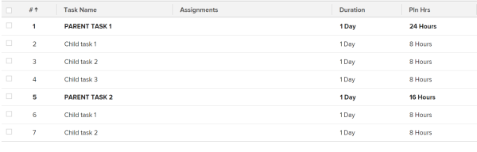

# Column: show name of parent tasks as all caps {#column-show-name-of-parent-tasks-as-all-caps}

You can add this column to a task view to display the name of the parent tasks in all capital letters.

To build this column in a task view:

1. Go to a list of tasks.
1. From the **View** drop-down menu, select **Customize View**.  
   Or  
   From the **View** drop-down menu, select **New View**.

1. In the** Column Preview** area, click the header of the column that shows the task name in the list.
1. Click** Switch to Text Mode**.
1. Mouse over the text mode area, and click **Click to edit text**.
1. Remove the text you find in the **Text Mode** box, and replace it with the following code: `<pre> descriptionkey=name displayname=Task Name textmode=true valueexpression=IF({numberOfChildren}>"0",UPPER({name}),{name}) valueformat=HTML width=150 </pre>`

1. Click **Save View**.

