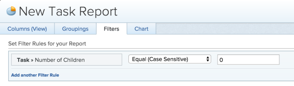

# Filter: parent task filter {#filter-parent-task-filter}

You can apply the following task filter to display only working tasks and remove all parent tasks.

Working tasks are tasks that can be worked independently and are not parent tasks to other tasks.

## Apply a parent task filter using the report builder {#apply-a-parent-task-filter-using-the-report-builder}

1.  `<MadCap:conditionalText data-mc-conditions="QuicksilverOrClassic.Quicksilver"> From the  <b>Main Menu</b>  , click  <b>Reports.</b></MadCap:conditionalText>` 
1. Click **New Report**.
1. Select a **Task Report**.
1. Click **Filters**.
1. Click **Add a Filter Rule**.
1. In the **Start typing field name ...** line, start typing **Number of Children**.

1. Select **Equal (Case Sensitive)** for your modifier, then enter **0** for the number of children.  
   

1. Click **Save + Close**.  
   This pulls a report for all tasks which are working tasks in your system.  
   We recommend that you add a grouping for Project Name to make the report easier to read. For more information about adding groupings to your reports, see the article [Create and customize Groupings](create-customize-groupings.md).

## Apply a parent task filter using a text mode filter {#apply-a-parent-task-filter-using-a-text-mode-filter}

You can apply a filter in a task report to filter out parent tasks and display only working tasks by building a filter in text mode.&nbsp;

To apply a text-mode parent task filter to a task report:

1.  `<MadCap:conditionalText data-mc-conditions="QuicksilverOrClassic.Quicksilver"> From the  <b>Main Menu</b>  , click  <b>Reports</b></MadCap:conditionalText>`.
1. Click **New Report**.
1. Select a **Task Report**.
1. Click **Filters**.
1. Click **Switch to Text Mode**.
1. In the&nbsp;text editing window, copy and paste the following text:&nbsp;  
   `<pre>numberOfChildren=0 numberOfChildren_Mod=eq</pre>`  

   >[!NOTE]
   >
   >If you consider adding more than one filter to this report, we recommend that you add all your filters using the report builder interface, and clicking Switch to Text Mode after all the other filter rules have been added. Then, you can add the code for the parent task filter as noted above.&nbsp;

1. Click **Save + Close**.

