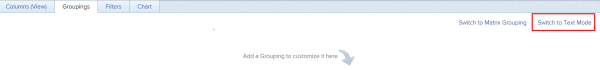
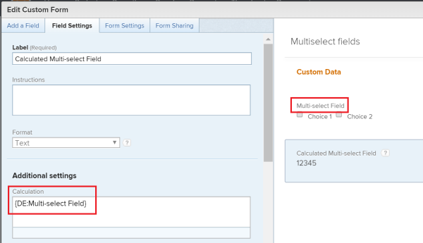
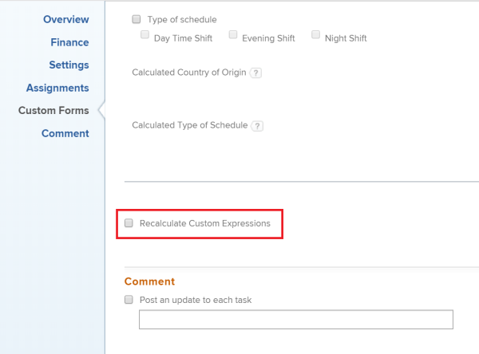

# Group and chart a report by a multi-select custom field {#group-and-chart-a-report-by-a-multi-select-custom-field}

You can group by the value in a multi-select custom field in a `Workfront` report. Examples of multi-select custom fields are:

* Checkboxes
* Multi-select dropdown menus

You can group by this type of field only by using text mode. For information about using text mode, see the article [Understand Text Mode](understand-text-mode.md).

You cannot chart a report by a multi-select custom field. You need to create an additional calculated field that refers to the multi-select custom field to also chart the report by the value of the multi-select custom field.

## Group a report by multi-select custom fields {#group-a-report-by-multi-select-custom-fields}

To be able to group by a multi-select custom field, you must have the following prerequisites:

* Build the multi-select custom field in a custom form.  
  For information about building custom forms and adding custom fields to them, see the article [Create a Custom Form](create-a-custom-form.md).

* Attach the custom form to objects.
* Populate the multi-select custom field with a value on each object.&nbsp;

To group by a multi-select custom field in a report:

1. Create a report or edit an existing one where you want to add a grouping for a multi-select custom field.  
   For information about creating reports, see the article [Create a report](create-report.md).

1. Select the **Groupings** tab.
1. Click **Switch to Text Mode**.  
     

1. Select the text in the **Group your Report** box and replace it with the following code:  
   `<pre>group.0.displayname=Multi-select Custom Field Name group.0.valueexpression={DE:Multi-select Custom Field Name} group.0.valueformat=HTML textmode=true</pre>`

1. Replace "Multi-select Custom Field Name" with the actual name of your multi-select custom field, as it appears in `Workfront`.&nbsp;&nbsp;
1. Click **Save and Close**.  
   The objects in the report are grouped by the values of the multi-select custom field.  
   The name of the groupings of the report are the names of the multi-select custom field followed by the values selected in the field.&nbsp;

## Chart a report by multi-select Custom Fields {#chart-a-report-by-multi-select-custom-fields}

You cannot build a chart in a report by referencing a multi-select custom field. Instead, you can create a calculated field that records the values of the multi-select custom field on a given object and group by the calculated field.&nbsp;

* [Build a calculated custom field that references a multi-select custom field](#building-calculated-field) 
* [Build a chart that references a calculated custom field](#building-a-chart) 

### Build a calculated custom field that references a multi-select custom field {#build-a-calculated-custom-field-that-references-a-multi-select-custom-field}

To be able to build a calculated field that references a multi-select custom field, you must have the following prerequisites:

* Build the multi-select custom field in a custom form.  
  For information about building custom forms and adding custom fields to them, see the article [Create a Custom Form](create-a-custom-form.md).

* Attach the custom form to objects.
* Populate the multi-select custom field with a value on each object.

To build the calculated custom field that references the multi-select custom field:

1. Create a custom form, or edit an existing one.  
   For information about creating custom forms, see the article [Create a Custom Form](create-a-custom-form.md).

1. Click** Add a Field**, then **Calculated **to add the multi-select custom field to the form.

1. In the **Label** box, name the new calculated field to indicate that it references the multi-select custom field.  
   For example: "Calculated Multi-select Field.&nbsp;"

1. In the **Calculation** box, enter the following code:&nbsp;  
   `<pre>{DE:Multi-select Custom Field}</pre>`

   >[!IMPORTANT] {type="important"}
   >
   >Replace "Multi-select Custom Field" with the actual name of your multi-select custom field, as it appears in `Workfront`.

  
     

1. (Optional) If the multi-select custom field is already on this form and if this form is already attached to objects, enable the **Update previous calculations**&nbsp;option.  
   This ensures that the new field is automatically populated with the value from the multi-select custom field as it is added to the forms attached to the objects already.

1. Click **Done**.
1. Click **Save +Close**.

### Build a chart that references a calculated custom field {#build-a-chart-that-references-a-calculated-custom-field}

1.  Go to the report where you want to add the chart for the calculated field that references the multi-select custom field. 
1.  (Optional) To ensure that all the calculated fields that you want to chart by are populated with values, select all the objects in your report, then click **Edit**. 
1.  (Optional and conditional) Enable the **Recalculate Custom Expressions** field, then click **Save Changes**.  
     

1.  Click **Report Actions**, then **Edit**. 

1. `Select the <strong>Groupings</strong> tab, then click <strong>Add Grouping</strong>.` 
1. `Add the<strong> Calculated Multi-select Field</strong> you created as your grouping.` 
1. `Select the <strong>Chart</strong> tab, and add a chart to your report. For information about adding a chart to a report, see the section <a href="create-custom-report.md#add-a-chart" class="MCXref xref">Add a chart to a report</a> in the article <a href="create-custom-report.md" class="MCXref xref">Create a custom report</a>.` 
1. `Select the <strong>Calculated Multi-select Field</strong> as one of the fields to display in the chart.` 
1. `Click <strong>Save + Close</strong>. The report displays the results grouped by the Calculated Multi-select Field in a chart.` 

