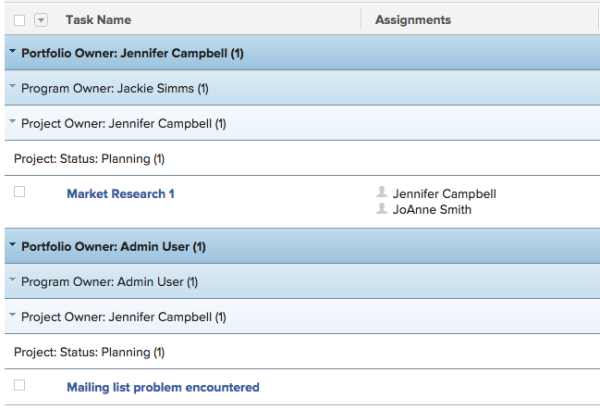

# Grouping: 4-level task Grouping for Portfolio Owner, Program Owner, Project Owner, and Project Status {#grouping-level-task-grouping-for-portfolio-owner-program-owner-project-owner-and-project-status}

This task Grouping provides 4 levels of Grouping. In this case, tasks are grouped by Portfolio Owner, Program Owner, Project Owner, and Project Status.&nbsp;You can only have up to 3 levels of Grouping using the standard interface. To add a fourth level, you must use Text Mode. You cannot group reports by more than 4 criteria at the same time.

To apply this grouping:

1. Go to a list of tasks.
1. From the **Grouping**&nbsp;drop-down menu, select **New Grouping**.

1. Click** Switch to Text Mode**.
1. Remove the text&nbsp;in the **Group your Report** area.
1. Replace&nbsp;the text with the following code:  
   group.0.linkedname=project  
   `<pre>group.0.name=Portfolio Owner group.0.notime=false group.0.valuefield=project:portfolio:owner:name group.0.valueformat=string group.1.linkedname=project group.1.name=Program Owner group.1.notime=false group.1.valuefield=project:program:owner:name group.1.valueformat=string group.2.linkedname=projectOwnerMM group.2.listgrouingparsedmethod=nested(project).nested(owner).string(name) group.2.namekey=projectownermm group.2.notime=false group.2.valuefield=projectOwnerMM:name group.2.valueformat=string group.3.enumclass=com.attask.common.constants.ProjectStatusEnum group.3.linkedname=project group.3.namekey=view.relatedcolumn group.3.namekeyargkey.0=project group.3.namekeyargkey.1=status group.3.notime=false group.3.valuefield=project:status group.3.valueformat=val</pre>`

1. Click **Save Grouping**.

