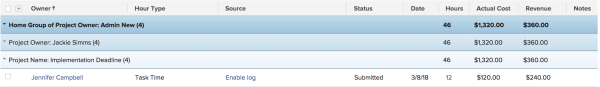

# Grouping: Home Group of Project Owner in a list of hours {#grouping-home-group-of-project-owner-in-a-list-of-hours}

You can display the name of the Home Group of the Project Owner in an Hour list or report.


The grouping also groups the results by the name of the Project Owner and the Project Name.





To apply this grouping:


1. Go to a list of hours.
1. From the&nbsp;**Grouping**&nbsp;drop-down menu, select&nbsp;**New Grouping**.

1. Click**&nbsp;Switch to Text Mode**.
1. Remove the text&nbsp;in the&nbsp;**Group your Report**&nbsp;area.
1.  Replace&nbsp;the text with the following code:


   ```
   group.0.displayname=Home Group of Project Owner<br>group.0.valuefield=project:owner:homeGroup:name<br>group.0.valueformat=HTML<br>group.1.displayname=Project Owner<br>group.1.linkedname=projectOwnerMM<br>group.1.namekey=view.relatedcolumn<br>group.1.namekeyargkey.0=projectOwnerMM<br>group.1.namekeyargkey.1=name<br>group.1.valuefield=projectOwnerMM:name<br>group.1.valueformat=string<br>group.2.displayname=Project Name<br>group.2.linkedname=project<br>group.2.namekey=view.relatedcolumn<br>group.2.namekeyargkey.0=project<br>group.2.namekeyargkey.1=name<br>group.2.valuefield=project:name<br>group.2.valueformat=string<br>textmode=true
   ```

  


1. Click **Save Grouping**.


