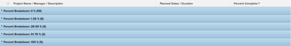

# Grouping: project percent breakdown 1 {#grouping-project-percent-breakdown}

In this custom project grouping, you can display projects grouped by a range of their percent complete values.

The following grouping organizes projects by the percent complete value into one of these groupings:

* 0%
* 1-25%
* 26-50%
* 51-75%
* 76-99%
* 100%

To apply this grouping:

1. Go to a list of projects.
1. From the **Grouping**&nbsp;drop-down menu, select **New Grouping**.

1. Click **Switch to Text Mode**.
1.  Remove the text in the box, and paste the following code in the available space:
   `<pre>group.0.linkedname=direct group.0.name=Percent Breakdown group.0.notime=false group.0.valueexpression=IF({percentComplete}=0,"0 %",IF({percentComplete}<=26,"0-25 %",IF({percentComplete}<=51,"25-50 %",IF({percentComplete}<=76,"50-75 %",IF({percentComplete}<100,"75-99 %","100 %"))))) group.0.valueformat=string</pre>` 

1. Click **Save Grouping**.

