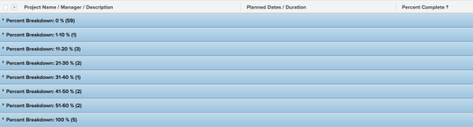

# Grouping: project percent breakdown 2 {#grouping-project-percent-breakdown}

In this custom project grouping, you can display projects grouped by a range of their percent complete values. The breakdowns show percent complete value of 10&nbsp;percent point increments: 0-10%, 11-20%, 21-30% etc.

The following grouping organizes projects by the percent complete value into one of these groupings:

* 0%
* 1-10%
* 11-20%
* 21-30%
* 31-40%
* 41-50%
* 51-60%
* 61-70%
* 71-80%
* 81-90%
* 91-99%
* 100%

To apply this grouping:

1. Go to a list of projects.
1. From the **Grouping**&nbsp;drop-down menu, select **New Grouping**.

1. Click **Switch to Text Mode**.
1. Remove the text in the box, and paste the following code in the available space:  
   `<pre>group.0.linkedname=direct group.0.name=Percent Breakdown group.0.notime=false group.0.valueexpression=IF({percentComplete}=0,"0 %",IF({percentComplete}<=11,"1-10 %",IF({percentComplete}<=21,"11-20 %",IF({percentComplete}<=31,"21-30 %",IF({percentComplete}<41,"31-40 %",IF({percentComplete}<51,"41-50 %",IF({percentComplete}<61,"51-60 %",IF({percentComplete}<71,"61-70 %",IF({percentComplete}<81,"71-80 %",IF({percentComplete}<91,"81-90 %",IF({percentComplete}<100,"91-99 %","100 %"))))))))))) textmode=true</pre>`

1. Click **Save Grouping**.

