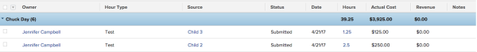

# Grouping: Project Sponsor for hours {#grouping-project-sponsor-for-hours}

This hour grouping organizes hours by the sponsor of the project where the hours are logged. The standard report builder interface for hour groupings does not provide a mapping to the Project Sponsor field. You must use the Text Mode interface to access this field.

To apply this grouping:

1. Go to a list of hours.
1. From the **Grouping**&nbsp;drop-down menu, select **New Grouping**.

1. Click** Switch to Text Mode**.
1. Remove the text&nbsp;in the **Group your Report** area.
1. Replace&nbsp;the text with the following code:  
   `<pre>group.0.linkedname=project:sponsor:name group.0.name= group.0.valuefield=project:sponsor:name group.0.valueformat=HTML textmode=true</pre>`

1. Click **Save Grouping**.

