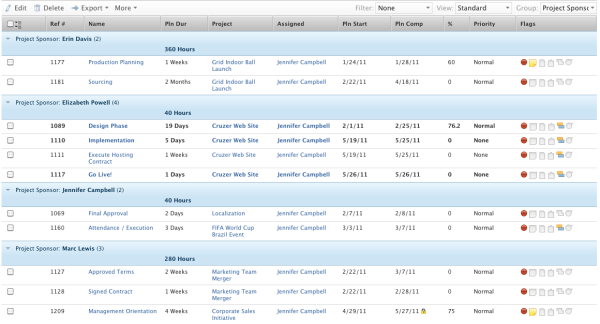

# Grouping: Project Sponsor for a task list {#grouping-project-sponsor-for-a-task-list}

This task grouping allows you to group tasks by the Project Sponsor.





To apply this grouping:


1. Go to list of tasks.
1. In the **Grouping** drop-down menu, select **New Grouping**.

1. Click **Switch to Text Mode**.
1. Remove the text you see in the text editing window.
1. Copy and paste the following code in the text editing window:  


   ```
   group.0.name=Project Sponsor<br>group.0.valuefield=project:sponsor:name<br>group.0.valueformat=string
   ```


1. Click **Save Grouping**.


