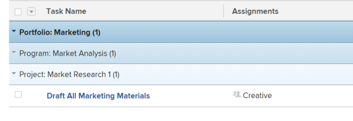

# Grouping: tasks by portfolio, program, and project {#grouping-tasks-by-portfolio-program-and-project}

Use this task grouping to group tasks by the portfolio, by program, and then by the project they are associated with.

To apply this grouping:

1. Go to a list of tasks.
1. From the **Grouping**&nbsp;drop-down menu, select **New Grouping**.

1. Click** Switch to Text Mode**.
1. Remove the text&nbsp;in the **Group your Report** area.
1. Replace&nbsp;the text with the following code:  
   `<pre>group.0.linkedname=project group.0.namekey=portfolio group.0.notime=false group.0.valuefield=project:portfolio:name group.0.valueformat=string group.1.linkedname=project group.1.namekey=program group.1.notime=false group.1.valuefield=project:program:name group.1.valueformat=string group.2.name=Project group.2.valuefield=project:name group.2.valueformat=HTML textmode=true </pre>`

1. Click **Save Grouping**.

&nbsp;
