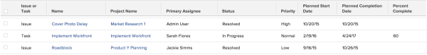

# Report: combined task and issue View and Grouping {#report-combined-task-and-issue-view-and-grouping}

This Work Item report&nbsp;shows both tasks and issues which users have accepted to work on in one report. It is best when combined with a custom grouping.


>[!TIP] {type="tip"}
>
>&nbsp;The Work Item view&nbsp;displays only tasks and issues that have been accepted by the users assigned to them. This report does not&nbsp;display work items that have not been moved from the Work Requests or Team Requests lists into the user's Working On list.





To build a report with this view:


1.  `<MadCap:conditionalText data-mc-conditions="QuicksilverOrClassic.Quicksilver"> From the  <b>Main Menu</b>  , click&nbsp; <b>Reports</b>.</MadCap:conditionalText>` 
1. Click **New Report** and select the object **Work Item** from the drop-down menu.

1. In the** Column Preview** area,&nbsp;click the header of the only column displayed.
1. Click** Switch to Text Mode**.
1. Mouse over the text mode area, and click **Click to edit text**.
1. Remove the text you find in the **Text Mode** box, and replace it with the following code:  
   `<pre>column.0.description=Task or Issue <br>column.0.name=Issue or Task<br>column.0.shortview=false<br>column.0.stretch=0<br>column.0.textmode=true<br>column.0.type=image<br>column.0.valueexpression=IF(ISBLANK({opTaskID}),'Task','Issue')<br>column.0.valueformat=<br>column.0.width=40<br>column.1.description=Task or Issue Name<br>column.1.isInlineEditable=false<br>column.1.link.linkproperty.0.name=ID<br>column.1.link.linkproperty.0.valuefield=task:ID<br>column.1.link.linkproperty.0.valueformat=string<br>column.1.link.lookup=link.view<br>column.1.link.valuefield=task:objCode<br>column.1.link.valueformat=val<br>column.1.listsort=nested(task).string(name)<br>column.1.name=Name<br>column.1.sharecol=true<br>column.1.shortview=false<br>column.1.stretch=50<br>column.1.textmode=true<br>column.1.valuefield=task:name<br>column.1.valueformat=HTML<br>column.1.width=120<br>column.2.isInlineEditable=false<br>column.2.link.linkproperty.0.name=ID<br>column.2.link.linkproperty.0.valuefield=opTask:ID<br>column.2.link.linkproperty.0.valueformat=string<br>column.2.link.lookup=link.view<br>column.2.link.valuefield=opTask:objCode<br>column.2.link.valueformat=val<br>column.2.linkedname=opTask<br>column.2.listsort=nested(opTask).string(name)<br>column.2.shortview=false<br>column.2.stretch=0<br>column.2.textmode=true<br>column.2.valuefield=opTask:name<br>column.2.valueformat=HTML<br>column.2.width=120<br>column.3.description=Project Name<br>column.3.isInlineEditable=false<br>column.3.link.linkproperty.0.name=ID<br>column.3.link.linkproperty.0.valuefield=task:projectID<br>column.3.link.linkproperty.0.valueformat=string<br>column.3.link.lookup=link.view<br>column.3.link.valuefield=task:project:objCode<br>column.3.link.valueformat=val<br>column.3.listsort=nested(task).nested(project).string(name)<br>column.3.name=Project Name<br>column.3.sharecol=true<br>column.3.shortview=false<br>column.3.stretch=50<br>column.3.textmode=true<br>column.3.valuefield=task:project:name<br>column.3.valueformat=HTML<br>column.3.width=120<br>column.4.isInlineEditable=false<br>column.4.link.linkproperty.0.name=ID<br>column.4.link.linkproperty.0.valuefield=opTask:projectID<br>column.4.link.linkproperty.0.valueformat=string<br>column.4.link.lookup=link.view<br>column.4.link.valuefield=opTask:project:objCode<br>column.4.link.valueformat=val<br>column.4.linkedname=opTask<br>column.4.listsort=nested(opTask).nested(project).string(name)<br>column.4.shortview=false<br>column.4.stretch=0<br>column.4.textmode=true<br>column.4.valuefield=opTask:project:name<br>column.4.valueformat=HTML<br>column.4.width=120<br>column.5.displayname=Primary Assignee<br>column.5.linkedname=assignment<br>column.5.namekey=view.relatedcolumn<br>column.5.namekeyargkey.0=assignment<br>column.5.namekeyargkey.1=assignedToID<br>column.5.querysort=assignment:assignedToID<br>column.5.textmode=true<br>column.5.valuefield=assignment:assignedTo:name<br>column.5.valueformat=HTML<br>column.6.displayname=Status<br>column.6.enumclass=com.attask.common.constants.OpTaskStatusEnum<br>column.6.enumtype=OPTASK<br>column.6.linkedname=opTask<br>column.6.namekey=view.relatedcolumn<br>column.6.namekeyargkey.0=opTask<br>column.6.namekeyargkey.1=status<br>column.6.querysort=opTask:status<br>column.6.sharecol=true<br>column.6.textmode=true<br>column.6.type=enum<br>column.6.valuefield=opTask:status<br>column.6.valueformat=val<br>column.7.displayname=<br>column.7.enumclass=com.attask.common.constants.TaskStatusEnum<br>column.7.enumtype=TASK<br>column.7.linkedname=task<br>column.7.namekey=view.relatedcolumn<br>column.7.namekeyargkey.0=task<br>column.7.namekeyargkey.1=status<br>column.7.querysort=task:status<br>column.7.textmode=true<br>column.7.type=enum<br>column.7.valuefield=task:status<br>column.7.valueformat=val<br>column.8.displayname=Priority<br>column.8.enumclass=com.attask.common.constants.TimelinePriorityEnum<br>column.8.enumtype=OPTASK<br>column.8.linkedname=opTask<br>column.8.namekey=view.relatedcolumn<br>column.8.namekeyargkey.0=opTask<br>column.8.namekeyargkey.1=priority<br>column.8.querysort=opTask:priority<br>column.8.sharecol=true<br>column.8.textmode=true<br>column.8.type=enum<br>column.8.valuefield=opTask:priority<br>column.8.valueformat=val<br>column.9.displayname=<br>column.9.enumclass=com.attask.common.constants.TimelinePriorityEnum<br>column.9.enumtype=TASK<br>column.9.linkedname=task<br>column.9.namekey=view.relatedcolumn<br>column.9.namekeyargkey.0=task<br>column.9.namekeyargkey.1=priority<br>column.9.querysort=task:priority<br>column.9.type=enum<br>column.9.valuefield=task:priority<br>column.9.valueformat=val<br>column.10.isInlineEditable=false<br>column.10.linkedname=task<br>column.10.listsort=nested(task).atDateAsAtDate(plannedStartDate)<br>column.10.name=Planned Start Date<br>column.10.sharecol=true<br>column.10.shortview=false<br>column.10.stretch=0<br>column.10.textmode=true<br>column.10.valuefield=task:plannedStartDate<br>column.10.valueformat=atDate<br>column.10.width=100<br>column.11.isInlineEditable=false<br>column.11.linkedname=opTask<br>column.11.listsort=nested(opTask).atDateAsAtDate(plannedStartDate)<br>column.11.shortview=false<br>column.11.stretch=0<br>column.11.textmode=true<br>column.11.valuefield=opTask:plannedStartDate<br>column.11.valueformat=atDate<br>column.11.width=1<br>column.12.isInlineEditable=false<br>column.12.linkedname=task<br>column.12.listsort=nested(task).atDateAsAtDate(projectedCompletionDate)<br>column.12.name=Planned Completion Date<br>column.12.sharecol=true<br>column.12.shortview=false<br>column.12.stretch=0<br>column.12.textmode=true<br>column.12.valuefield=task:projectedCompletionDate<br>column.12.valueformat=atDate<br>column.12.width=100<br>column.13.isInlineEditable=false<br>column.13.linkedname=opTask<br>column.13.listsort=nested(opTask).atDateAsAtDate(projectedCompletionDate)<br>column.13.shortview=false<br>column.13.stretch=0<br>column.13.textmode=true<br>column.13.valuefield=opTask:projectedCompletionDate<br>column.13.valueformat=atDate<br>column.13.width=1<br>column.14.isInlineEditable=false<br>column.14.linkedname=task<br>column.14.listsort=nested(task).double(percentComplete)<br>column.14.name=Percent Complete<br>column.14.sharecol=true<br>column.14.shortview=false<br>column.14.stretch=0<br>column.14.textmode=true<br>column.14.valueexpression=IF(ISBLANK({taskID}),"",{task}.{percentComplete})<br>column.14.valueformat=HTML<br>column.14.width=100<br>column.15.textmode=true<br>column.15.value=<br>column.15.valueformat=HTML<br>column.15.width=1</pre>`

1. `(Optional) Click **Groupings** to add a grouping to the report.` 
1. `(Optional) If you are adding a grouping, click **Switch to Text Mode**.` 
1. ` `(Optional) Replace the text inside the grouping text mode area with the following code:```<pre>group.0.name=<br>group.0.valueexpression=IF(ISBLANK({opTaskID}),'Task','Issue')<br>group.0.valueformat=string<br>textmode=true</pre>` `This grouping groups all the Tasks together, and all the Issues together.` 

1. `Click **Save + Close**.` 


