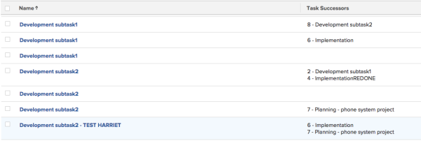

# View (Column): list of successors {#view-column-list-of-successors}

You can add a column to a task view to show a list of the successors of the tasks. The **Task Successors** column includes the number of the successor as well as the name.

To add this column to a task view:

1. Go to an existing task view.
1. Expand the View drop-down menu, and select **Customize View**.
1. Click **Add Column**.
1. Click **Switch to Text Mode**.
1. Mouse over the **Show in this column** area, and click **Click to edit text**.

1. Remove all text in the Text Mode box, and replace it with the following code:  
   `<pre>displayname=Task Successors listdelimiter=  listmethod=nested(successors).lists textmode=true type=iterate valueexpression=CONCAT({successor}.{taskNumber},' - ',{successor}.{name}) valueformat=HTML</pre>`

1. Click **Save View**.

