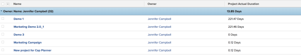

# View (Column): project with average Actual Duration aggregated in a Grouping {#view-column-project-with-average-actual-duration-aggregated-in-a-grouping}

You can add the following column in a project report to show the Actual Duration aggregated as an average in a grouping.

To add this column to a project view:

1. (Recommended)&nbsp;For best results and to see the aggregated average value of the Actual Duration, you must have a Grouping added to your project list or report.  
   For more information about creating Groupings, see the article [Create and customize Groupings](create-customize-groupings.md).

1. Go to an existing project view.
1. Expand the View drop-down menu, and select&nbsp;**Customize View**.
1. Click&nbsp;**Add Column**.
1. Click&nbsp;**Switch to Text Mode**.
1. Mouse over the&nbsp;**Show in this column**&nbsp;area, and click&nbsp;**Click to edit text**.

1. Remove all text in the Text Mode box, and replace it with the following code:  
   `<pre>aggregator.displayformat=compound  aggregator.function=AVG  aggregator.namekey=view.relatedcolumn  aggregator.namekeyargkey=actualduration  aggregator.valuefield=actualDurationMinutes  aggregator.valueformat=val  displayname=Project Actual Duration  durationunitfield=durationUnit.value  linkedname=project  namekey=actualduration  namekeyargkey=actualduration  querysort=actualDurationMinutes  textmode=true  valuefield=actualDurationMinutes  valueformat=compound#M:D  viewalias=actualduration</pre>`

1. Click **Save View**.

