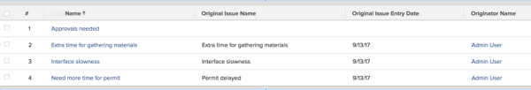

# View: display original issue information on task and project list {#view-display-original-issue-information-on-task-and-project-list}

You can display information from the original issue on task and project lists, after the issue has been converted to the tasks and projects in the list.  
  
Applying this view is identical for tasks and projects.


To apply this view to a task list:


1. Go to a list of tasks which have been converted from issues
1. From the **View** drop-down menu, select **New View**.

1. In the** Column Preview** area, eliminate all columns except for one.
1. Click the header of the remaining column, then click** Switch to Text Mode**.
1. Mouse over the text mode area, and click **Click to edit text**.
1. Remove the text you find in the **Text Mode** box, and replace it with the following code:  
  


   ```
   column.0.descriptionkey=name<br>column.0.isInlineEditable=false
   ```

   *

   ```
   <br>column.0.link.linkproperty.0.name=ID
   ```

   **

   ```
   <br>column.0.link.linkproperty.0.valuefield=ID
   ```

   **

   ```
   <br>column.0.link.linkproperty.0.valueformat=int
   ```

   *

   ```
   <br>column.0.link.lookup=link.view<br>column.0.link.valuefield=objCode<br>column.0.link.valueformat=val<br>column.0.linkedname=direct<br>column.0.listsort=string(name)<br>column.0.querysort=name<br>column.0.section=0<br>column.0.shortview=false<br>column.0.stretch=100<br>column.0.valuefield=name<br>column.0.valueformat=HTML<br>column.0.width=150<br>column.1.displayname=Original Issue Name<br>column.1.linkedname=convertedOpTask<br>column.1.textmode=true<br>column.1.valuefield=convertedOpTaskName<br>column.1.valueformat=HTML<br>column.2.displayname=Original Issue Entry Date<br>column.2.textmode=true<br>column.2.valuefield=convertedOpTaskEntryDate<br>column.2.valueformat=HTML<br>column.3.displayname=Originator Name<br>column.3.textmode=true<br>column.3.valuefield=convertedOpTaskOriginator:name<br>
   ```

   *

   ```
   column.3.valueformat=HTML 
   ```

  
   *

1.  Click **Save View**. 


