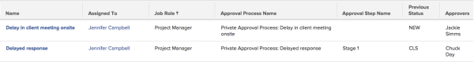

# View: issues with approval information {#view-issues-with-approval-information}

The following issue view shows the approval process, step, names of the approvers, and the status of the issue before the approval was granted. Some of these fields are not accessible through the standard interface builder.

To apply this view:

1. Go to a list of issues.
1. From the **View** drop-down menu, select **New View**.

1. In the** Column Preview** area, eliminate all columns except for one.
1. Click the header of the remaining column, then click** Switch to Text Mode**.
1. Mouse over the text mode area, and click **Click to edit text**.
1. Remove the text you find in the **Text Mode** box, and replace it with the following code:  
   `<pre style="font-style: normal;"><em>column.0.descriptionkey=name</em> <em>column.0.link.linkproperty.0.name=ID</em> <em>column.0.link.linkproperty.0.valuefield=ID</em> <em>column.0.link.linkproperty.0.valueformat=int</em> <em>column.0.link.lookup=link.view</em> <em>column.0.link.valuefield=objCode</em> <em>column.0.link.valueformat=val</em> <em>column.0.linkedname=direct</em> <em>column.0.listsort=string(name)</em> <em>column.0.namekey=name.abbr</em> <em>column.0.querysort=name</em> <em>column.0.shortview=false</em> <em>column.0.stretch=40</em> <em>column.0.valuefield=name</em> <em>column.0.valueformat=HTML</em> <em>column.0.width=220</em> <em>column.1.descriptionkey=assignedto</em> <em>column.1.linkedname=assignedTo</em> <em>column.1.listsort=nested(assignedTo).string(name)</em> <em>column.1.namekey=assignedto</em> <em>column.1.querysort=assignedTo:name</em> <em>column.1.shortview=true</em> <em>column.1.stretch=0</em> <em>column.1.valuefield=assignedTo:name</em> <em>column.1.valueformat=HTML</em> <em>column.1.width=150</em> <em>column.2.descriptionkey=role</em> <em>column.2.linkedname=role</em> <em>column.2.listsort=nested(role).string(name)</em> <em>column.2.namekey=role</em> <em>column.2.querysort=role:name</em> <em>column.2.shortview=false</em> <em>column.2.stretch=25</em> <em>column.2.valuefield=role:name</em> <em>column.2.valueformat=HTML</em> <em>column.2.width=150</em> <em>column.3.description=Approval Process Name</em> <em>column.3.linkedname=direct</em> <em>column.3.listsort=string(name)</em> <em>column.3.name=Approval Process Name</em> <em>column.3.querysort=name</em> <em>column.3.shortview=false</em> <em>column.3.stretch=35</em> <em>column.3.valuefield=approvalProcess:name</em> <em>column.3.valueformat=HTML</em> <em>column.3.width=220</em> <em>column.4.description=Approval Step Name</em> <em>column.4.linkedname=direct</em> <em>column.4.listsort=string(name)</em> <em>column.4.name=Approval Step Name</em> <em>column.4.querysort=name</em> <em>column.4.shortview=false</em> <em>column.4.stretch=0</em> <em>column.4.valuefield=currentApprovalStep:name</em> <em>column.4.valueformat=HTML</em> <em>column.4.width=220</em> column.5.description=Previous Status <em>column.5.linkedname=direct</em> <em>column.5.listsort=string(name)</em> <em>column.5.name=Previous Status</em> <em>column.5.querysort=name</em> <em>column.5.shortview=false</em> <em>column.5.stretch=0</em> <em>column.5.valuefield=previousStatus</em> <em>column.5.valueformat=HTML</em> <em>column.5.width=220</em> <em>column.6.linkedname=direct</em> <em>column.6.listsort=HTML(approversString)</em> <em>column.6.namekey=approver.plural.abbr</em> <em>column.6.querysort=approversString</em> <em>column.6.shortview=false</em> <em>column.6.stretch=0</em> <em>column.6.valuefield=approversString</em> <em>column.6.valueformat=HTML</em> <em>column.6.viewalias=approver.plural</em> <em>column.6.width=200</em> </pre>`

1. Click **Save View**.

